---
title:
subtitle: 
author:
date:
output:
  html_document:
    toc: false
    toc_float: true 
    depth: 2
    number_sections: false
    theme: spacelab
    highlight: pygments
editor_options: 
  markdown: 
    wrap: 150
---

```{r, echo=FALSE}
htmltools::img(src =knitr::image_uri('images/session_0/workshop_banner.png'),
               alt = 'logo', 
               style = 'position:center; top:0; left:0; padding:0px;')
```

------------------------------------------------------------------------------------------------------------------------------------------------------

# Using animal tracking data to explore behaviour and distributions of species {.tabset .tabset-fade}

<br>

## Introductions

::: {style="display: grid; grid-template-columns: 2fr 1fr; grid-column-gap: 60px;"}
<div>

### Who are we?

<br><br>

**Mina** is a Research Associate in the [Fish and Fisheries Lab](https://www.fishandfisheries.com) at James Cook University. She first became interested 
in using R as a tool to wrangle large datasets to assess risks posed by climate change to both animal populations and the livelihoods of human communities
reliant upon them. She has worked as a teaching assistant at JCU, creating R boot camps and leading weekly workshops for students learning to model using **R**. 

<br><br>

**Vinay** is a Spatial Ecologist at the [Charles Darwin Foundation](https://www.darwinfoundation.org/en/). He is an ecologist that is particularly
interested in using spatio-temporal datasets to understand animal movements and distributions patterns. He has considerable experience using **R** to
analyse and visualise large and complex spatial datasets. He has developed **R** code and packages to analyse 2 and 3 dimensional movement patterns of
animals using acoustic telemetry data from single study sites to continental scale arrays. Vinay's **R** codes can be found on his [github
page](https://github.com/vinayudyawer).

</div>

<div>


<br>


</div>
:::

<br><br>

------------------------------------------------------------------------------------------------------------------------------------------------------

### Course outline

**In this course you will learn to work with spatial datasets and spatial models using R**. This workshop will
demonstrate how **R** can make the processing of spatial data much quicker and easier than using standard GIS software! At the end of this workshop
you will also have the annotated **R** code that you can re-run at any time, share with collaborators and build on with those newly acquired data!

We designed this course not to comprehensively cover all the tools in **R**, but rather to give you an understanding of options on how to analyse your
satellite telemetry data and build spatial models. Every new project comes with its own problems and questions and you will need to be
independent, patient and creative to solve these challenges. It makes sense to invest time in becoming familiar with **R**, because today **R** is the
leading platform for environmental data analysis and has some other functionalities which may surprise you!

<br>

This **R** workshop is intended to run across 4 sessions.

<br>

-   **Session 1:** *Basics of data cleaning and mapping using telemetry data*

This session will address the fundamentals of data pre-processing and visualisation, utilising the `tidyverse`, `sf`, and `ggspatial` R packages. 
Participants will learn efficient data cleaning methods, organisation of telemetry data, and the creation of geospatial visualisations to gain 
insights into animal movements.

<br>

-   **Session 2:** *Using satellite telemetry data to define behaviours*

The second session will introduce participants to the `aniMotum` package, a valuable tool for analysing animal movement data. Attendees will acquire
the skills to define distinct behavioural patterns exhibited by tracked animals.

<br>

-   **Session 3:** *Basics of Species Distribution Models (SDMs)*

Species distribution models are instrumental in predicting and understanding the geographic ranges of species. In this session, we will delve into the 
theory of SDMs and use a number of R tools inluding `dismo`, `mgcv` and `randomForest` R packages, covering the basics of species distribution modelling. 
Participants will learn how to construct predictive models and assess habitat suitability for species.

<br>

-   **Session 4:** *Using telemetry data to define species distributions*

The final session focuses on integrating telemetry data with species distribution models, enabling the creation of comprehensive distribution maps and the 
analysis of how environmental variables influence species presence and absence.

<br><br>

------------------------------------------------------------------------------------------------------------------------------------------------------

<style>
div.blue { background-color:#e6f0ff; border-radius: 5px; padding: 20px;}
</style>
<div class = "blue">

### Course Resources

The course resources will be emailed to you prior to the workshop. However, you can also access the data and scripts we will work through in this
course following these steps:

**1. Download the course walkthrough and code from [this link](https://raw.githubusercontent.com/vinayudyawer/OCS2024_SDMworkshop/main/R/OCS2024-SDMworkshop.zip).**

**2. Unzip the downloaded file. It should have the following folder and a html file:**

- [***Code***]{style="color:darkblue"} *folder*
- [***OCS2024-SDMworkshop.html***]{style="color:darkblue"} *file*

**3. Save all the files in a location on your computer you can find again during the workshop**
    
</div>

------------------------------------------------------------------------------------------------------------------------------------------------------

<a href="#top" style="color:steelblue; font:bold;" >Back to top</a>

<br><br>

## Software installation

<br>

Processing and analysing large datasets like those from animal telemetry work can require a huge investment in time: rearranging data, removing
erroneous values, purchasing, downloading and learning the new software, and running analyses. Furthermore merging together Excel spreadsheets,
filtering data and preparing data for statistical analyses and plotting in different software packages can introduce all sorts of errors.

**R** is a powerful language for data wrangling and analysis because...

-   It is relatively *fast* to run and process commands
-   You can create *repeatable* scripts
-   You can *trace errors* back to their source
-   You can *share your scripts* with other people
-   It is *easy to identify errors* in large data sets
-   Having your data in **R** opens up a huge array of cutting edge analysis tools.
-   **R** is also totally **FREE!**

<br>

**Installing packages**

Part of the reason **R** has become so popular is the vast array of packages that are freely available and highly accessible. In the last few years,
the number of packages has grown exponentially [\> 10,000 on CRAN!](http://blog.revolutionanalytics.com/2017/01/cran-10000.html) These can help you to
do a galaxy of different things in **R**, including *running complex analyses*, drawing *beautiful figures*, running *R as a GIS*, constructing your
own *R packages*, building *web pages* and even *writing R course handbooks* like this one!

Let's suppose you want to load the `sf` package to access this package's incredible spatial functionality. If this package is not already installed on
your machine, you can download it from the web by using the following command in **R**.

```{r, include=TRUE, eval=FALSE, class.source = 'fold-show'}
install.packages("sf", repos='http://cran.us.r-project.org')
```

In this example, `sf` is the package to be downloaded and '<http://cran.us.r-project.org>' is the repository where the package will be accessed from.

<br>

More recently, package developers have also used other platforms like [**GitHub**](https://github.com) to house **R** packages. This has enabled users
to access packages that are actively being updated and enable developers to fix problems and develop new features with user feedback.

The `remotes` and `devtools` **R** packages have enabled the installation of packages directly from platforms like **GitHub**. For example, if we want
want to download the `visreg` package from the github repository, we can use the `install_github()` package to do it like this:

```{r, include=TRUE, eval=FALSE, class.source = 'fold-show'}
remotes::install_github("pbreheny/visreg")
```


------------------------------------------------------------------------------------------------------------------------------------------------------

<style>
div.blue { background-color:#e6f0ff; border-radius: 5px; padding: 20px;}
</style>
<div class = "blue">

### Installation instructions:

For this course, make sure you have downloaded and installed the most updated versions of the following software:

<br>

**1. Download R for your relevant operating system from the [CRAN website](https://cran.rstudio.com)** <br>

**2. Download RStudio for your relevant operating system from the [RStudio website](https://posit.co/products/open-source/rstudio/)** <br>

**3. Once you've installed the above software, make sure you install the following packages prior to the start of the course**

```{r, include=TRUE, eval=FALSE, class.source = 'fold-show'}
## Packages that are on CRAN

install.packages(c("tidyverse",
                   "sf",
                   "terra",
                   "raster",
                   "lubridate",
                   "ggspatial",
                   "ggaminate",
                   "leaflet",
                   "remotes",
                   "dismo",
                   "stats",
                   "mgcv",
                   "mgcViz",
                   "randomForest",
                   "plotly",
                   "patchwork"
                   ))

## Install packages from GitHub and other external repositories

remotes::install_github("r-spatial/mapview", build_vignettes = TRUE)
remotes::install_github("pbreheny/visreg", build_vignettes = TRUE)
install.packages("aniMotum", 
                 repos = c("https://cloud.r-project.org",
                 "https://ianjonsen.r-universe.dev"),
                 dependencies = TRUE)

```

When downloading from **GitHub**, the R console will ask you if it should also update packages. In most cases, you can skip updating packages (**option [3]**)
as this often stalls the whole process of downloading the package. If there are package dependencies, these will often be downloaded automatically (but not
always!). If you want to update the packages you have, you can do it separately.

</div>

------------------------------------------------------------------------------------------------------------------------------------------------------

<a href="#top" style="color:steelblue; font:bold;" >Back to top</a>

<br><br>


## Session 1

### Basics of data cleaning and mapping using telemetry data

|                                 |
|:--------------------------------|
|  |

<br>

This session will address the fundamentals of data pre-processing and visualisation, utilising `lubridate`, `tidyverse`, `sf`, `ggspatial`, and `gganimate` **R** packages. Participants will learn efficient data cleaning methods, organisation of telemetry data, and the creation of geospatial visualisations to gain insights into animal distributions and movements.


<br><br>

#### One: Reading the data

------------------------------------------------------------------------------------------------------------------------------------------------------

Before we can analyze these data, we first need to read the dataset into **R**. The 'comma separated value' (.csv) format is a popular and effective way to export large data sets. This format is a preferred way to store your data, and easily import into R. 

In this session, we will explore how to import a .csv file using base R and using tidyverse. 

<br>

##### One A: Base R

A .csv file can be imported into R using the read.csv base function, and by telling R where the file is located on your computer. 

```{r, message=FALSE}
# Load the whale shark data using the 'read.csv' function from your local repository
# whaleshark <- read.csv('/location of data/Whalesharks_Maldives.csv', header = TRUE)

# Load the whale shark data using the 'read.csv' function directly from github 
whaleshark <- read.csv('https://raw.githubusercontent.com/vinayudyawer/OCS2024_SDMworkshop/main/data/Whaleshark.csv', header = TRUE)
```

Now, let's do a quick exploration of the data using base R to get familiar with it. 
```{r, eval=FALSE}
summary(whaleshark) # Provides a summary of the data frame 
class(whaleshark) # tells us what form 'whaleshark' is in (data frame)

# Now lets explore what form each of our columns are in
class(whaleshark$ANIMALID) # character
class(whaleshark$DATE) # character
class(whaleshark$LONGITUDE) # numeric
class(whaleshark$LATITUDE) # numeric
class(whaleshark$ARGOSCLASS) # character
```

So far everything is looking good! But you'll notice that our 'DATE' field has been read in as a 'character'. This is fine for now, but in order to do more complex visualizations of the data, we will need R to recognize the 'DATE' field as a 'date-time object'. Luckily, there is an AMAZING package in R that will easily do this for us! 

<br>

`lubridate` package 
```{r, message=FALSE, warning=FALSE}
#First, lets load up lubridate using the library package. 
library(lubridate)

# Now we can use the 'ymd_hms' function to reformat our 'DATE' field as a POSIXct. 
whaleshark$DATE <- ymd_hms(whaleshark$DATE)

# Or we can use the parse_date_time function
whaleshark$DATE <- parse_date_time(whaleshark$DATE, "Ymd HMS")

# We can check if it worked by using the class function
class(whaleshark$DATE)

```


The `lubridate` package is AMAZING. Aside from changing date/time formats easily, you can also convert between various time zones. In this case, it's not super important for our animal tracking data to be in a specific time zone, but you may run into a scenario where your data was collected in UTC, but you need it in a local time. 

This may be especially relevant later on when creating species distribution models' when correlating the time an animal was present with environmental factors.

```{r, message=FALSE}
# Lets practice by creating a new field with the time zone as the local time (Indian Ocean/Maldives UTC +5:00). 
whaleshark$LOCAL_DATE_TIME <- with_tz(whaleshark$DATE, tzone = "Indian/Maldives")

# You may also be looking at a larger temporal resolution and want to separate the 'date' from the 'time' field, we can also use the 'date' and 'time' functions in lubridate to do this!

whaleshark$date <- date(whaleshark$DATE) # Create a new column with only date 
whaleshark$time <- format(whaleshark$DATE, "%H:%M:%S") # create a new column with only time

```

<br>


##### One B: `tidyverse` package 

Alternatively, we can use the `tidyverse` package to do everything we just did above in base R. There are many reasons why various coders prefer `tidyverse` or base R. However, the ease of data manipulation in `tidyverse` makes it extremely helpful in handling data. 

First lets load up `tidyverse`. 
```{r, message=FALSE, warning=FALSE}
# Load 'tidyverse' - which we will use for data cleaning, filtering, and visualization 
library(tidyverse)
```

Now lets see an example of it's usefulness. Above, we loaded the data using base r's read.csv() function and then had to change the DATE column into a datetime object by loading up lubridate. The tidyverse version is read_csv(). The main difference is that data will be imported as a tibble data frame. The read_csv() package will guess what format the data are in and all the columns will be imported already in their correct format. 

```{r, message=FALSE}
# whaleshark <- read_csv('/location of data/Whalesharks_Maldives.csv')

# You can also use read_csv to input data directly from a website URL
whaleshark <- read_csv('https://raw.githubusercontent.com/vinayudyawer/OCS2024_SDMworkshop/main/data/Whaleshark.csv')

# Note, right now we are reading over our previous 'whaleshark' data frame. So any manipulations you've done to the data frame will be reset. 
```

As you can see, the date field is already a 'dttm' (date time) object. How clever of tidyverse to automatically know this! 


<br><br>

#### Two: Data Exploration 

------------------------------------------------------------------------------------------------------------------------------------------------------

Now that we've loaded our tracking dataset, let's explore the data! We are going to use the read_csv() version of the data, where the 'DATE' field is already a 'dttm'. 

The easiest way to do explore our data is by using pipes, which we can get either from base r in the format '|>' or from tidyverse (originally from the magrittr package) in the format'%>%'. While both these pipes are *essentially* do the same function, there can sometimes be crucial differences. However, for most coders, the differences are unimportant and you can choose which pipe you prefer. 

If you're a more advanced coder, you can read about the differences in pipes [here](https://www.tidyverse.org/blog/2023/04/base-vs-magrittr-pipe/) before choosing your piping preference. 

For the purpose of this workshop, we will be using the '%>%' pipe, because this is what most people are familiar with. 
%>% is an infix operator. This means it takes two operands, left and right and ‘pipes’ the output of the last expression/function (left) forward to the first input of the next function (right).

For example, above we used the code 'class(whaleshark)' to see what class our data was in. In tidyverse, we can do this same operation using a pipe...

```{r, message=FALSE}
whaleshark %>% class() # In English: take the 'whaleshark' data frame and run the class function on it. 

```

<br><br>

***Benefits of pipes %>%***

* Functions flow in natural order that tells story about data.
* Code effects are easy to reason about by inserting View() or head() into pipe chain.
* Common style makes it easy to understand collaborator (or your own) code.

We can quickly explore our data using the following pipes: 
```{r, eval=FALSE}
whaleshark %>% View() # opens data in a new window
whaleshark %>% head() # first 6 rows by default
whaleshark %>% tail(10) # specify we want to look at the last 10 rows
whaleshark %>% nrow() # number of rows in the data frame
whaleshark %>% ncol() # number of columns in the data frame
whaleshark %>% str() # provides internal structure of an R object
whaleshark %>% summary() # provides result summary of the data frame
```

This functionality is particularly useful if the data is very large!

Note the (), as opposed to the [] we used for indexing. The () signify a function.

We can also use pipes on a *single column* in our data frame:
```{r, message=FALSE}
whaleshark$DATE %>% class()
```

But the main benefit to pipes is that they can be used to conduct multiple functions in a certain order instead of having to perform operations individually! This makes piping super handy for data manipulation and filtering. 

<br><br>

#### Three: Data manipulation and filtering  

------------------------------------------------------------------------------------------------------------------------------------------------------

For example, lets figure out how many detections we have for whale shark 'M-150'...
```{r, message=FALSE, warning=FALSE}

whaleshark %>% 
  subset(ANIMALID == "M-150") %>% # subset dataset to include only the whale shark 'M-150'
  nrow() # count number of rows (i.e. detections) from 'M-150'

```

Pipes can also be used to pre-process our data before plotting them. Lets now use pipes to create a simple plot of number of detections of M-150 over time.

```{r, message=FALSE, fig.align = 'center', fig.height = 4, fig.width = 10}
whaleshark %>% # take the whale shark df
  mutate(date = date(DATE)) %>% # then create a new column called date from the date time column
  subset(ANIMALID == "M-150") %>% # then subset to just the data from shark M-150 
  with(table(date)) %>% # create a table with the number of detections per day
  plot(type = 'b', xlab = "Date", ylab = "Number of detections", col = 'lightblue') # plot detections over time 

```

<br>

##### `dplyr` package: using dplyr for data wrangling

* dplyr is the data wrangling workhorse of the tidyverse.
* Provides functions, verbs, that can manipulate data into the shape you need for analysis.
* Has many backends allowing dplyr code to work on data stored in SQL databases and big data clusters.
* Works via translation to SQL. Keep an eye out for the SQL flavour in dplyr

Load up the `dplyr` package
```{r, message=FALSE, warning=FALSE}
library(dplyr)
```


<br>

<style>
div.blue { background-color:#e6f0ff; border-radius: 5px; padding: 20px;}
</style>
<div class = "blue">

**Basic vocabulary**

* select() columns from a tibble
* filter() to rows matching a certain condition
* arrange() rows in order
* mutate() a tibble by changing or adding rows
* group_by() a variable
* summarise() data over a group using a function

Check out this useful online [cheatsheet](https://rstudio.github.io/cheatsheets/html/data-transformation.html?_gl=1*1osjb37*_ga*OTE3OTY4MTUzLjE2OTMyODk4OTM.*_ga_2C0WZ1JHG0*MTY5MzQ1NDM4NS4yLjAuMTY5MzQ1NDM4NS4wLjAuMA..) for data wrangling.

</div>

<br>

`select`

We can use the `select` function in `dplyr` to choose the columns we want to include for our analyses and plotting. Let's say we weren't interested in the 'ARGOSCLASS' column. We can remove the column using `select` in two different ways

```{r, message=FALSE, warning=FALSE}
whaleshark %>% 
  dplyr::select(ANIMALID, DATE, LONGITUDE, LATITUDE)# %>% # columns we want to include
#  OR ALTERNATIVELY 
# dplyr::select(-ARGOSCLASS) # the minus symbol denotes columns we want to drop

```
In this case, our data came pretty tidy and we probably want to hold on to all the columns for now. 

<br>

`filter` and `arrange`

We can use these functions to subset the data to rows matching logical conditions and then arrange according to particular attributes
```{r, message=FALSE, warning=FALSE}
# as an example, we could filter to look at the detections of only one of our whale sharks 
whaleshark %>%
  filter(ANIMALID == 'M-150') %>%
  arrange(DATE) # arrange M-150's detections in chronological order

```

<br>

`group_by` and `summarise`

We can use these functions to determine the number of detections per individual
```{r, message=FALSE, warning=FALSE}
whaleshark %>%
  group_by(ANIMALID) %>%
  summarise(NumDetections = n()) # summarise number of detections per tagged shark

```
Now we can see that there is huge variability in number of detections for individuals. Whale shark M-130 has by far the most detections (202), while whale shark M-129 only has 16 detections. This might have implications for our modelling in session 2...

<br>

`mutate` 

Adding and removing data to the data frame through a pipe

Up until now, we haven't made any permanent changes to the 'whaleshark' dataframe. We've only demonstrated how certain functions can be used. 

If we want to make a permanent change, we have to assign the function to a name. We do this using '<-'. 

For example, it's pretty confusing that our column named 'DATE' is actually 'date-time'. Let's change the name of the DATE Column to DATETIME to avoid confusion. 
```{r, message=FALSE, warning=FALSE}

whaleshark <-
  whaleshark %>% 
  rename(DATETIME = DATE) %>% # change the name of our DATETIME column
  mutate(DATE = as.Date(DATETIME)) %>% # add a column to the whale shark data with just date of each detection
  mutate(TIME = format(DATETIME, format = "%H:%M:%S")) # add a column for just time 

```

By assigning whaleshark <- before the operations, we have now made a permanent change to the 'whaleshark' dataframe. If you're making lots of changes to your data, it's good practice to preserve previous versions of your data in case you need to go back to an earlier version. For the purpose of this demonstration, we will just write over the previous version. 

<br><br>

#### Four: Data visualization using `ggplot`

------------------------------------------------------------------------------------------------------------------------------------------------------

`ggplot2` is a powerful data visualization package for the **R** programming language. The package makes it very easy to generate some very impressive figures and utilise a range of colour palettes, taking care of many of the fiddly details that can make plotting graphs in **R** a hassle.

The system provides mappings from your data to aesthetics which are used to construct beautiful plots.

Documentation for ggplot2 can be found [here](https://ggplot2.tidyverse.org/).

There is also this awesome 
[cheetsheet](https://rstudio.github.io/cheatsheets/html/data-visualization.html?_gl=1*hd7s9e*_ga*OTE3OTY4MTUzLjE2OTMyODk4OTM.*_ga_2C0WZ1JHG0*MTY5MzQ1NDM4NS4yLjAuMTY5MzQ1NDM4NS4wLjAuMA) 
for `ggplot2`

Lets load up the package
```{r, message=FALSE, warning=FALSE}
library(ggplot2)  
```

<br>

<style>
div.blue { background-color:#e6f0ff; border-radius: 5px; padding: 20px;}
</style>
<div class = "blue">

***ggplot2 grammar***

The basic idea: independently specify plot building blocks and combine them to create just about any kind of graphical display you want.

Building blocks of a graph include:

* data
* aesthetic mapping
* geometric object
* statistical transformations
* scales
* coordinate system
* position adjustments
* faceting

**Aesthetic Mapping**

In `ggplot2`, aesthetic means “something you can see”. Aesthetic mapping (i.e., with aes()) only says that a variable should be mapped to an aesthetic. It doesn’t say how that should happen. For example, when mapping a variable to shape with aes(shape = x) you don’t say what shapes should be used. Similarly, aes(color = z) doesn’t say what colors should be used. Describing what colors/shapes/sizes etc. to use is done by modifying the corresponding scale.

In `ggplot2` scales include:

* position (i.e., on the x and y axes)
* color (“outside” color)
* fill (“inside” color)
* shape (of points)
* linetype
* size
Each type of geom accepts only a subset of all aesthetics–refer to the geom help pages to see what mappings each geom accepts. Aesthetic mappings are set with the aes() function.


**Geometic Objects (geom)**

Geometric objects are the actual marks we put on a plot. Examples include:

* points (geom_point, for scatter plots, dot plots, etc)
* lines (geom_line, for time series, trend lines, etc)
* boxplot (geom_boxplot, for, well, boxplots!) A plot must have at least one geom; there is no upper limit. You can add a geom to a plot using the + operator

You can get a list of available geometric objects using the code below:
```{r, eval=FALSE}
help.search("geom_", package = "ggplot2")
```

</div>

<br>

##### Basic plotting and data visualization 

In the script below, we call in the whaleshark dataset, perform some operations on it, and then pipe it into a ggplot() function, in this case we are using geom_boxplot() to create a box plot

```{r, message=FALSE, fig.align = 'center', fig.height = 3, fig.width = 10}
whaleshark %>%
  group_by(ANIMALID, DATE) %>% 
  summarise(daily_detections = n()) %>% # use summarise to calculate numbers of detections per day per animal
  ggplot(mapping = aes(x = ANIMALID, y = daily_detections, color = ANIMALID)) + # define the aesthetic map (what to plot)
  xlab("Animal ID") + ylab("Number of detections per day") +
  geom_boxplot() + # define the geometric object (how to plot it).. in this case a boxplot 
  theme(legend.position = "none")

```
Here, we can visualize the range in number of detections per day per shark. Shark M 130 has the greatest range in detections per day, as well as highest number of detections in one day.  


We can also use an 'abacus plot' to visualize temporal patterns of shark detections. This plot can help quickly represent temporal patterns in animal detection frequency. 
```{r, message=FALSE, fig.align = 'center', fig.height = 3, fig.width = 10}
whaleshark %>%
  ggplot(mapping = aes(x = DATE, y = ANIMALID, color = ANIMALID)) + 
  xlab("Date") + ylab("Animal ID") +
  geom_point() +
   theme(legend.position = "none")

```
Now we can see that Sharks M-130 and M-150 have the largest date range of detections, while shark M-129, we detected the least, and over the shortest date range. 

<br><br>

#### Five: Spatial Mapping in **R**

------------------------------------------------------------------------------------------------------------------------------------------------------

##### Five A: Introduction to the `sf` package for spatial mapping 

Up until this point, we've been visualizing, manipulating, and cleaning the data by looking at number of individuals, number of detections, and date range of detections. But since this is spatial data, we can look more deeply into the longitude and latitude columns to understand where exactly these animals are. 

R offers a variety of functions for importing, manipulating, analysing and exporting spatial data. Although one might at first consider this to be the exclusive domain of GIS software, using R can frequently provide a much more lightweight, yet equally effective solution that embeds within a larger analytic workflow.

One of the tricky aspects of pulling spatial data into your analytic workflow is that there are numerous complicated data formats. In fact, even within R itself, functions from different user-contributed packages often require the data to be structured in very different ways. The good news is that just like the tidyverse package family, efforts are underway to standardize spatial data classes in **R**.

This movement is facilitated by sf, an important base package for spatial operations in **R**. It provides definitions for basic spatial classes (points, lines, polygons, pixels, and grids) in an attempt to unify the way **R** packages represent and manage these sorts of data, and uses grammer that can be integrated into tidyverse script. It also includes some core functions for creating and manipulating these data structures. The hope is that all spatial **R** packages will use (or at least provide conversions to) the ‘Spatial’ data class and its derivatives, as now defined in the sf package.

[Here](https://r-spatial.github.io/sf/) is a very useful style guide for coding using the `sf` package. 

<br>

<style>
div.blue { background-color:#e6f0ff; border-radius: 5px; padding: 20px;}
</style>
<div class = "blue">

**Coordinate Reference Systems (CRS)**

Central to working with spatial data, is that these data have a coordinate reference system (CRS) associated with it. Geographical CRS are expressed in degrees and associated with an ellipse, a prime meridian and a datum. Projected CRS are expressed in a measure of length (meters) and a chosen position on the earth, as well as the underlying ellipse, prime meridian and datum.

Most countries have multiple coordinate reference systems, and where they meet there is usually a big mess — this led to the collection by the **European Petroleum Survey Group (EPSG)** of a geodetic parameter dataset.

The EPSG list among other sources is used in the workhorse PROJ.4 library, and handles transformation of spatial positions between different CRS. This library is interfaced with R in the rgdal package, and the CRS is defined partly in the proj package and partly in rgeos.

In the next step, we will convert our whaleshark dataset (whaleshark) into a spatial object and specify the CRS. We therefore need to refer to the correct CRS information associated with the spatial data.

For simplicity, each projection can be referred to by a unique ID from the **European Petroleum Survey Group (EPSG)** geodetic parameter dataset. You can find the relevant EPSG code for your coordinate system from this [website](https://epsg.io/). There, simply enter in a key word in the search box and select from the list the correct coordinate system. There is a map image in the top right of the site to help you.


</div>

<br><br>

***Using the `sf` package to create spatial objects***

The sf package makes it easy to convert any data frame into a spatial object which we can then plot and explore using other packages. The conversion from data frame to a spatial object can be done easily using the `st_as_sf()` function. Lets convert two data sets into spatial objects so we can plot them out. The main information we need to provide to convert it to a spatial object will be the names of the columns that denote the coordinates, and the CRS for the data. Our whaleshark data were recorded in the WGA 84 geographic datum in decimal degrees, which is the equivalent EPSG code of [4326](https://epsg.io/4326)

First lets load the sf package 
```{r, message=FALSE, warning=FALSE}
library(sf)
```

<br>

`st_as_sf()` 

Next we can convert out whale shark data frame into a 'simple feature' (aka a spatial object) using the `st_as_sf()` function in the `sf` package 

```{r, message=FALSE, warning=FALSE}
whaleshark_sf <-
  whaleshark %>% 
    st_as_sf(coords = c("LONGITUDE", "LATITUDE"), crs= 4326, remove = F)

```

Now if you look at the sf objects we've created, it gives information of what kind of spatial object we made (POINTS) and it will provide information on what CRS has been assigned to the coordinate data set. The data itself should look very similar to a tibble object, which should be familiar to you now. The addition of the geometry column should give you a hint that it is now a spatial point object. 

```{r, message=FALSE, warning=FALSE}
head(whaleshark_sf)
```

<br>

##### Five B: Plotting a spatial object using `ggplot2`

We can make a simple plot to visualize the points spatially using the `ggplot2` package, specifically the `geom_sf()` function 

```{r, message=FALSE, fig.align = 'center', fig.height = 3, fig.width = 10}

ggplot(whaleshark_sf, aes(color = ANIMALID)) + 
  geom_sf() +
  labs(x = "Longitude", y = "Latitutde")
```
Amazing! It worked! We can see that sharks M-149 and M-150 have the most detections, and also have the largest spatial range of detections. The data is looking MESSY though. It would be helpful to connect the POINTS with LINES, because then we can visualise each animal's path! 

To do this, we need to create a LINES sf object using the `st_cast()` function 

```{r, message=FALSE, warning=FALSE}

whaleshark_path <- 
  whaleshark_sf %>%
  group_by(ANIMALID) %>% #Group by animal ID so that each animal has it's own unique path
  arrange(DATETIME) %>% # arrange by the date to ensure data are in the correct sequence 
  summarise(do_union = FALSE) %>% 
  st_cast("LINESTRING") # converts our points sf to a path sf

```

<br>

<style>
div.blue { background-color:#e6f0ff; border-radius: 5px; padding: 20px;}
</style>
<div class = "blue">

**Fun fact:** By default, the st_cast() function will try to unite the resulting geometry. If our data is not in chronological order or if we have multiple animals, the resulting paths will not resemble the chronological movements of individuals over time, rather it will go by the default organisation of the data. It's good practice to first 'arrange' by the date time field, then to specify `do_union = FALSE` to avoid this behaviour. If you're curious, try running the code with and without the arrange and summarise line to see how this changes the resulting path outputs.  

</div>

<br>


```{r, message=FALSE, fig.align = 'center', fig.height = 3, fig.width = 10}

ggplot() + 
  geom_sf(data = whaleshark_sf, aes(color = ANIMALID)) +
  geom_sf(data = whaleshark_path, aes(color = ANIMALID)) +
  labs(x = "Longitude", y = "Latitutde")

```
That's much better! 

<br>

##### Five C: Introduction to the `ggspatial package` for static spatial mapping 

The above plot is great for visualizing the data but lets say we want to make a more formal, polished figure that is publication ready. The `ggspatial` package is a very useful package that allows you to integrate basemaps to your plots. Adding basemaps means you can do more complex mapping without the need to import multiple shapefules. These basemaps also include satellite imagery which means you can produce nice maps with a variety of basemaps in the background. The grammer used by the `ggspatial` package is similar to that of `ggplot2`, which makes swapping between the two easy. 

There are a range of basemaps available to users through various providers like ESRI, Carto, OpenStreetMap, Mapbox and even Google. 

However, some of these providers (such as Google and Mapbox) require users to register and purchase a map token to allow access. 


Let's focus in on the shark we have the most data for, M-150, and plot detections over a basic basemap using the OpenStreetMap provider. We do this by using the `annotation_map_tile()` function, followed by adding the spatial layer using `layer_spatial()` 

First lets load up the package and prepare the data
```{r, message=FALSE, warning=FALSE}

library(ggspatial)

M150_sf <- whaleshark_sf %>% 
  filter(ANIMALID == 'M-150')

M150_path <- 
  M150_sf %>% 
  arrange(DATETIME) %>% 
  summarise(do_union = FALSE) %>%
  st_cast("LINESTRING")

```

<br>

***OSM basemap*** 
```{r, eval=FALSE}
  
ggplot() +
  annotation_map_tile(type = "osm") +
  layer_spatial(data = M150_sf) +
  layer_spatial(data = M150_path) +
  labs(x = "Longitude", y = "Latitude")

```

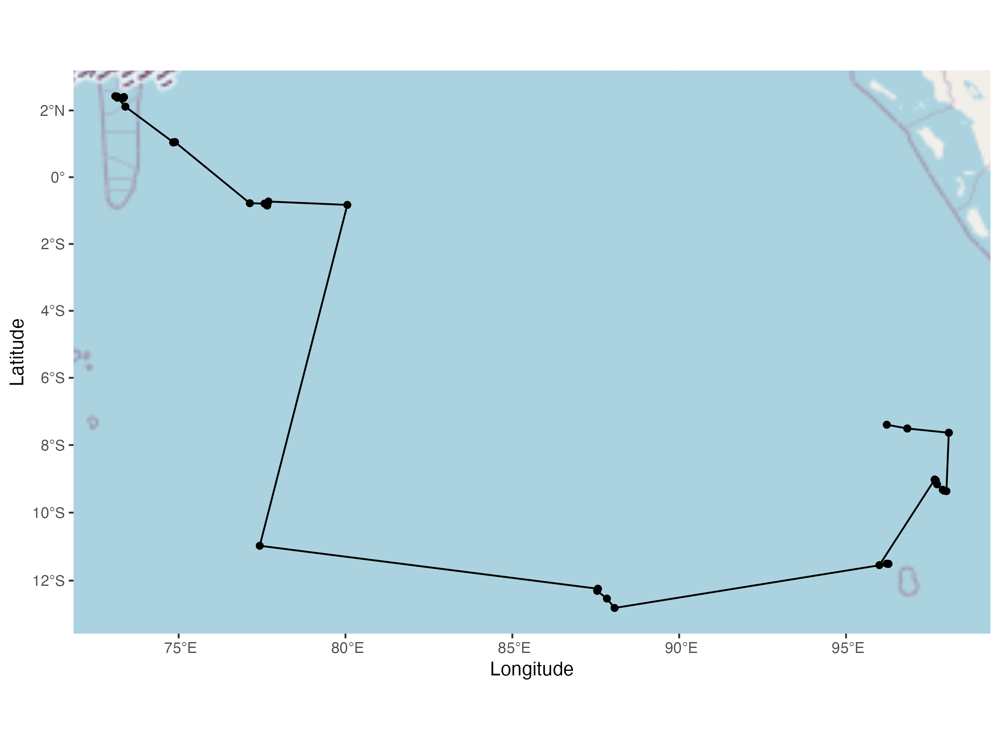

You will notice, you now have an extra folder in your working directory called 'rosm.cache'. This is the folder `ggspatial` uses to cache basemap images for your locations and zoom level. This reduces the number of times we have to download the basemap images if we are plotting the same map multiple times. Now lets explore other basemap options that may be useful for making professional looking plots:

<br>

***Carto basemap***
```{r, eval=FALSE}

ggplot() +
  annotation_map_tile(type = "cartolight", zoom = 8) +
  layer_spatial(data = M150_sf) +
  layer_spatial(data = M150_path) +
  labs(x = "Longitude", y = "Latitude")

```

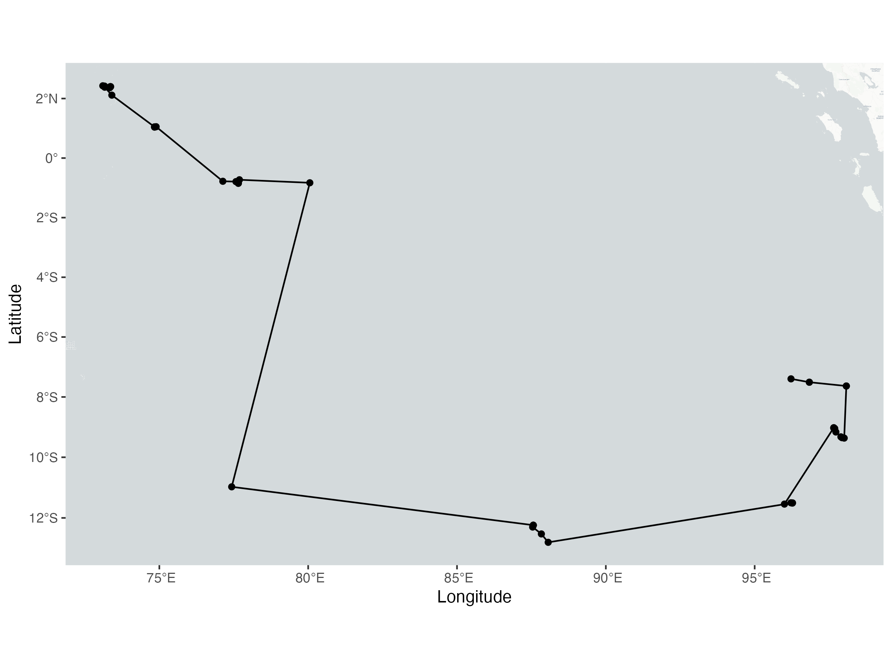

Cartolight is a grey marine basemap with societal land features such as city names and roads. Because our shark is in out in the Indian ocean, away from land, this basemap isn't as appropriate for this particular situation. But, it is an option! 

<br>

***Non-standard basemaps***

1. *ESRI Satellite imagery* 

```{r, eval=FALSE}

esri_sat <- paste0('https://services.arcgisonline.com/arcgis/rest/services/',
                   'World_Imagery/MapServer/tile/${z}/${y}/${x}.jpeg')

ggplot() +
  annotation_map_tile(type = esri_sat, zoom = 8) +
  layer_spatial(data = M150_sf, color = 'white')  +
  layer_spatial(data = M150_path, color = 'white') +
  labs(x = "Longitude", y = "Latitude")

```

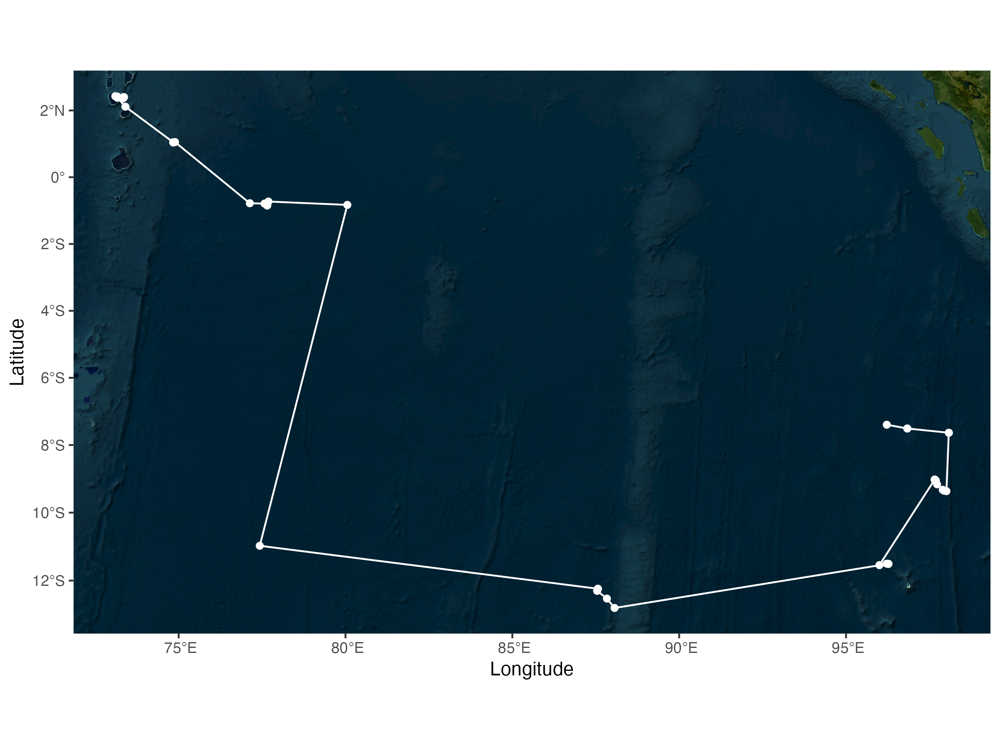

<br>

2. *ESRI topographical imagery* 

```{r, eval=FALSE}

esri_topo <- paste0('https://services.arcgisonline.com/arcgis/rest/services/',
                   'World_Topo_Map/MapServer/tile/${z}/${y}/${x}.jpeg')

ggplot() +
  annotation_map_tile(type = esri_topo, zoom = 8) +
  layer_spatial(data = M150_sf)  +
  layer_spatial(data = M150_path) +
  labs(x = "Longitude", y = "Latitude")

```

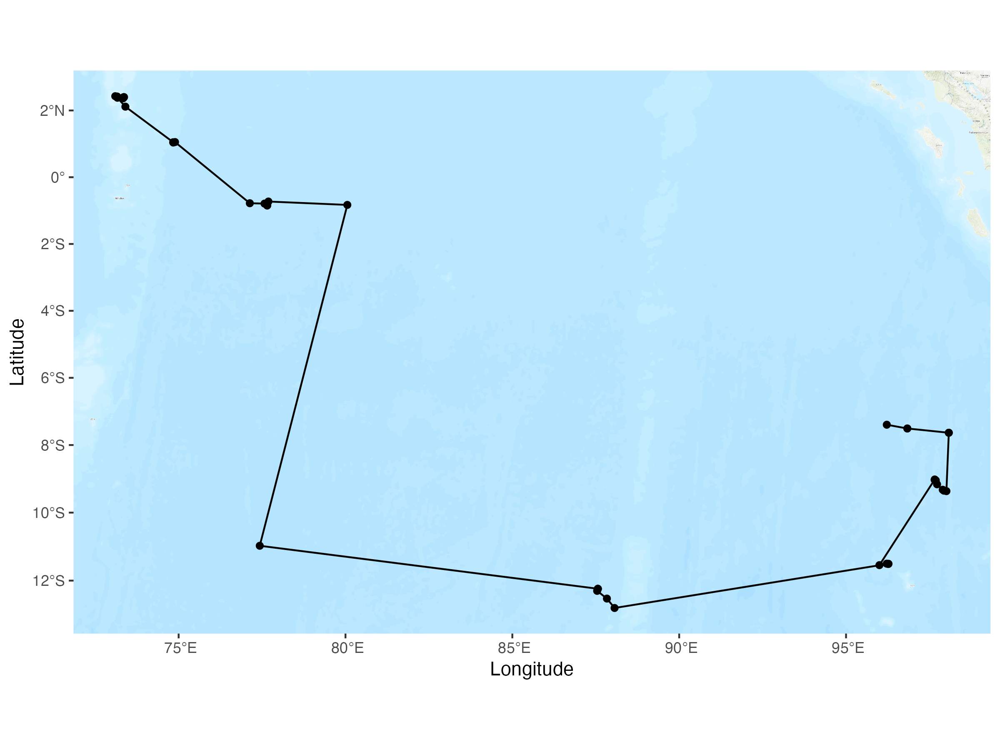

<br>

Just like in `gglot2` you can now add more layers to the map, and control the aesthetics of the layers in the same way. Lets add other features in the map like a scale bar using the `annotation_scale()` function. 

```{r, eval=FALSE}
ggplot() +
  annotation_map_tile(type = 'osm', zoom = 8) +
  layer_spatial(data = M150_sf) +
  layer_spatial(data = M150_path) +
  annotation_scale() +
  theme(legend.position = "bottom") +
  labs(x = "Longitude", y = "Latitude")

```

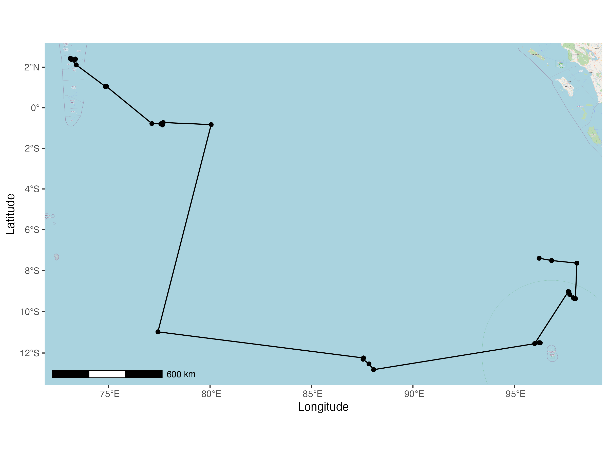

<br><br>

#### Six: Making dynamic maps using the `gganimate` package

------------------------------------------------------------------------------------------------------------------------------------------------------

We've explored creating static maps in **R** but for tracking data, it can be useful to create animated maps to visualise animal tracks in real time. 

The `gganimate` package works to animate your `ggplot2` creations, which is an especially helpful feature for visualising telemetry data by creating animations of animal movement over time. The `gganimate` package works alongside the ggplot2 package by adding layers to animate the created plot. 

* transition_*() defines how the data should be spread out and how it relates to itself across time.
* view_*() defines how the positional scales should change along the animation.
* shadow_*() defines how data from other points in time should be presented in the given point in time.
* enter_*()/exit_*() defines how new data should appear and how old data should disappear during the course of the animation.
* ease_aes() defines how different aesthetics should be eased during transitions.

More information on the gganimate package can be found [here](https://gganimate.com/). 

Load up the `gganimate()` package

```{r, message=FALSE}

library(gganimate)

```

Lets try to animate our path for whaleshark M-150 using the `transition_time()` function in `gganimate`. 

Using our mapping code from above...

```{r, eval=FALSE}

ggplot() +
  annotation_map_tile(type = esri_sat) +
  layer_spatial(data = M150_sf, color = 'white')  +
  layer_spatial(data = M150_path, color = 'red') + 
  annotation_scale(text_col = "white") +
  transition_time(DATETIME) +
  labs(x = "Longitude", y = "Latitude")

```

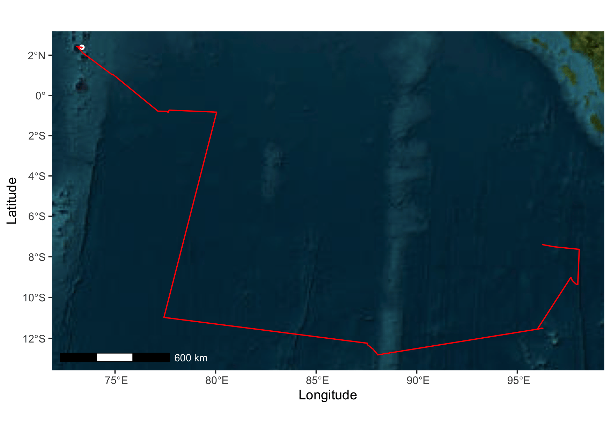

<br>

You'll notice that only the POINT data has animated, the PATH data is stagnant. This is because when we transformed our 'sf' object into a 'path' it preserves the entire path as one object. This makes using the `layer_spatial()` code really handy for visualising **static** maps, but less so for **dynamic** ones. 

We can solve this by using the `geom_spatial_*()` function from `ggplot2` instead of `layer_spatial`. In the below example, we provide `gganimate` with the point dataset and use the *transition_reveal function instead to animate both the POINT and PATH data. 

```{r, eval=FALSE}

ggplot() +
  annotation_map_tile(type = esri_sat) +
  geom_spatial_path(data = M150_sf, aes(x = LONGITUDE, y = LATITUDE), crs = 4326, color = 'white')  +
  geom_spatial_point(data = M150_sf, aes(x = LONGITUDE, y = LATITUDE), crs = 4326, color = 'red') +
  annotation_scale(text_col = "white") +
  transition_reveal(DATETIME) +
  labs(x = "Longitude", y = "Latitude")

```

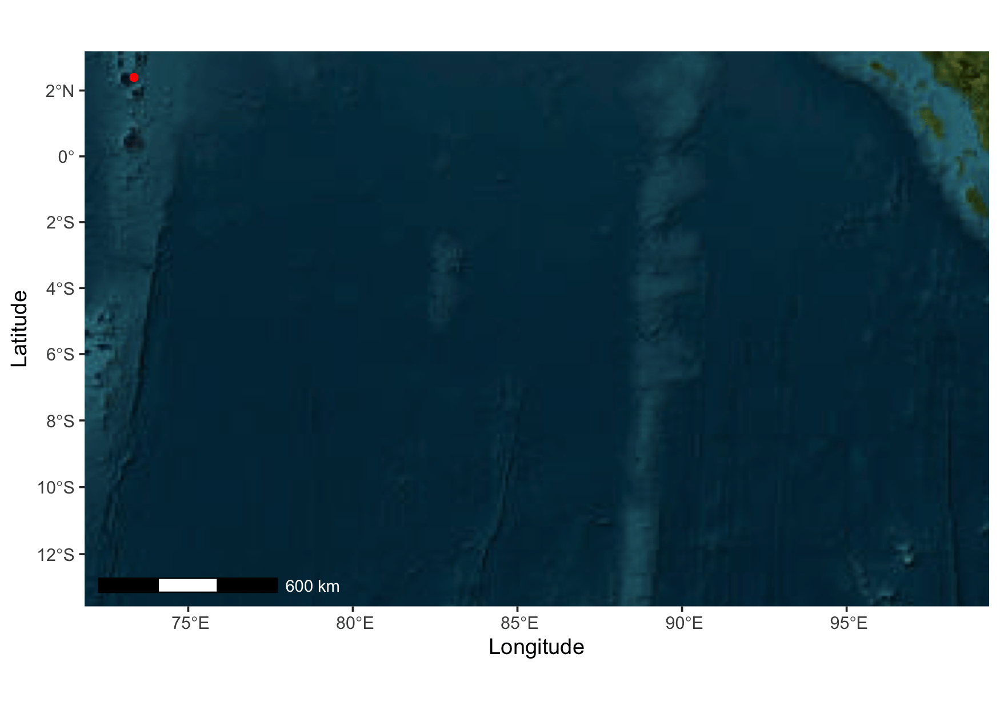

<br><br>

#### Seven: Using the Mapview package to create interactive maps 

------------------------------------------------------------------------------------------------------------------------------------------------------

The `mapview` package is a really simple way of creating interactive maps. 

First lets load up `mapview` package

```{r, message=FALSE, warning=FALSE}
library(mapview)

mapviewOptions(fgb = FALSE) 
```

<br>

<style>
div.blue { background-color:#e6f0ff; border-radius: 5px; padding: 20px;}
</style>
<div class = "blue">

***Fun fact:*** If set to TRUE, mapview uses a file format called flatgeobuf (fgb). FGB allows the resultant map to load faster because the html output doesn't contain the data directly, more so a snapshot of the data. This is super handy when working with large datasets! The trade off is that this optimization can sometimes leads to issues with mapping. If you're curious go ahead and try the following maps with 'fgb = TRUE' and 'fgb = FALSE' to see the difference for yourself! 

</div>

<br>

Next, let's use the `mapview` package to visualise the movements for all our sharks. 
```{r, message=FALSE, warning=FALSE, out.width='100%'}

whaleshark_paths <-
  whaleshark_sf %>% 
  arrange(DATETIME) %>% 
  group_by(ANIMALID) %>% 
  summarise(do_union = FALSE) %>%
  st_cast("LINESTRING")

mapview(whaleshark_sf, zcol = "ANIMALID")
mapview(whaleshark_paths)
  
```

<br>

Now let's use the `mapview` package to put the points and lines layers together into one interactive map!

Here we will use the burst parameter to enable subsetting and separately plot different subsets interactively. 
```{r, message=FALSE, warning=FALSE, out.width='100%'}
map1<-
  mapview(whaleshark_sf,
          zcol = "ANIMALID",
          burst = T,
          map.types = "Esri.WorldImagery",
          legend = F,
          homebutton = F,
          cex = 5) +
  mapview(whaleshark_paths,
          zcol = "ANIMALID",
          burst = T,
          legend = F,
          homebutton = F)

map1

```

If you have a closer look at our interactive map (map1), you’ll notice it has two components:
```{r, eval=FALSE}
map1@object
map1@map

```

<br>

The `map1@object` component houses all the raw spatial data that the interactive map plots, and the `map1@map` component has the actual map. We can use other functions from the `leaflet` package to make other adjustments to our @map component to make is easier to interact with. Here we will use the `addLayersControl()` function to modify how we can interact with the subsets of detection data:

```{r, message=FALSE, warning=FALSE, out.width='100%'}
library(leaflet)

map2 <- 
  map1@map %>%
    addLayersControl(
      baseGroups = unique(whaleshark_sf$ANIMALID), 
      options = layersControlOptions(collapsed = F)) %>%
  hideGroup(unique(whaleshark_sf$ANIMALID))

map2

```

<br>

We can then use the `mapshot()` function in the `mapview package` to save our interactive map as a html file or a png output. You can then share the html version of the output to collaborators, or upload them on websites for others to explore your data interactively.

```{r, eval=FALSE}
mapview::mapshot(map2, url = "Spatial_Interactive.html", remove_controls = NULL, selfcontained = TRUE)
```


<br>

------------------------------------------------------------------------------------------------------------------------------------------------------

<a href="#top" style="color:steelblue; font:bold;" >Back to top</a>

<br><br>


## Session 2 

### Using satellite telemetry data to define behaviours

|                                 |
|:--------------------------------|
|  |

<br>

In this session we will introduce you to the `aniMotum` package, a valuable tool for analysing animal movement data. In this session we will work with a 
small subset of fictionalized tracking data that closely mimic Whale sharks tracked in the Indian Ocean. The data 
consists of tracking data from six Whale Sharks (*Rhincodon typus*) tagged with ARGOS tags at the Thaa Atoll, the Maldives. The data shows the 
large oceanic dispersal these species conduct across the Indian Ocean. The data have been processed using a Least-Squares algorithm, and each position
has an estimated error expressed as an ARGOS location class. We will use this dataset to further refine positions, and predict positions at regular 
intervals, and calculate measures of movement to get some insight into the behaviours of two of the individuals individuals.


<br>

```{r, echo=FALSE, message=FALSE, include=TRUE, out.width = '100%'}
library(tidyverse)
library(sf)
library(mapview)
library(leaflet)
mapviewOptions(fgb=FALSE)

tagdat <- 
  read_csv('https://raw.githubusercontent.com/vinayudyawer/OCS2024_SDMworkshop/main/data/Whaleshark.csv') %>% 
  rename(DeployID = ANIMALID) %>% 
  st_as_sf(coords = c("LONGITUDE", "LATITUDE"), crs = 4326)

path <-
  tagdat %>% 
  group_by(DeployID) %>% 
  summarise(do_union = FALSE) %>% 
  st_cast("LINESTRING")

m_111 <-
  mapview(path %>% filter(DeployID %in% "M-111"), alpha = 1, color = "white", homebutton = F, legend = F, map.type = c("Esri.NatGeoWorldMap"), layer.name = "M-111") +
  mapview(tagdat %>% filter(DeployID %in% "M-111"), alpha.regions = 1, alpha = 0, col.regions = "white", homebutton = F, legend = F, cex = 3, layer.name = "M-111") +
  mapview(tagdat %>% filter(DeployID %in% "M-111") %>% slice(1), alpha.regions = 1, alpha = 0, col.regions = "darkgreen", homebutton = F, legend = F, layer.name = "M-111") +
  mapview(tagdat %>% filter(DeployID %in% "M-111") %>% slice(n()), alpha.regions = 1, alpha = 0, col.regions = "firebrick", homebutton = F, legend = F, layer.name = "M-111")

m_129 <-
  mapview(path %>% filter(DeployID %in% "M-129"), alpha = 1, color = "white", homebutton = F, legend = F, map.type = c("Esri.NatGeoWorldMap"), layer.name = "M-129") +
  mapview(tagdat %>% filter(DeployID %in% "M-129"), alpha.regions = 1, alpha = 0, col.regions = "white", homebutton = F, legend = F, cex = 3, layer.name = "M-129") +
  mapview(tagdat %>% filter(DeployID %in% "M-129") %>% slice(1), alpha.regions = 1, alpha = 0, col.regions = "darkgreen", homebutton = F, legend = F, layer.name = "M-129") +
  mapview(tagdat %>% filter(DeployID %in% "M-129") %>% slice(n()), alpha.regions = 1, alpha = 0, col.regions = "firebrick", homebutton = F, legend = F, layer.name = "M-129")

m_130 <-
  mapview(path %>% filter(DeployID %in% "M-130"), alpha = 1, color = "white", homebutton = F, legend = F, map.type = c("Esri.NatGeoWorldMap"), layer.name = "M-130") +
  mapview(tagdat %>% filter(DeployID %in% "M-130"), alpha.regions = 1, alpha = 0, col.regions = "white", homebutton = F, legend = F, cex = 3, layer.name = "M-130") +
  mapview(tagdat %>% filter(DeployID %in% "M-130") %>% slice(1), alpha.regions = 1, alpha = 0, col.regions = "darkgreen", homebutton = F, legend = F, layer.name = "M-130") +
  mapview(tagdat %>% filter(DeployID %in% "M-130") %>% slice(n()), alpha.regions = 1, alpha = 0, col.regions = "firebrick", homebutton = F, legend = F, layer.name = "M-130")

m_149 <-
  mapview(path %>% filter(DeployID %in% "M-149"), alpha = 1, color = "white", homebutton = F, legend = F, map.type = c("Esri.NatGeoWorldMap"), layer.name = "M-149") +
  mapview(tagdat %>% filter(DeployID %in% "M-149"), alpha.regions = 1, alpha = 0, col.regions = "white", homebutton = F, legend = F, cex = 3, layer.name = "M-149") +
  mapview(tagdat %>% filter(DeployID %in% "M-149") %>% slice(1), alpha.regions = 1, alpha = 0, col.regions = "darkgreen", homebutton = F, legend = F, layer.name = "M-149") +
  mapview(tagdat %>% filter(DeployID %in% "M-149") %>% slice(n()), alpha.regions = 1, alpha = 0, col.regions = "firebrick", homebutton = F, legend = F, layer.name = "M-149")

m_150 <-
  mapview(path %>% filter(DeployID %in% "M-150"), alpha = 1, color = "white", homebutton = F, legend = F, map.type = c("Esri.NatGeoWorldMap"), layer.name = "M-150") +
  mapview(tagdat %>% filter(DeployID %in% "M-150"), alpha.regions = 1, alpha = 0, col.regions = "white", homebutton = F, legend = F, cex = 3, layer.name = "M-150") +
  mapview(tagdat %>% filter(DeployID %in% "M-150") %>% slice(1), alpha.regions = 1, alpha = 0, col.regions = "darkgreen", homebutton = F, legend = F, layer.name = "M-150") +
  mapview(tagdat %>% filter(DeployID %in% "M-150") %>% slice(n()), alpha.regions = 1, alpha = 0, col.regions = "firebrick", homebutton = F, legend = F, layer.name = "M-150")

m_156 <-
  mapview(path %>% filter(DeployID %in% "M-156"), alpha = 1, color = "white", homebutton = F, legend = F, map.type = c("Esri.NatGeoWorldMap"), layer.name = "M-156") +
  mapview(tagdat %>% filter(DeployID %in% "M-156"), alpha.regions = 1, alpha = 0, col.regions = "white", homebutton = F, legend = F, cex = 3, layer.name = "M-156") +
  mapview(tagdat %>% filter(DeployID %in% "M-156") %>% slice(1), alpha.regions = 1, alpha = 0, col.regions = "darkgreen", homebutton = F, legend = F, layer.name = "M-156") +
  mapview(tagdat %>% filter(DeployID %in% "M-156") %>% slice(n()), alpha.regions = 1, alpha = 0, col.regions = "firebrick", homebutton = F, legend = F, layer.name = "M-156")
  
(m_111 + m_129 + m_130 + m_149 + m_150 + m_156)@map %>% 
  addLayersControl(
        # overlayGroups = c("Esri.NatGeoWorldMap","Esri.WorldImagery"),
        baseGroups = c("M-111", "M-129", "M-130", "M-149", "M-150", "M-156"),
        options = layersControlOptions(collapsed = FALSE))


```

<br>

::: {style="display: grid; grid-template-columns: 1fr 2fr; grid-column-gap: 60px;"}
<div>

We will use the [***aniMotum***](https://github.com/ianjonsen/aniMotum) package developed by Dr. Ian Jonsen. This package provides a quick and easy
means to refine positions by integrating the error associated with location data, and modelling the data to be able to predict locations at fixed
intervals. The package also provides a means to explore potential movement behaviours using the characteristics of the track. For more details on
the package you can explore the vignettes provided with the package, and also explore its applications in this [paper](https://doi.org/10.1111/2041-210X.14060).

<br>

The package has a clear workflow, and we can walk through the first 4 steps to process and visualise our data:

<br>

1. Modify our data to the expected input format

2. Choose and fit an appropriate state-space movement process model

3. Check our model fit

4. Visualise our model estimates

5. Simulate tracks

</div>

<div>


</div>
:::

<br><br>

#### Step 1: Input and format data 

------------------------------------------------------------------------------------------------------------------------------------------------------

<br>

##### Input data

Lets begin our data processing by first reading in the data, and formatting it so that the package can read it properly:

```{r, message=FALSE}

library(aniMotum)

raw_data <- read_csv('https://raw.githubusercontent.com/vinayudyawer/OCS2024_SDMworkshop/main/data/Whaleshark.csv')

head(raw_data)

```

aniMotum expects the data to be in a specific form. 'Argos Least-Squares and GPS data should have 5 columns in the following order: id, date, lc, lon, lat. Where date can be a POSIC object or a text string in YYYY-MM-DD HH:MM:SS format. If a text string is supplied then the time zone is assumed to be UTC. Location class can include the following values: 3, 2, 1, 0, A, B, Z, G, or GL. The latter two are for GPS locations and 'Generic Locations', respectively. Class Z values are assumed to have error variances 10x smaller than Argos class 3 variances, but unlike Argos error variances the GPS variances are the same for longitude and latitude.' (From Help viewer)

Argos Kalman filter data should have 8 columns, the above 5 plus smaj, smin, eor that contain Argos error ellipse variables (in m for smaj, smin and deg for eor)

<br>


##### Format the data 

```{r, message=FALSE}
# Using transmute from the Dplyr package 
tagdat <- raw_data %>%
  dplyr::transmute(id = ANIMALID,
              date = DATE, 
              lc= ARGOSCLASS,
              lon = LONGITUDE, 
              lat = LATITUDE)

# Using format_data from the aniMotum Package) 
tagdat2 <- format_data(
  raw_data,
  id = "ANIMALID",
  date = "DATE",
  lc = "ARGOSCLASS",
  coord = c("LONGITUDE", "LATITUDE")
)

head(tagdat)
```

<br>

Lets look at the quality of the data by investigating the ARGOS class 


```{r, message=FALSE, fig.align='center'}
tagdat %>% 
  group_by(id, lc) %>% 
  summarise(num_pos = n()) %>% 
  ggplot(aes(x = id, y = num_pos, fill = lc)) +
  geom_col(position = "fill") +
  labs(x = "Tag ID", y = "Proportion of fixes", fill = "Location\nClass") +
  theme_bw()
```

It looks like a large proportion of our data have low accuracy position estimates (Location Classes A and B). This is often the same in many tracking studies. At this stage, we can make a decision on if we want to subset our tracking data to only include certain Location Classes, to make sure our positional data are accurate. However another way to get more accurate positions and retain as much data as possible, is to model the data with the estimated error to predict more accurate positions.

<br><br>

#### Step 2: Choose and fit a movement model 

------------------------------------------------------------------------------------------------------------------------------------------------------

Lets try and retain as much data as we can and move onto the second step; choosing and fitting a movement model. This step allows us to model the data we have, and gives us the ability to then predict positions along the animals movement path to produce positions at fixed time periods. This becomes important when we want to calculate metrics of movements to help define movement behaviours. There are three main movement processes that `aniMotum` provides:

 
- ***Random Walk (RW) models*** - where movements between positions are modeled to be random in direction and magnitude.

- ***Correlated Random Walk (CRW) model*** - where movements between positions are modeled as random and correlated in direction and magnitude.

- ***Continuous-time Move Persistence (MP) model*** - where movements between positions are modeled as random with correlations in direction and magnitude that vary in time.


<br>


*"The MP approach is most appropriate for fitting to irregularly timed and error-prone Argos data as both aspects are taken into account explicitly".* (Johnson 2023)


You can explore the specifics of this package from the vignette [here](https://ianjonsen.github.io/aniMotum/articles/Overview.html).

For our data, we will use the Continuous-time move persistence model (‘mp’ option in the code). We can run this model by simply using the `fit_ssm()` function in aniMotum. The function requires some basic information on the dispersal ability of our study species. At the least, it asks for our estimate of swimming speed of our animal. Whale sharks are pretty slow swimming sharks and their average speed has been measured to be about 1.5 m/s. We can also use this function to predict positions at fixed time periods. Here lets predict two positions for each day of the tracking period (a position every 12 hours).

```{r, message=FALSE, warning=FALSE}
# Fitting a Continuous-time move persistence (MP) model to our data 
fit <-
  fit_ssm(x = tagdat, 
          vmax = 1.5, ## maximum speed of whale sharks (in m/s)
          model = "mp", ## Move persistence model
          time.step = 12, ## predict positions every 12 hours
          control = ssm_control(verbose = 0)) ## Lets turn off the progress text

fit

```
<br>

So if we take a look at the fit object, we can see that actually the model converged for all but two of our sharks (M-150 and M-156). From the model run, we also found models were having issues evaluating standard errors. This can be due to a pre-filter step `fit_ssm()` conducts. Models can often also not converge as our predicted time-steps are too close, and thus overfitting a model. Lets modify our code to try and get more of our animals to converge. So lets now run another model, but this time lets use a larger time-step of 48 hours and turn off the pre-filter step (using the 'spdf' parameter). 


```{r, message=FALSE, warning=FALSE}
fit2 <-
  fit_ssm(x = tagdat, 
          vmax = 1.5, ## maximum speed of whale sharks (in m/s)
          model = "mp", ## Move persistence model
          time.step = 48, ## predict positions every 24 hours
          spdf = FALSE, ## turn off the pre-filter step
          control = ssm_control(verbose = 0)) ## Lets turn off the progress text

fit2

```

<br>

This is a lot better! When predicting on a 48 hour time step with the pre-filter turned off, the models converged for all sharks. Let's focus on two sharks as an example, lets use M-150 and M-130. 

```{r, message=FALSE, warning=FALSE}
fit3 <- tagdat %>%
  dplyr::filter(id %in% c("M-150", "M-130")) %>%
  fit_ssm(vmax = 1.5, ## maximum speed of whale sharks (in m/s)
          model = "mp", ## Move persistence model
          time.step = 48, ## predict positions every 24 hours
          spdf = FALSE, ## turn off the pre-filter step
          control = ssm_control(verbose = 0)) ## Lets turn off the progress text

summary(fit3)

```

<br>

Lets visualize and explore the outputs of the model: 

```{r, message=FALSE, fig.align = 'center', fig.height = 3, fig.width = 10}
## Lets have a look at the fitted component of the model 
## (original data, corrected by including positional error)

plot(fit3, 
     what = "fitted", ## what component of the model to plot ('fitted', 'predicted' or 'rerouted')
     type = 2, ## type of plot to make
     pages = 1, 
     ncol = 2)
```
In the above plots, the blue are the original positions, the yellow are where the model has 'corrected' positions, and the black 'x's are outliers identified by the model. 

<br><br>


#### Step 3: Check model fit 

------------------------------------------------------------------------------------------------------------------------------------------------------

<br>

Next we can look at the predicted component of the model and see how well the model fit the data. We can use the `osar()` function for this: 


```{r, eval=FALSE}

resid <- osar(fit3)

## Lets check our model fit for both tracks
plot(resid, type = "qq")
plot(resid, type = "acf")

```


<br>

We can also look at how closely the predicted positions compare to the ‘corrected’ fitted positions. This is often the best way to ascertain if the model you produced is a good fit. You can play around with the model parameters (e.g., vmax) to make sure the model represents the biology of the animal you are tracking

```{r, message=FALSE, fig.align = 'center', fig.height = 3, fig.width = 10}
plot(fit3, 
     what = "predicted", 
     type = 2,
     pages = 1,
     ncol = 2)

```

<br><br>

#### Step 4: Visualize move persistence estimates

------------------------------------------------------------------------------------------------------------------------------------------------------

<br>

##### What is 'move persistence'? 

Move persistence is an index of movement behaviour and is a continuous value between 0-1. The value represents changes in movement pattern for that individual based on autocorrelation in speed and direction (see details [here](https://esajournals.onlinelibrary.wiley.com/doi/10.1002/ecy.2566)). We can look at the patterns in this metric for each tracked individual spatially and over the tracking period. Lower move persistence values are related to slower movements that are often associated with 'area restricted searching behaviours' often associated with foraging, with higher move persistence values representing more linear movements that are associated with migratory behaviours. 
Since we ran the 'mp' model, we now have values of move persistence for each predicted location and can explore a bit more into our animal's movement behaviours. 


```{r, message=FALSE, fig.align = 'center', fig.height = 3, fig.width = 10, fig.show='hold'}
plot(fit3,
     what = "predicted",
     type = 3,
     pages = 1,
     ncol = 2,
     normalise = TRUE)

plot(fit3,
     what = "predicted",
     type = 4,
     pages = 1,
     ncol = 2,
     normalise = TRUE)

```

We can use the `grab()` function to extract specific components of the model output to have a closer look at them, or produce our own maps using previously covered packages (eg., `ggspatial` or `mapview`). The `grab()` function also allows users to extract the positional data as a sf object and makes it so easy to plot them using other packages! 


```{r, message=FALSE}
# Lets plot our own version of the predicted component using mapview
pred_data <- grab(fit3,
                  what = "predicted",
                  normalise = TRUE)

# Lets convert this data frame into a point dataset using `sf`
library(sf)

pred_sf <-
  pred_data %>% 
  st_as_sf(coords = c("lon", "lat"), crs = 4326, remove = F)

# Lets convert the point dataset into a path

pred_path <- 
  pred_sf %>%
  group_by(id) %>%
  summarise(do_union = FALSE) %>%
  st_cast("LINESTRING")

```

<br><br>

##### ***Animate the tracks using gganimate!*** 

We can use the knowledge we acquired in session one to animate the modeled tracks
```{r, eval=FALSE}
library(ggspatial)
library(gganimate)

## NOTE: the creation of the animation can take a long time!

esri_sat <- paste0('https://services.arcgisonline.com/arcgis/rest/services/',
                   'World_Imagery/MapServer/tile/${z}/${y}/${x}.jpeg')
track <- 
  ggplot() +
  annotation_map_tile(type = esri_sat) +
  geom_spatial_path(data = pred_data, aes(x = lon, y = lat, group = id), col = "white", crs = 4326) + 
  geom_spatial_point(data = pred_data, aes(x = lon, y = lat, group = id, col = id), crs = 4326) +
  labs(title = 'Date: {as.Date(frame_along)}', x = 'Longitude', y = 'Latitude') +
  annotation_scale(text_col = "white") +
  transition_reveal(date)

anim <- animate(track, width = 7, height = 5, units = "in", res = 250, nframes = 250, fps = 50,
                render = gifski_renderer(loop = FALSE))

save_animation(animation = anim, file = "~/Desktop/session2_anim.gif")

```


<br><br>

Now lets use our lovely `mapview` and `leaflet` knowledge from session one to plot a nice, interactive plot of move persistence data! 

```{r, message=FALSE, out.width = '100%'}
library(leaflet)
library(mapview)
mapview::mapviewOptions(fgb = FALSE)

color_palette <- colorRampPalette(hcl.colors(10, palette = "Reds 3"))

m_130 <-
  mapview(pred_path %>% filter(id %in% "M-130"), alpha = 1, color = "white", homebutton = F, 
          legend = F, map.type = c("Esri.WorldImagery"), layer.name = "M-130") +
  mapview(pred_sf %>% filter(id %in% "M-130"), alpha.regions = 1, alpha = 0, zcol = "g",
          homebutton = F, legend = F, cex = 3, layer.name = "M-130", col.regions = color_palette(93)) +
  mapview(pred_sf %>% filter(id %in% "M-130") %>% slice(1), alpha.regions = 1, alpha = 0,
          col.regions = "darkgreen", homebutton = F, legend = F, layer.name = "M-130") +
  mapview(pred_sf %>% filter(id %in% "M-130") %>% slice(n()), alpha.regions = 1, alpha = 0,
          col.regions = "firebrick", homebutton = F, legend = F, layer.name = "M-130")

m_150 <-
  mapview(pred_path %>% filter(id %in% "M-150"), alpha = 1, color = "white", homebutton = F, 
          legend = F, map.type = c("Esri.WorldImagery"), layer.name = "M-150") +
  mapview(pred_sf %>% filter(id %in% "M-150"), alpha.regions = 1, alpha = 0, zcol = "g",
          homebutton = F, legend = F, cex = 3, layer.name = "M-150", col.regions = color_palette(54)) +
  mapview(pred_sf %>% filter(id %in% "M-150") %>% slice(1), alpha.regions = 1, alpha = 0,
          col.regions = "darkgreen", homebutton = F, legend = F, layer.name = "M-150") +
  mapview(pred_sf %>% filter(id %in% "M-150") %>% slice(n()), alpha.regions = 1, alpha = 0,
          col.regions = "firebrick", homebutton = F, legend = F, layer.name = "M-150")

mm <- 
(m_130 + m_150)@map %>% 
  addLayersControl(
        baseGroups = c("M-130", "M-150"),
        options = layersControlOptions(collapsed = FALSE)) %>% 
  addLegend(colors = color_palette(11), 
            labels = round(seq(0, 1, by = 0.1), 2),
            title = "g", opacity = 1)

mm
```

<br><br>

#### Step 5: Simulated tracks

------------------------------------------------------------------------------------------------------------------------------------------------------

<br>

The `aniMotum` package also allows users to use your fitted model to simulate similar tracks, which is useful if you want to compare your animal's track with other 'null' models. This allows for further hypothesis testing and analyses like resource selection functions. Here, we will use the `sim_fit()` function to simulate 'null' tracks for all our animals using model outputs from our tracks. Lets start with the raw data again to build our state-space model.

When fitting a state-space model to build simulation data, the `sim_fit()` function cannot handle 'move persistance' models (like the ones we built above). So lets build a simpler model using the 'Correlated Random Walk' (crw) algorithm. We will model it to predict one position per day to provide sufficient data to build Species Distribution Models in the next session.  


```{r, eval=FALSE}
## Lets use the tagdat dataframe to build our whaleshark crw model

whaleshark_fit <-
  fit_ssm(x = tagdat, 
          vmax = 1.5, ## maximum speed of whale sharks (in m/s)
          model = "crw", ## Move persistence model
          time.step = 24, ## predict positions every 24 hours
          spdf = FALSE) ## turn off the pre-filter step

  
null_fit <- 
  sim_fit(whaleshark_fit, ## the ssm model we want to base our null models on
          what = "predicted", ## component of the model to use
          reps = 20) ## number of replicated simulations per animal

plot(null_fit, ncol = 3)

```


<br>

Now if you have a look at the simulated tracks, it looks like the simulations go onto land, which isn't all that accurate for Whalesharks. The `aniMotum` package has a way to take this into account. The simulation function can take into account land masses to constrain the tracks from going onto land. We need to run a few extra steps first (check out [this vignette](https://ianjonsen.github.io/aniMotum/articles/Track_simulation.html#simulate-tracks-with-a-potential-function-to-help-avoid-land) to learn more about this feature):


```{r, eval=FALSE}

## load a rasterised file that provides information on the gradient of landmasses
library(terra)

load(system.file("extdata/grad.rda", package = "aniMotum"))
grad <- terra::unwrap(grad)

## Now lets rerun the simulation including the gradient object

null_fit2 <- 
  sim_fit(whaleshark_fit, 
          what = "predicted", 
          reps = 20, 
          grad = grad, 
          beta = c(-300,-300))

plot(null_fit2, ncol = 3)

```


<br>

Now that we have fixed the simulations from going on land, we can further refine the simulations to pick the ones that are most like the data the simulations are built from. When simulating a large number of replicate tracks using sim_fit, some portion of the simulations may reflect unrealistic movement patterns due to the relatively unconstrained nature of the simulation. A simple approach for identifying and removing less realistic simulated tracks is to use a similarity filter. We can use the `sim_filter()` function to filter out simulated tracks based on comparison with the spatial extent of original track.

```{r, eval=FALSE}

## Lets filter out the top 50% of tracks that are spatially similar to our original track

null_fit2_filtered <- 
  sim_filter(null_fit2, ## null simulation to filter
             keep = 0.5, ## proportion of tracks to keep
             var = c("lon", "lat"), ## variables to compare with original track
             FUN = "mean") ## filter to use a mean value of the above variables

plot(null_fit2_filtered, ncol = 3)
```


<br>

```{r, eval=FALSE}
## We can then finally extract all the tracks as a data.frame and save it as a .csv file

null_dat <- 
  null_fit2_filtered %>% 
  unnest(cols = sims)

write_csv(null_dat, "null_data.csv")

```


<br>

------------------------------------------------------------------------------------------------------------------------------------------------------

<a href="#top" style="color:steelblue; font:bold;" >Back to top</a>

<br><br>


## Session 3

### Basics of Species Distribution Models (SDMs)

|                                 |
|:--------------------------------|
|  |

<br>

Species distribution models are instrumental in predicting and understanding the geographic ranges of species. In this session, we will delve into the
use of `dismo`, `mgcv` and `randomForest` R packages, covering the basics of species distribution modelling. This will be a quick run-though over the theory and 
workflow of how to construct SDMs using observational data, and useful resources to help you along the way. Participants will learn how to construct
predictive models and assess habitat suitability for species.

<br>

#### Theory and Concept

------------------------------------------------------------------------------------------------------------------------------------------------------

Species Distribution Models (SDMs) are fundamental tools in ecology and conservation biology, aiming to understand and predict the spatial
distribution of species based on environmental variables. At its core, SDMs are grounded in the ecological niche theory, which suggests that species
occupy specific ecological niches characterised by environmental conditions such as temperature, water quality, and habitat features. By quantifying
the relationship between species occurrence records and environmental variables through statistical modeling techniques, SDMs provide insights into
the ecological requirements and habitat preferences of species.

<br><br>


<br><br>

These models typically utilise various algorithms, including MaxEnt, Random Forest, and Generalized Linear Models, to predict species distributions
across geographic areas. We will quickly go through an example dataset, and how different model structures and algorithm can drastically change your
predicted distribution. SDMs have diverse applications, from assessing the potential impacts of climate change on species distributions to informing
conservation planning and management strategies. However, they also come with limitations and uncertainties, including data quality issues,
assumptions about species-environment relationships, and challenges in extrapolating predictions to novel environmental conditions. Continuous
refinement and integration of multiple data sources and modeling approaches are essential for improving the accuracy and reliability of SDMs, thereby
enhancing their utility in addressing pressing ecological and conservation challenges. In this session, we will run though a quick example of how SDMs
are created in R, and the complexities of their development and interpretation.


Here we will provide a quick tour of SDMs, but if you want a more in-depth look at what goes into building and refining a SDM, check out some of these 
online sources ([SDM Intro](https://damariszurell.github.io/SDM-Intro/), [terra vignette](https://rspatial.org/raster/sdm/) and [Ecocommons](https://support.ecocommons.org.au/support/solutions/folders/6000240802/page/1?url_locale=)). There is also a wealth of literature on the subject
that you can refer to, including [this curated list](https://doi.org/10.1016/j.ecolmodel.2022.110242) of R packages that you can use to explore these analyses.


In this session we will use occurrence data on Oceanic Whitetip Sharks (*Carcharhinus longimanus*) from the Indian Ocean to model their distribution
using five commonly used SDM algorithms. We will also finally quickly introduce a simple ensemble model workflow to show how you can integrate outputs
from multiple algorithms to get better predictions of distribution. 

***We have provided code to replicate the analysis and plotting, but as we will have***
***limited time during this session, we dont expect everyone to run these code. You can run them on your own time to see how it works!***

<br><br>


#### Basic steps of building SDMs

------------------------------------------------------------------------------------------------------------------------------------------------------

Building a SDM is an iterative process, and typically involves several steps. The paper [Zurell et al. 2020](https://doi.org/10.1111/ecog.04960) provides a
comprehensive step by step run through of a standard protocol on how to develop SDMs and how to report them in papers to allow for reproducibility. 
Here's a quick overview:

<br><br>


<br><br>


***Overview/Conceptualisation -*** One of the key steps in developing SDMs is first conceptualising the objectives, available data, and the relevance of SDMs
for your research question. This includes understanding if SDMs are going to tell you what you need to answer your hypothesis. Similarly, if you do not have 
access to relevant data, then the outputs of SDMs may not be useful (the old GIGO adage: garbage in, gargabe out!). In this step, it is worth 
overviewing and conceptialising the objectives of the modelling excercise, and asscertain if this model is relevant for the taxon, location,
spatial and temporal scale of your study system.

<br>


***Data Collection, preperation and exploration -*** The next step we gather occurrence data for the species of interest (e.g., presence-only or 
presence-absence data) and environmental variables (e.g., temperature, bathymetry) that may be biologically relevant for the study area and the 
species of interest. Organise and clean the data, ensuring that it's in a suitable format for analysis. This may involve handling missing values, 
converting data types, and standardizing units. Explore the relationships between species occurrence and environmental variables using visualization
techniques such as scatter plots, histograms, 
and correlation matrices.

<br>


***Model selection, fitting and training -*** We then choose an appropriate modeling technique for your data. Common SDM algorithms in R include MaxEnt 
(using the `dismo` package), Generalized Linear Models (GLMs) or Generalized Additive Models (GAMs) (using the `mgcv` package), and Random Forest 
(using the `randomForest` package). We then split the data into training and testing sets needed to evaluate model performance further down the track. 
We finally fit the chosen model using the training data. We will cover some of these techincal steps later in this session.

<br>


***Model assessment and exploration -*** Once models have been fit, we assess the performance of the model using evaluation metrics such as Area Under 
the Receiver Operating Characteristic Curve (AUC-ROC), Area Under the Precision-Recall Curve (AUC), or True Skill Statistic (TSS). We also explore the 
response curves for the model to identify how each explanatory predictor impacts the probability of presence of your species. Response curves and variable
importance plots can tell you if the predictor variables used are relevant, or having any influence on the model.

<br>


***Model prediction and visualisation -*** Once the model is trained and evaluated, use it to predict species distributions across the study area based 
on environmental variables. Visualize the predicted species distribution map using mapping packages like `terra` or `ggplot2`, along with additional spatial
data if necessary. Validate the predicted distributions against the testing subset of data, independent occurrence data or expert knowledge to verify the 
accuracy and reliability of the model. 

<br>


***Refinement and Iteration -*** Refinement is key in SDMs, and you can often go through 10s of iterations before you have a properly fitted model that 
provides accurate estimates of species presence and response curves. Iterate through the modeling process, refining the model and incorporating additional
data or variables as needed to improve accuracy and robustness.


<br><br>

#### Data preperation                                       

------------------------------------------------------------------------------------------------------------------------------------------------------

Here we will go through a quick workflow in R to enable a ***very simple*** SDM, from sourcing occurrence data all the way to building ensemble models. 
Note, this is an overly simplistic example just to get everyone up to speed on how SDMs operate using occurrence data. We will go through how this modelling
workflow can be modified to use movement data to inform distribution models in the next session.

<br>

##### ***Occurrence data***

Occurrence data used for SDMs typically include records of species presence or presence-absence across geographic locations. These data can be obtained from 
various sources, including published literature, museum collections, citizen science projects, and online databases. In R, there are several packages and 
resources available for accessing occurrence data:


- [***GBIF***](https://www.gbif.org) (Global Biodiversity Information Facility): The [`rgbif` package](https://docs.ropensci.org/rgbif/articles/rgbif.html) allows 
you to search and download occurrence records from the GBIF database directly within R.
- [***rvertnet***](https://github.com/ropensci/rvertnet): This package provides access to occurrence data from multiple vertebrate-focused biodiversity data networks,
including VertNet, MaNIS, and ORNIS.
- [***spocc***](https://github.com/ropensci/spocc): This package provides a unified interface to several online species occurrence data sources, including GBIF, 
iNaturalist, and eBird.
- [***ALA***](https://www.ala.org.au) (Atlas of Living Australia): The [`galah`](https://github.com/AtlasOfLivingAustralia/galah-R) package allows you to access 
species occurrence data from the ALA database.
- ***Data repositories***: Many research papers provide access to their occurrence data through online repositories such as [Dryad](https://datadryad.org/stash)
or [Figshare](https://figshare.com). You can download these datasets directly or use APIs if available.


Once you have obtained the occurrence data, you can import it into R using the functions we discussed in Session 1, or specific functions provided by the packages 
mentioned above. Be sure to clean and preprocess the data as needed before using it in your SDM analysis. Here we have accessed some example data on Oceanic Whitetip
Sharks (*Carcharhinus longimanus*) in the Indian Ocean from [GBIF](https://www.gbif.org), and using the code from Session 1 have plotted it using `ggspatial`.

<br>


```{r, eval=TRUE, message=FALSE, warning=FALSE}
## Lets first load some useful packages
library(tidyverse)
library(sf)
library(terra)
library(raster)
library(ggspatial)
library(dismo)
library(stats)
library(randomForest)
library(mgcv)
library(visreg)


```


```{r, eval=FALSE}
## We can call on the data from the workshop GitHub page directly

occ <- read_csv("https://raw.githubusercontent.com/vinayudyawer/OCS2024_SDMworkshop/main/data/session_3/Oceanic%20whitetip%20occ.csv")

occ_vect <-
  occ %>% 
  st_as_sf(coords = c("lon", "lat"), crs = 4326, remove = F) %>% 
  vect()

ggplot() + 
  annotation_map_tile('cartolight', zoom = 4) +
  layer_spatial(occ_vect, color = "black") +
  annotation_scale(width_hint = 0.2, location = "br") +
  theme_void()


```


<br>

##### ***Absence or Pseudo-absence data***

Now that we have occurrence data, we need data used to represent locations where a species is presumed to be absent. These data points serve as a contrast to presence
data and are essential for modeling the species' distribution accurately. If we have quantitative data of confirmed absences (i.e., we know for sure this species is 
not found here!), this is very valuable for SDM modelling. However, in most real-world cases, this kind of information is not available. In which case, we use 'presumed'
absence data known as 'pseudo'-absences. Pseudo-absence data are generated using various techniques such as random sampling from areas where the species has not been 
observed, environmental similarity methods, or background sampling from the study area.

In R, generating pseudo-absence data can be done using functions like `randomPoints()` from the `dismo` package or 'st_sample()' function from the `sf` package. Additionally,
some SDM packages in R, such as `dismo`, `biomod2`, and `MaxEnt`, include built-in functions for generating pseudo-absence data as part of their modeling workflow.

It's important to note that the selection and quality of pseudo-absence data can significantly impact model performance and interpretation. Careful consideration should be 
given to the method used for generating pseudo-absences to ensure they adequately represent areas where the species is genuinely absent while minimizing sampling bias.

<br>

```{r, eval=FALSE}
## Lets define our model extent to within our occurrence data
model_extent <- st_read("https://raw.githubusercontent.com/vinayudyawer/OCS2024_SDMworkshop/main/data/session_3/mod_ext.GeoJSON")

## upload pseudo absence points from the GitHub page
pseudo_vect <- 
  read_csv("https://raw.githubusercontent.com/vinayudyawer/OCS2024_SDMworkshop/main/data/session_3/Oceanic%20whitetip%20peudo_absence.csv") %>% 
  st_as_sf(coords = c("lon", "lat"), crs = 4326, remove = F) %>% 
  vect()


ggplot() + 
  annotation_map_tile('cartolight', zoom = 4) +
  layer_spatial(pseudo_vect, color = "red", alpha = 0.3) +
  layer_spatial(occ_vect, color = "black") +
  layer_spatial(model_extent, fill = NA, col = "black", lwd = 0.5) +
  annotation_scale(width_hint = 0.2, location = "br") +
  theme_void()


```


<br>

##### ***Environmental predictors***

The final component required to run a basic SDM is the model predictors. When developing SDMs, model predictors take the format of rasterised gridded data. These datasets
include climate variables (e.g., temperature, current, wind), biological variables (e.g., primary productivity, prey density) or habitat characteristics
(e.g., habitat type, slope, bathymetry). Now when developing large scale models like we are doing here, using remote sensing datasets provide a great way to include ecologically
and biologically relevant predictor variables that can inform the probability of presence of the target species. When choosing and processing environmental predictor variables
for SDMs, several steps are essential:


- ***Selection of predictors -*** Identify variables that are likely to influence the distribution of hte species of interest.
- ***Data acquisition -*** Obtain spatial datasets for the selected predictors. There are several online data sources where this data can be obtained from. The two most useful
sources are from the [**MARSPEC**](http://marspec.weebly.com) dataset, and the [**Bio-ORACLE**](https://bio-oracle.org) dataset. These datasets can be accessed either through 
each of the dataset websites linked here, or can be directly accessed and downloaded through R using the [`sdmpredictors`](https://cran.r-project.org/web/packages/sdmpredictors/vignettes/quickstart.html) package.
- ***Data preprocessing -*** Preprocess the environmental predictor data to ensure consistency and compatibility with the species occurrence data. This may involve resampling 
or reprojecting datasets to a common spatial resolution and coordinate system, masking out irrelevant areas (e.g., land), and handling missing or erroneous values. This can be
done easily in R using the `sf` and `terra` packages.
- ***Variable reduction -*** Assess multicollinearity among predictors and consider reducing the number of variables to avoid overfitting and improve model interpretability. 
Techniques such as principal component analysis (PCA), variable clustering, or expert knowledge can aid in identifying redundant variables.
- ***Biological relevance -*** Consider the biological relevance of predictors to the species being modeled. Exclude variables that are not ecologically meaningful or are known 
to have little influence on the species distribution.
- ***Variable transformation -*** Transform predictors if necessary to meet model assumptions or improve model fit. Common transformations include logarithmic or square root 
transformations for skewed variables or standardization to a common scale.
- ***Variable correlation -*** Examine pairwise correlations among predictors to ensure they are not overly correlated, as this can lead to unstable model estimates. Consider 
removing highly correlated variables or using regularization techniques to mitigate collinearity effects.


Here we have accessed four environmental variables from the [Bio-ORACLE](https://bio-oracle.org) dataset, including **bathymetry**, **current velocity**, **mixed layer depth** and 
**sea surface temperature**. We have selected just four variables to simplify this excersise, but keep in mind you will need to have a closer look at variables when modelling your
own SDM to make sure the variables are ecologically relevant to your species. Similarly, conducting pairwise correlations should be conducted to make sure environmental variables
are not overly correlated, which will influence model outputs.


```{r, eval=FALSE}
## Lets download the example environmental variables and plot them
env_stack <- rast("https://raw.githubusercontent.com/vinayudyawer/OCS2024_SDMworkshop/main/data/session_3/env_layers.tif")

plot(env_stack)

```


<br><br>


#### Model fitting {.tabset .tabset-fade .tabset-pills}

------------------------------------------------------------------------------------------------------------------------------------------------------

Now that we have all our basic components to build a SDM, lets have a look at some of the algorithms commonly used to build distribution models. Here
we will use the occurrence, pseudo-absence and environmental data to build four types of models. For each algorithm we will build the model, explore
the model responses, evaluate the model accurracy, and finally predict a spatial probability of presence to define the species' distribution. Before we
get started, lets first format our model data and develop a training and testing dataset to allow model evaluation.


```{r, eval=FALSE}
## Lets extract environmental variables associated with all the occurrence and pseudo-absence data

# occurrence data extraction
ext_occ <- 
  extract(env_stack, occ_vect) %>% 
  mutate(pa = 1, 
         lat = occ_vect$lat, 
         lon = occ_vect$lon, 
         kfold = kfold(ext_occ, 5),
         test_train = ifelse(kfold == 1, "test", "train"))

# pseudo-absence data extraction
ext_pseudo <- 
  extract(env_stack, pseudo_vect) %>% 
  mutate(pa = 0, 
         lat = pseudo_vect$lat, 
         lon = pseudo_vect$lon, 
         kfold = kfold(ext_pseudo, 5),
         test_train = ifelse(kfold == 1, "test", "train"))

# put together the dataset and configure them to build models
model_data <- 
  bind_rows(ext_occ, ext_pseudo) %>% 
  as_tibble() %>% 
  transmute(pa = factor(pa), lon, lat, bathymetry, current_velocity, 
            mixed_layer_depth, temperature, test_train) %>% 
  na.omit()

```
```{r, echo=FALSE, eval=TRUE, message=FALSE, warning=FALSE, error=FALSE}
model_data <- 
  read_csv("https://raw.githubusercontent.com/vinayudyawer/OCS2024_SDMworkshop/main/data/session_3/model_data.csv") %>% 
  na.omit() %>% 
  mutate(pa = factor(pa))
env_stack <- rast("https://raw.githubusercontent.com/vinayudyawer/OCS2024_SDMworkshop/main/data/session_3/env_layers.tif")
```
```{r}

## Now we can partition our data into 'training' datasets (to model) 
## and 'testing' datasets (to evaluate models)

training_data <- 
  model_data %>% 
  filter(test_train %in% "train")

test_presence <- 
  model_data %>% 
  filter(test_train %in% "test") %>% 
  filter(pa %in% 1) %>% 
  st_as_sf(coords = c("lon", "lat"), crs = 4326) %>% 
  as_Spatial()

test_absence <-
  model_data %>% 
  filter(test_train %in% "test") %>% 
  filter(pa %in% 0) %>% 
  st_as_sf(coords = c("lon", "lat"), crs = 4326) %>% 
  as_Spatial()


```

<br>

**Click through the below buttons to have a look at how each model is built and evaluated:**

<a id="session_3"></a>

------------------------------------------------------------------------------------------------------------------------------------------------------

##### Linear models

<style>
div.blue { background-color:#e6f0ff; border-radius: 5px; padding: 20px;}
</style>
<div class = "blue">


Linear models are a versatile way to explore relatively simplistic relationships between occurrence and environmental data. Here we will use a Generalised
Linear Model (GLM) to build our first SDM using the `stats` package. 


```{r}
## Build GLM model
glm_mod <- glm(pa ~ bathymetry + current_velocity + mixed_layer_depth + temperature, 
               data = training_data, family = binomial(link = "logit"))


summary(glm_mod)


```


We can now use the `visreg` package to look at the response curves of this model:

```{r, eval=FALSE}
visreg(glm_mod, scale = "response", gg = TRUE)


```


We can also look at how two variables may interact with each other in the model:

```{r, eval=FALSE}
visreg2d(glm_mod, xvar = "bathymetry", yvar = "temperature", plot.type = "persp", scale = "response",
         xlab = "Bathymetry (m)", ylab = "Sea Surface Temparature (˚C)", zlab = "Probability of presence",
         theta = 145, phi = 15, zlim = c(0,1))

```


We can now evaluate the model by quantifying false positive and true positive rates using the 'testing' dataset

```{r, eval=FALSE}
## using the evaluate() function in the `dismo` package
glm_eval <- evaluate(p = test_presence, a = test_absence, model = glm_mod)

plot(glm_eval, "ROC", type = "l")

```


And finally we can use the model to predict the distribution using the 'predict()' function in the `terra` package:


```{r, eval=FALSE}
## We can predict and plot the model response (continuous value between 0 and 1)
glm_predict <- terra::predict(env_stack, glm_mod, type = "response")

plot(glm_predict)

## We can now threshold the output to a map identifying the species distribution
# we need to first predict the model 'link' function
glm_link <- terra::predict(env_stack, glm_mod, type = "link")

# define the threshold using the evaluation metrics estimated earlier
glm_threshold <- threshold(glm_eval, stat = 'spec_sens')

plot(glm_link > glm_threshold)

```


<br>

</div>

<br>

------------------------------------------------------------------------------------------------------------------------------------------------------

[Explore the other models](#session_3)

<br><br>

##### Non-linear models             

<style>
div.blue { background-color:#e6f0ff; border-radius: 5px; padding: 20px;}
</style>
<div class = "blue">


Non-linear models fit more complex relationships between occurrence and environmental data, and the model often fits the data better. 
Here we will use a Generalised Additive Model (GAM) to build this SDM using the `mgcv` package. 


```{r}
## Build GAM model
gam_mod <- gam(pa ~ s(bathymetry) + s(current_velocity) + s(mixed_layer_depth) + s(temperature),
               data = training_data, family = binomial(link = "logit"))


summary(gam_mod)


```


We can now use the `visreg` package to look at the response curves of this model:

```{r, eval=FALSE}
visreg(gam_mod, scale = "response", gg = TRUE)

```


We can also look at how two variables may interact with each other in the model:

```{r, eval=FALSE}
visreg2d(gam_mod, xvar = "bathymetry", yvar = "temperature", scale = "response", plot.type = "persp",
         xlab = "Bathymetry (m)", ylab = "Sea Surface Temparature (˚C)", zlab = "Probability of presence",
         theta = 145, phi = 15, zlim = c(0,1))

```


We can now evaluate the model by quantifying false positive and true positive rates using the 'testing' dataset

```{r, eval=FALSE}
## using the evaluate() function in the `dismo` package
gam_eval <- evaluate(p = test_presence, a = test_absence, model = gam_mod)

plot(gam_eval, "ROC", type = "l")

```


And finally we can use the model to predict the distribution using the 'predict()' function in the `terra` package:


```{r, eval=FALSE}
## We can predict and plot the model response (continuous value between 0 and 1)
gam_predict <- terra::predict(env_stack, gam_mod, type = "response")

plot(gam_predict)

## We can now threshold the output to a map identifying the species distribution
# we need to first predict the model 'link' function
gam_link <- terra::predict(env_stack, gam_mod, type = "link")

# define the threshold using the evaluation metrics estimated earlier
gam_threshold <- threshold(gam_eval, stat = 'spec_sens')

plot(gam_link > gam_threshold)

```


<br>

</div>

<br>

------------------------------------------------------------------------------------------------------------------------------------------------------

[Explore the other models](#session_3)

<br><br>

##### Classification models

<style>
div.blue { background-color:#e6f0ff; border-radius: 5px; padding: 20px;}
</style>
<div class = "blue">


Classification models are another versatile way to define the relationship between occurrence and environmental predictors. These methods typically involve 
training classifiers on labeled occurrence data (presence-absence or presence-background) and environmental predictor variables. Common classification algorithms 
include Random Forest, Support Vector Machines (SVM), k-Nearest Neighbors (k-NN), and Gradient Boosting Machines (GBM). These algorithms learn patterns from 
the training data and then classify new locations as suitable or unsuitable for the species based on the learned patterns and environmental characteristics. 
Classification-based SDMs offer robustness, flexibility, and often higher predictive accuracy, making them valuable tools for ecological research, conservation 
planning, and biodiversity management. Here we will use a Random Forest model to build this SDM using the `randomForest` package. 


```{r}
## Build Random Forest model
rf_mod <- randomForest(pa ~ bathymetry + current_velocity + mixed_layer_depth + temperature,
                       data = model_data, ntree = 1000, nodesize = 10, importance = T)


rf_mod

```


We can now use the `visreg` package to look at the response curves of this model:

```{r, eval=FALSE}
visreg(rf_mod, gg = TRUE)

```


We can also look at how two variables may interact with each other in the model:

```{r, eval=FALSE}
visreg2d(rf_mod, xvar = "bathymetry", yvar = "temperature", plot.type = "persp",
         xlab = "Bathymetry (m)", ylab = "Sea Surface Temparature (˚C)", zlab = "Probability of presence",
         theta = 145, phi = 15)

```


We can now evaluate the model by quantifying false positive and true positive rates using the 'testing' dataset

```{r, eval=FALSE}
## using the evaluate() function in the `dismo` package
rf_eval <- evaluate(p = test_presence, a = test_absence, model = rf_mod, type = "prob")

plot(rf_eval, "ROC", type = "l")

```


And finally we can use the model to predict the distribution using the 'predict()' function in the `terra` package:


```{r, eval=FALSE}
## We can predict and plot the model probability (continuous value between 0 and 1)
rf_predict <- terra::predict(env_stack, rf_mod, type = "prob")

plot(rf_predict[[2]])

## We can now threshold the output to a map identifying the species distribution
# for randomForest models we model the 'response' to get the thresholded output
rf_link <- terra::predict(env_stack, rf_mod, type = "response")

plot(rf_link)

```


<br>

</div>

<br>

------------------------------------------------------------------------------------------------------------------------------------------------------

[Explore the other models](#session_3)

<br><br>

##### Maximum Entropy                      

<style>
div.blue { background-color:#e6f0ff; border-radius: 5px; padding: 20px;}
</style>
<div class = "blue">

The 'MaxEnt' method, short for Maximum Entropy Modeling, is a popular technique for Species Distribution Models (SDMs) widely used due to its effectiveness 
in predicting species distributions using presence-only data. MaxEnt models estimate the probability distribution of species occurrences by maximising entropy
subject to constraints derived from environmental predictor variables. This approach allows MaxEnt to capture complex relationships between species occurrences
and environmental conditions while making minimal assumptions about the underlying ecological processes. By leveraging environmental data, MaxEnt produces 
spatially explicit predictions of species distributions, providing valuable insights for conservation planning, habitat suitability assessment, and understanding
species-environment relationships.

Here we will use MaxEnt to build this SDM using the `dismo` package. This model requires the data in a slightly different format. 


```{r, eval=FALSE, message=FALSE, warning=FALSE}
## Setup the input data to enable the maxent() function in `dismo`
presence_data <- 
  training_data %>% 
  filter(pa %in% 1) %>% 
  st_as_sf(coords = c("lon", "lat"), crs = 4326) %>% 
  as_Spatial()

absence_data <- 
  training_data %>% 
  filter(pa %in% 0) %>% 
  st_as_sf(coords = c("lon", "lat"), crs = 4326) %>% 
  as_Spatial()

predictors <- raster::stack(env_stack)

## Build the MaxEnt model
maxent_mod <- maxent(x = predictors, p = presence_data, a = absence_data)

maxent_mod

```


We can now use the `dismo` packages 'response()' function to look at the response curves of this model:

```{r, eval=FALSE}
response(maxent_mod)

```


We can now evaluate the model by quantifying false positive and true positive rates using the 'testing' dataset, and identify which variables
contribute to the model most significantly

```{r, eval=FALSE}
## using the evaluate() function in the `dismo` package
maxent_eval <- evaluate(p = test_presence, a = test_absence, model = maxent_mod)

plot(maxent_eval, "ROC", type = "l")
plot(maxent_mod)

```


And finally we can use the model to predict the distribution using the 'predict()' function in the `terra` package:


```{r, eval=FALSE}
## We can predict and plot the model probability (continuous value between 0 and 1)
maxent_predict <- terra::predict(maxent_mod, env_stack)

plot(maxent_predict)

## We can now threshold the output to a map identifying the species distribution
# define the threshold using the evaluation metrics estimated earlier
maxent_threshold <- threshold(maxent_eval, stat = 'spec_sens')

plot(maxent_predict > maxent_threshold)

```


<br>

</div>

<br>

------------------------------------------------------------------------------------------------------------------------------------------------------

[Explore the other models](#session_3)

<br><br>

#### **Ensemble Models**

------------------------------------------------------------------------------------------------------------------------------------------------------

Ensemble models in SDMs are approaches that combine predictions from multiple individual models to generate a more robust and accurate prediction of 
species distributions. These models leverage the diversity of individual modeling techniques or variations in model parameters to capture different aspects
of species-environment relationships and uncertainties in predictions. Common ensemble methods include model averaging, where predictions from individual 
models are averaged, and stacking, where predictions are combined using a meta-model. Ensemble models often outperform single-model approaches by reducing
overfitting, improving generalization, and providing more reliable estimates of uncertainty in predictions. They are valuable tools for addressing the 
complexities and uncertainties inherent in SDMs,


Here we will run a simple example of how ensemble models are created. Since we have already made predictions using GLM, GAM, Random Forest and MaxEnt algorithms
we can combine these predictions to develop an ensembe model output. The `terra` package makes this very efficient and fast:


```{r, eval=FALSE}
## Lets create a raster stack compiling all our predictions so far
models <- c(glm_predict, gam_predict, rf_predict, maxeny_predict)

names(models) <- c("GLM", "GAM", "RF", "MaxEnt")

plot(models)

```


Now we can develop a simple average model, and a weighted average model to incorporate the accuracy in each model prediction in our ensemble output:

```{r, eval=FALSE}
## Simple average model
average_model <- mean(models)
average_threshold_map <- average_model> 0.5

plot(average_model)
plot(average_threshold_map)


## Now with a weighted mean model (weighted using model AUCs)
w_average_model <- weighted.mean(models, w = c(0.675, 0.81, 0.5, 0.797))
w_average_threshold_map <- w_average_model> 0.5

plot(w_average_model)
plot(w_average_threshold_map)

```


<br>

------------------------------------------------------------------------------------------------------------------------------------------------------

<a href="#top" style="color:steelblue; font:bold;" >Back to top</a>

<br><br>


## Session 4

### Using telemetry data to define species distributions

|                                 |
|:--------------------------------|
|  |

<br>


In session 2, we learned to develop state-space models to clean your messy satellite telemetry data, and to use those data to inform movement behaviour. The move persistance
parameter can provide information on 'Area restricted searching' behaviour and migratory behaviour. In session 3, we learned how to use spatial occurrence data and environmental
data to build species distribution models. Here we can bring them both together to develop SDMs that incorporate movement behaviours. Combining these two steps can create more
complexities in analytic processes, so tread carefully! Here we will to through a ***very*** simple example of using processed satellite tracking data to develop species distribution
models. The tracking and environmental data used here are just simple examples, and are may not be the most biologically relevant to inform the distribution of our species,
whale sharks (*Rhincodon typus*), but this tutorial will show you the technique to use these data to develop spatial models. Lets get started! 

<br>

```{r, message=FALSE, warning=FALSE}
## Lets load up some useful packages

library(tidyverse)
library(terra)
library(ggspatial)
library(plotly)
library(patchwork)
library(visreg)
library(dismo)
library(mgcv)
library(mgcViz)

```

<br><br>

#### Input occurrence, absence and environmental data

------------------------------------------------------------------------------------------------------------------------------------------------------


```{r, eval=FALSE}
## Lets upload the cleaned up track data we processed in Session 2
tracks <- 
  read_csv('https://raw.githubusercontent.com/vinayudyawer/OCS2024_SDMworkshop/main/data/session_4/track_data.csv')

## Lets also upload the null tracks we simulated in Session 2 
null_tracks <- 
  read_csv('https://raw.githubusercontent.com/vinayudyawer/OCS2024_SDMworkshop/main/data/session_4/null_data.csv')

## Including the simulated tracks, we can also use background data (random points within the model extent)
background <- 
  read_csv('https://raw.githubusercontent.com/vinayudyawer/OCS2024_SDMworkshop/main/data/session_4/bg_data.csv')

## And finally the spatial extent of our model
model_extent <- 
  vect("https://raw.githubusercontent.com/vinayudyawer/OCS2024_SDMworkshop/main/data/session_3/mod_ext.GeoJSON")

```

<br>

Lets now produce a quick plot to show the presence (red), pseudo-absences (pink) and background (grey) datasets:

```{r, eval=FALSE}
ggplot() +
  annotation_map_tile('cartolight', zoom = 4) +
  layer_spatial(model_extent, fill = NA) +
  geom_spatial_point(data = background, aes(x = lon, y = lat), col = "grey", crs = 4326) +
  geom_spatial_point(data = null_tracks, aes(x = lon, y = lat), col = "pink", crs = 4326) +
  geom_spatial_point(data = tracks, aes(x = lon, y = lat), col = "firebrick", crs = 4326) +
  facet_wrap(~id) +
  theme_void()
```

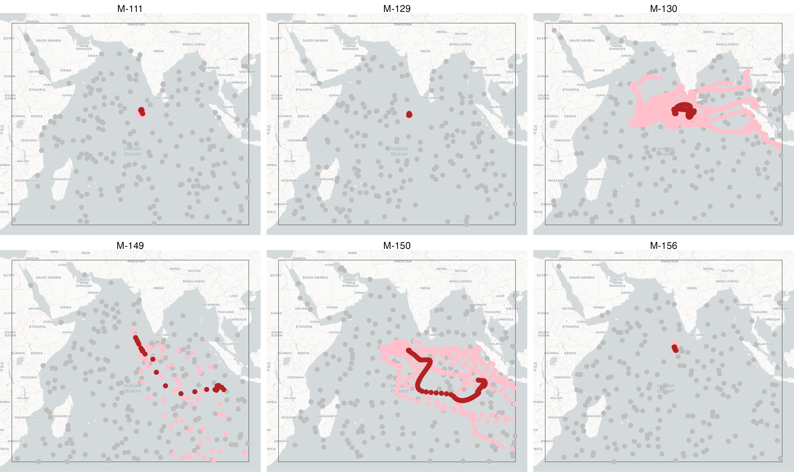

<br><br>

#### Input environmental data

------------------------------------------------------------------------------------------------------------------------------------------------------


```{r, eval=FALSE}
env_stack <- rast("https://raw.githubusercontent.com/vinayudyawer/OCS2024_SDMworkshop/main/data/session_3/env_layers.tif")

# quick plot

plot(env_stack)

```

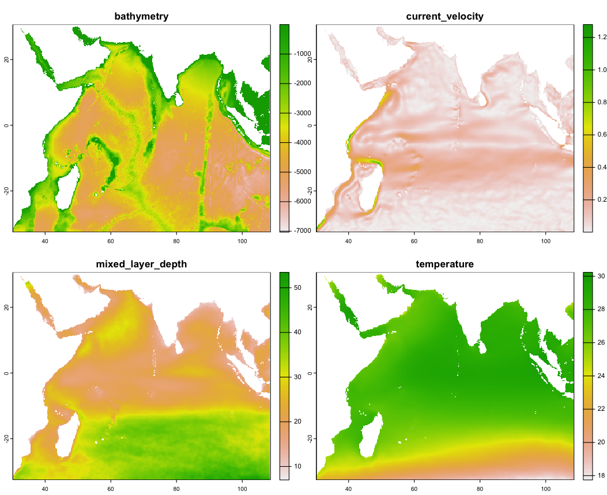


<br><br>

#### Extract environmental data for each occurrence, pseudo-absence and background point

------------------------------------------------------------------------------------------------------------------------------------------------------

Now that we have both the spatial point data and the environmental predictor data, we can use the `terra` package to overlay the vector point
data (a `vect()` object) and the rasterised envionmental data (a `rast()` object). `terra` allows us to quickly conduct overlap functions
that can quickly extract the four environemntal predictors at each spatial points.


```{r, eval=FALSE}

tracks_vec <- vect(tracks, geom=c("lon", "lat"), crs = "EPSG:4326")
null_vec <- vect(null_tracks, geom=c("lon", "lat"), crs = "EPSG:4326")
bg_vec <- vect(background, geom=c("lon", "lat"), crs = "EPSG:4326")

tracks_env <- 
  tracks %>% 
  bind_cols(extract(env_stack, tracks_vec)[-1])

null_env <- 
  null_tracks %>% 
  bind_cols(extract(env_stack, null_vec)[-1])

bg_env <- 
  background %>% 
  bind_cols(extract(env_stack, bg_vec)[-1])

```

<br>

Now that we have all the environmental data extracted, we can combine all the seperate datasets into a single data frame to allow for 
easier visualisation, exploration and modelling:

```{r, echo=FALSE, message=F}
model_data <- read_csv('https://raw.githubusercontent.com/vinayudyawer/OCS2024_SDMworkshop/main/data/session_4/model_data.csv')

```
```{r, eval=FALSE}
model_data <- 
  bind_rows(tracks_env, null_env, bg_env) %>% 
  mutate(presence = case_when(type %in% c("occurrence") ~ 1,
                              TRUE ~ 0)) %>% 
  filter_at(vars(bathymetry, current_velocity, mixed_layer_depth, temperature), all_vars(!is.na(.)))

```
```{r, message=FALSE}
model_data
```

<br><br>

#### Explore the distributions of the predictor variables

------------------------------------------------------------------------------------------------------------------------------------------------------

Lets look at the distributions of the environmental variables. The quickest and easiest way to look at their distribution is to build quick
histograms in `ggplot2`:

```{r, eval=FALSE}
model_data %>% ggplot(aes(x = bathymetry)) + geom_histogram() + theme_bw() +
model_data %>% ggplot(aes(x = temperature)) + geom_histogram() + theme_bw() +
model_data %>% ggplot(aes(x = current_velocity)) + geom_histogram() + theme_bw() +
model_data %>% ggplot(aes(x = mixed_layer_depth)) + geom_histogram() + theme_bw()

```

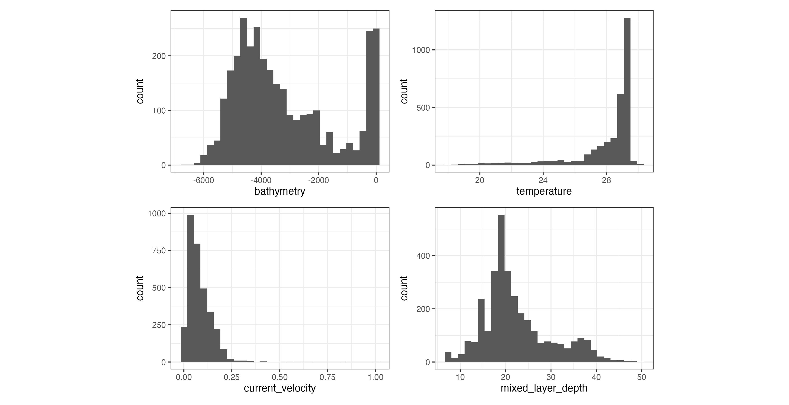

<br>

As you can see, a few of the variables are highly skewed! so lets use some simple transformation techniques to normalise our data.
Data transformation can take many forms, and can be simple (like here), or can be more complex. There are several ways to transform
your data to fit a normal distribution to build better models, and there are other techniques and modelling frameworks that can account
for skewed and non-normal data. Its up to you to do your research to figure out if simple transformation is enough, or if you need to 
consider more complex modelling frameworks to account for skewness or non-uniformity in your datasets.

Here we will transform the current velocity, temprature and mixed layer depth data to quickly correct skewness in variables. 


```{r, message=FALSE}
trans_data <-
  model_data %>%
  mutate(current_velocity = log10(current_velocity),
         temperature = exp(temperature),
         mixed_layer_depth = log10(mixed_layer_depth))

```


Now lets plot that again to check if the transformations have corrected the skewness in the data:

```{r, eval=FALSE}
trans_data %>% ggplot(aes(x = bathymetry)) + geom_histogram() + theme_bw() +
trans_data %>% ggplot(aes(x = temperature)) + geom_histogram() + theme_bw() +
trans_data %>% ggplot(aes(x = current_velocity)) + geom_histogram() + theme_bw() +
trans_data %>% ggplot(aes(x = mixed_layer_depth)) + geom_histogram() + theme_bw()

```

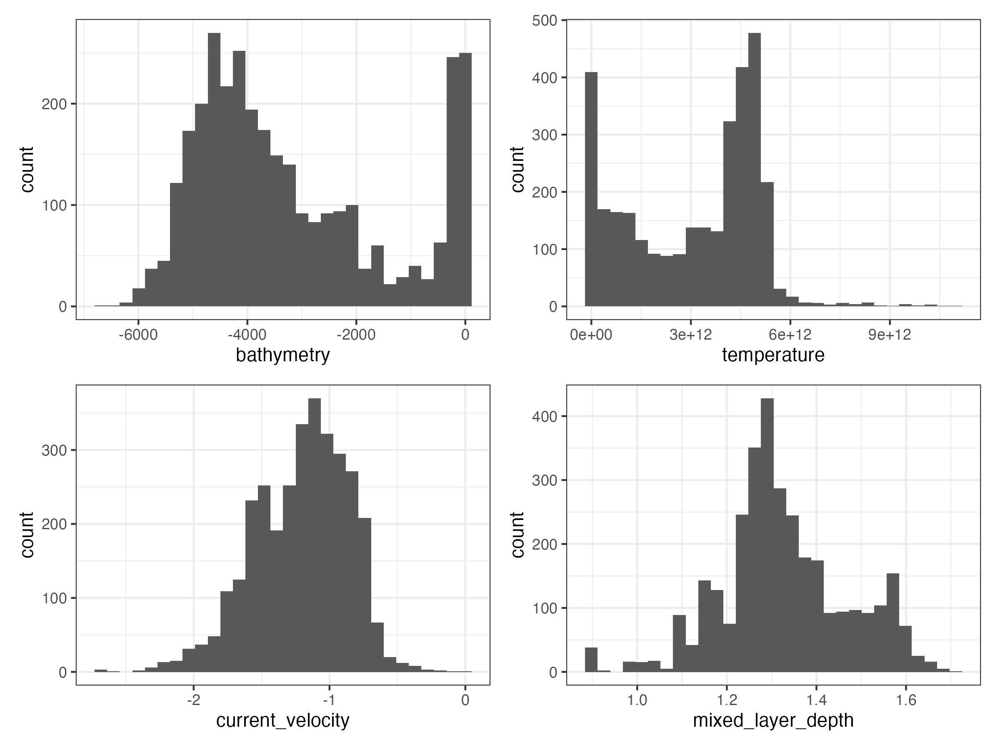

This looks a little bit better!! 


Now that we have figured out which transformations are needed, we also have to transform the data in our rasterised `env_stack`
dataset, so our predictions take the transformed data into account. `terra` allows you to transform your raster data very quickly
and easily:


```{r, eval=FALSE}

env_trans <- env_stack

env_trans$current_velocity <- log10(env_trans$current_velocity)
env_trans$temperature <- exp(env_trans$temperature)
env_trans$mixed_layer_depth <- log10(env_trans$mixed_layer_depth)

plot(env_trans)

```

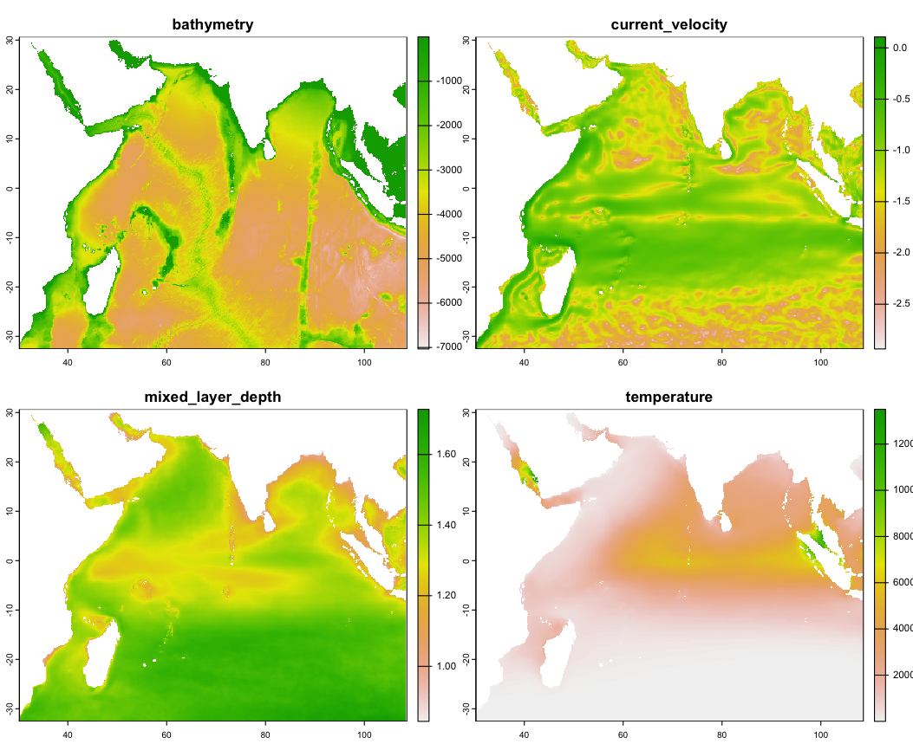

<br><br>

#### Visualise the ecological niche

------------------------------------------------------------------------------------------------------------------------------------------------------

Now that our environmental data have been transformed, we can try and visualise the environmental niche. Lets use the very useful `plotly` package to
visualise the data in 3D environmental space. 


```{r, out.width='100%'}
library(plotly)

trans_data %>% 
  plot_ly(x = ~bathymetry, 
        y = ~temperature,
        z = ~current_velocity,
        color = ~type) %>% 
  add_markers()

```


Have a look at the 3D plot above and see how the background and pseudo-absence data define different aspects of
the environmental space to allow further models to better define the niche of the occurrence data.


<br><br>

#### Creating a Species Distribution Model (SDM)

------------------------------------------------------------------------------------------------------------------------------------------------------

Now that we have all our input data, lets configure our transformed model data (`trans_data`) into a training dataset (*to build the model*) and a testing
dataset (*to evaluate the model*). Again, there are several ways to do this, and here we will use a simple ***k-fold cross-validation*** technique to evaluate
our model, but this may not be relevant in some cases, especially when using autocorrelated data (like tracking data!).


````{r, eval=FALSE}

training_data <- 
  trans_data %>% 
  filter(test_train %in% "train")

test_presence <- 
  trans_data %>% 
  filter(test_train %in% "test") %>% 
  filter(presence %in% 1) %>% 
  vect(crs = "EPSG:4326")

test_absence <-
  trans_data %>% 
  filter(test_train %in% "test") %>% 
  filter(presence %in% 0) %>% 
  vect(crs = "EPSG:4326")

```

<br>

##### ***Building the model***

In Session 3, we talked about several modelling algorithms used to build SDMs. One of the frameworks we discussed was using a non-linear model using a Generalised
Additive Model (GAM) to incorporate non-linear relationships between the probability of presence and environmental predictor. Here since we have multiple individually tracked
animal data, the occurrence data we have collected is highly autocorrelated within each tracked individual. One way to account for this is using a Mixed model version of GAMs.


Using a Generalized Additive Mixed Model (GAMM) to model SDMs with tracking data allows for the incorporation of individual variability as a 'random effect'. This approach 
recognises that individuals within a species may exhibit unique behaviours and responses to environmental preditors. By treating individual identity as a random effect in 
the model, GAMMs can account for this variability while still capturing the overall patterns of species distributions. This integration of individual-level data enhances the
accuracy and ecological realism of SDMs, providing valuable insights into how individual behaviour influences species' spatial distributions and habitat preferences. We can build
GAMMs using the same `mgcv` package we used in the last session. The process is slightly different though:


```{r, eval=FALSE}

library(mgcv)

## Lets build a GAMM with the simplist configuration of a non-linear model
gamm_mod <- gamm(presence ~ s(bathymetry) + s(temperature) + 
                   s(current_velocity) + s(mixed_layer_depth), 
                 data = training_data, ## training input data
                 random = list(id = ~id), ## id as a random variable
                 method = "REML", 
                 family = binomial("logit")) ## using a binomial framework


## Lets separate the GAM portion of the GAMM model 
mod <- gamm_mod$gam

```


Now that the model has run, we can explore the response curves of the GAMM using the very useful `mgcViz` package.
We firt need to configure the model object so the package can plot out the response curves. The package however has a very 
peculiar grammer of plotting (something similar to `ggplot2` but not quite!)

```{r, eval=FALSE}

library(mgcViz)

mod_viz <- getViz(mod)

print(
  plot(mod_viz) + 
    l_ciPoly(alpha = 0.5) + 
    l_fitLine() + 
    l_rug() +
    theme_bw(), 
  pages = 1)

```

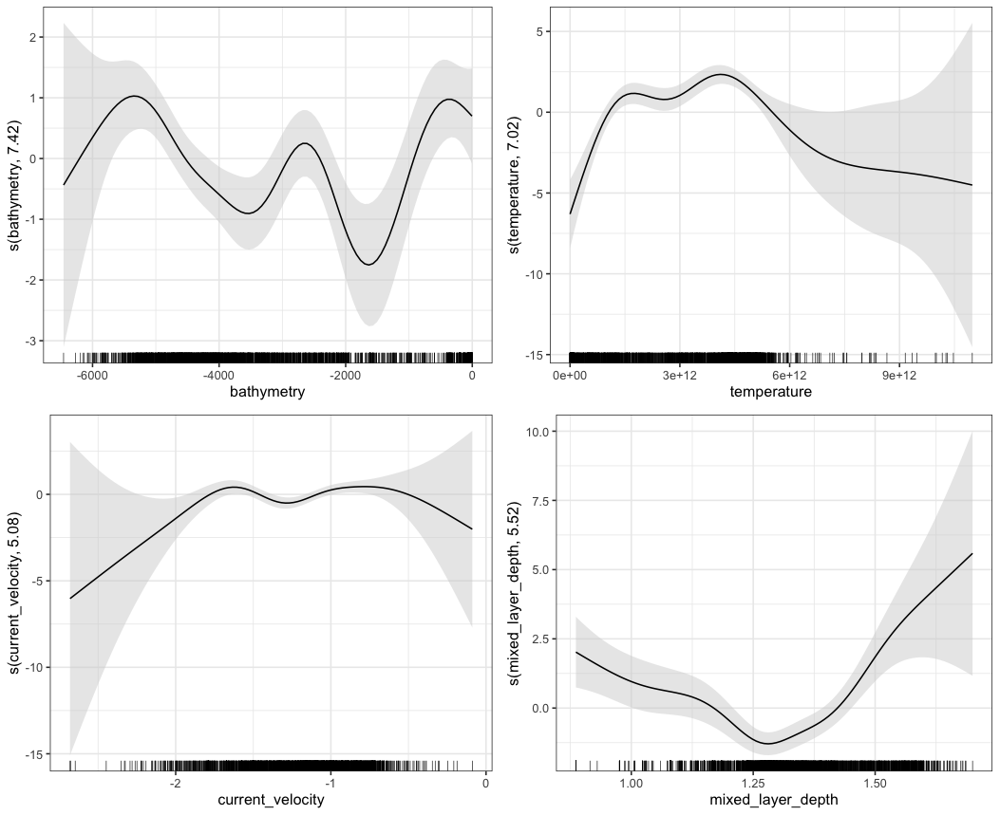


<br>

The `mgcViz` package can also help you explore the correlation between two variables simultaneously: 


```{r, eval=FALSE}

vis.gam(mod, view = c("bathymetry", "temperature"), theta = 145, phi = 15, type = "response")

```

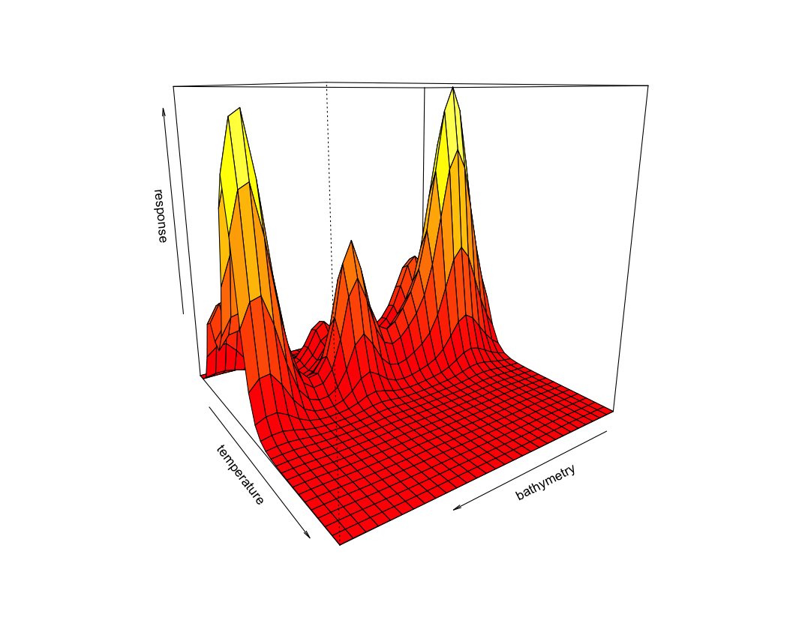

```{r, eval=FALSE}

vis.gam(mod, view = c("mixed_layer_depth", "current_velocity"), theta = 145, phi = 15, type = "response")

```


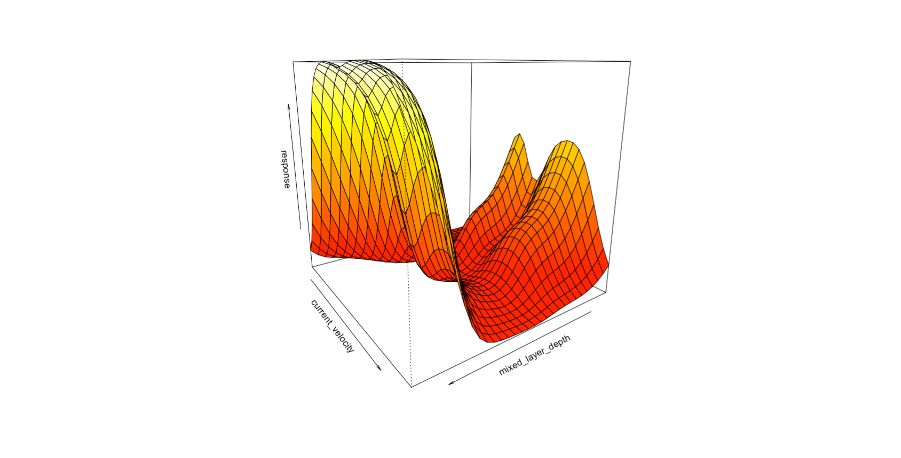

<br>

##### ***Evaluating the model***

Similar to the last session, we can use the `dismo` package to evaluate the performance of our SDM. The 'evaluate()' function works here with our previously
subsetted testing datasets. We can then use the evaluate object to plot the 'Receiver Operating Characteristic' of the model, and quantify the 'Area Under the
Curve' (AUC) of the model. The ROC curve plots the true positive rate (sensitivity) against the false positive rate (1 - specificity) for different threshold 
values. A perfect model would have an ROC curve that reaches the upper left corner of the plot (sensitivity = 1, specificity = 1), while a random guess would 
result in a diagonal line from the bottom left to the top right (AUC = 0.5).


```{r, eval=FALSE}
library(dismo)

gamm_eval <- dismo::evaluate(p = test_presence, a = test_absence, model = mod)

plot(gamm_eval, "ROC", type = "l")

```

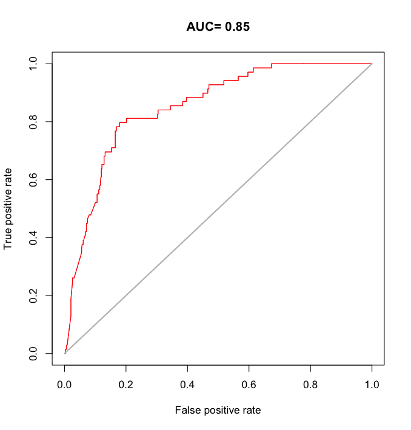

<br>

##### ***Model prediction***

We can now predict and plot the model response (continuous value between 0 and 1)

```{r, eval=FALSE}
gamm_predict <- terra::predict(env_trans, mod, type = "response")

plot(gamm_predict)


## We can now threshold the output to a map identifying the species distribution
# we need to first predict the model 'link' function
gamm_link <- terra::predict(env_trans, mod, type = "link")

plot(gamm_link)

# define the threshold using the evaluation metrics estimated earlier
gamm_threshold <- threshold(gamm_eval, stat = 'spec_sens')

plot(gamm_link > gamm_threshold)

```

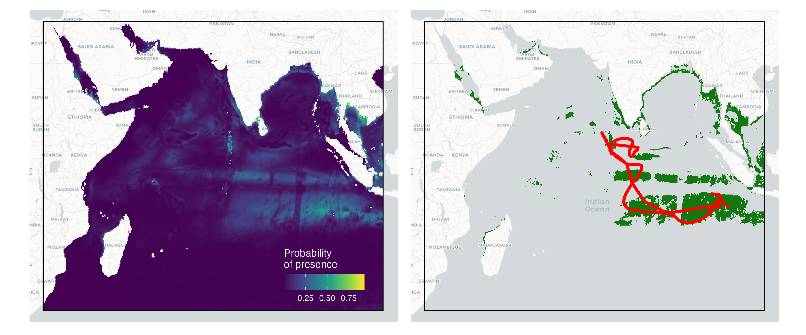

<br><br>

<style>
div.blue { background-color:#e6f0ff; border-radius: 5px; padding: 20px;}
</style>
<div class = "blue">


#### Modelling move persistance ($\gamma_{t}$)

------------------------------------------------------------------------------------------------------------------------------------------------------

In session 2, we used the `aniMotum` package to built a move persistence model, to incorporate a continuous-valued behavioural index into our tracks. 
The move persistence variable ($\gamma_{t}$). Move persistence is an index of movement behaviour and is a continuous value between 0-1. The value represents
changes in movement pattern for that individual based on autocorrelation in speed and direction (see details 
[here](https://ianjonsen.github.io/aniMotum/articles/Move_persistence_models.html)). Lower move persistence values are related to slower movements that are often 
associated with area restricted searching behaviours often associated with foraging, with higher move persistence values representing more linear movements 
that are associated with migratory behaviours.

<br>

We can use this continuous variable to look at how environmental variables influence 'area restricted behaviours' and migratory behaviours, and we can also
spatially model it to identify potential 'migratory highways' and potential foraging and nursery areas. Here we will conduct a very simple version of this model,
but if you want to see how this kind of modelling help define important areas for species [this](https://esajournals.onlinelibrary.wiley.com/doi/10.1002/ecy.2566) 
is a good paper to dwelve deeper into the modeling framework.

Lets use a simpler GAM model to explore the relationship between move persistence index and the environmental variables we have at hand:

```{r, warning=FALSE}

mp_mod <- gam(g ~ s(bathymetry) + s(temperature) + 
                s(current_velocity) + s(mixed_layer_depth), 
               data = trans_data, 
              family = quasibinomial("logit"))

summary(mp_mod)

```

<br>

We can now use the `visreg` package to explore the response curve of the model:

```{r, eval=FALSE}
visreg::visreg(mp_mod, scale = "response", partial = T,  gg = T)

```

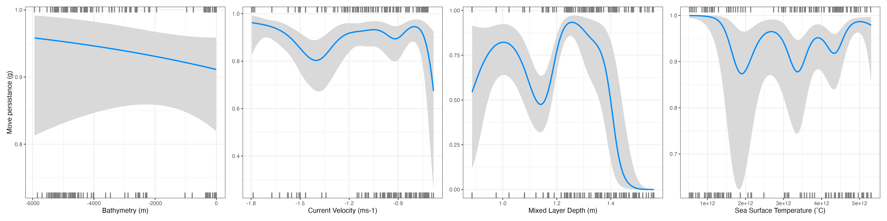

Similar to the previous model, we can also explore the relationship between two variables to move persistence

```{r, eval=FALSE}

visreg2d(mp_mod, xvar = "mixed_layer_depth", yvar = "temperature", scale = "response", plot.type = "persp",
         xlab = "Mixed Layer Depth (m)", ylab = "Sea Surface Temparature (˚C)", zlab = "Move persistence",
         theta = 145, phi = 15, zlim = c(0,1))

```

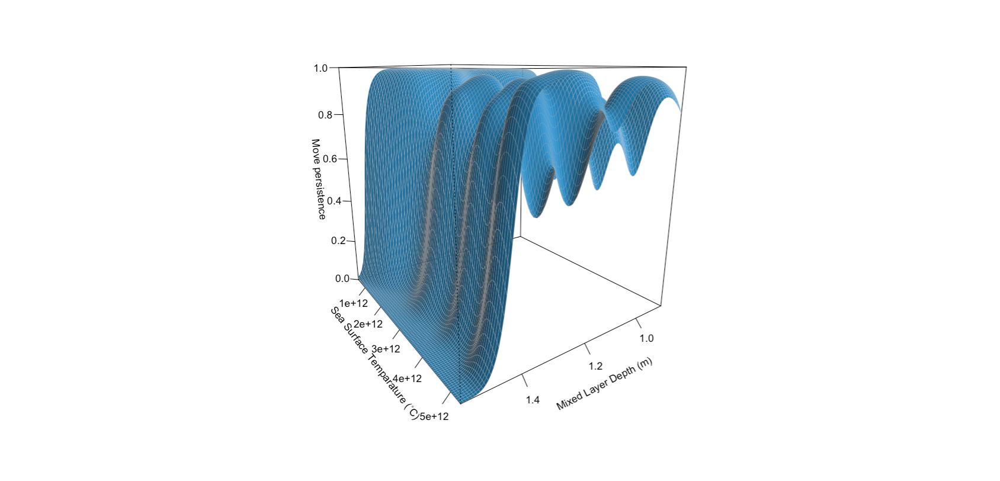

<br>

Finally, we can now predict the model across the larger spatial scale across our pre-defined model extent. ***But be careful about predicting too extensively outside the***
***ecological space of our model!***   


```{r, eval=FALSE}

mp_resp <- terra::predict(env_trans, mp_mod, type = "response")

plot(mp_resp)

```


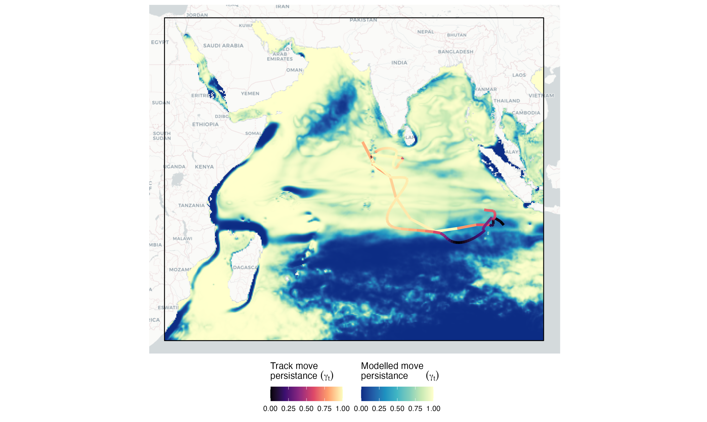

<br>

There are several ways to modify this model, further refine it and use more appropriate ways to evaluate these kinds of models. However, we have run out of
time! but hopefully this workshop has given you a good starter to the world of animal tracking, behavioural classification, species distribution modelling,
and combining all of these aspects to build ecologically informative maps. Happy coding!

<br>

</div>

<br>

------------------------------------------------------------------------------------------------------------------------------------------------------

<a href="#top" style="color:steelblue; font:bold;" >Back to top</a>

<br><br>


