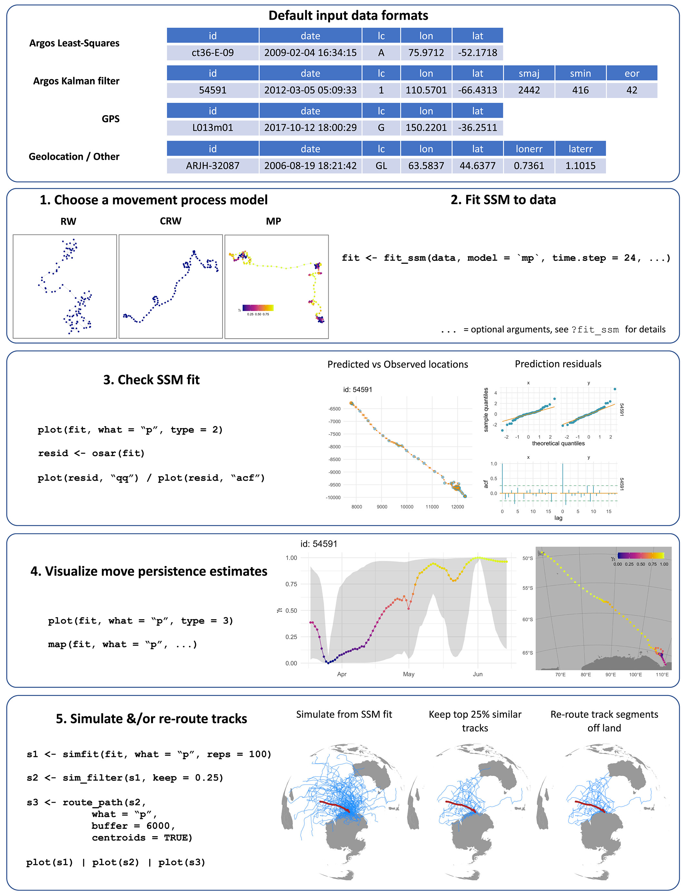
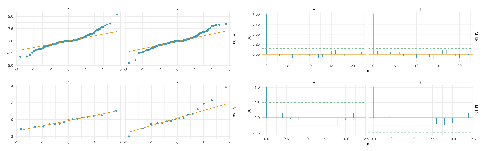
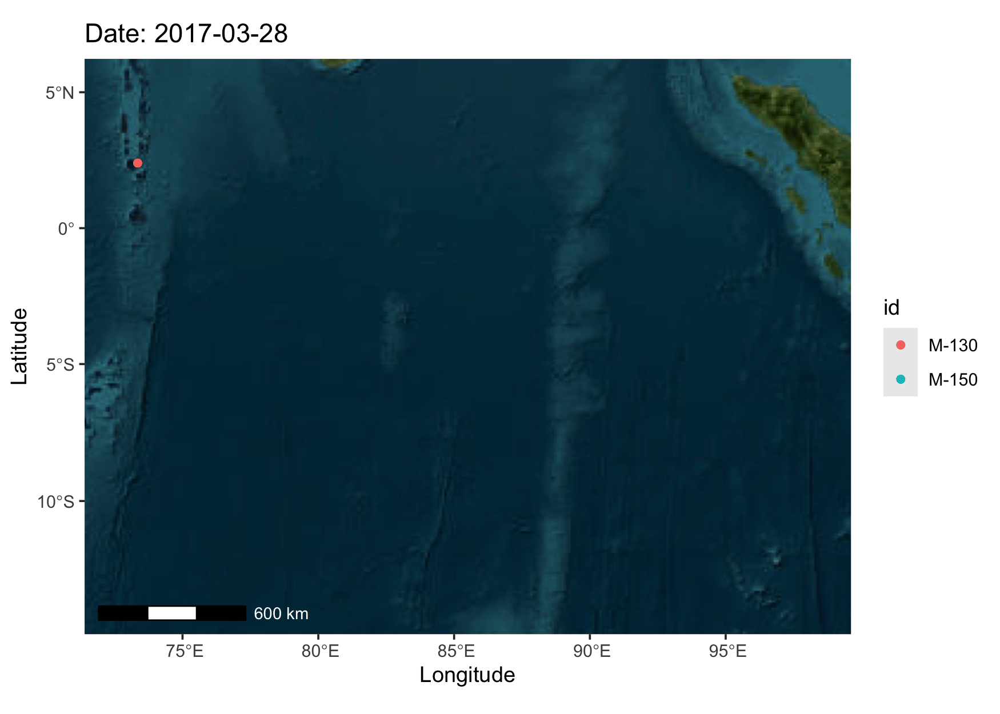
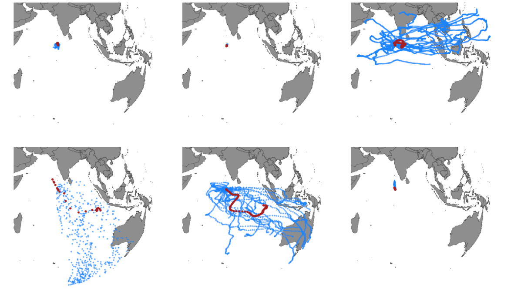
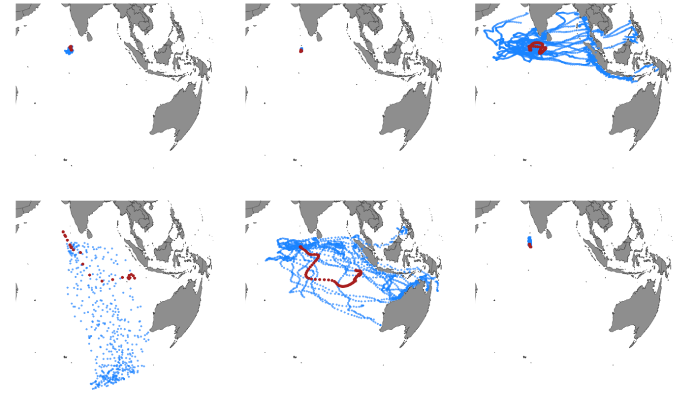
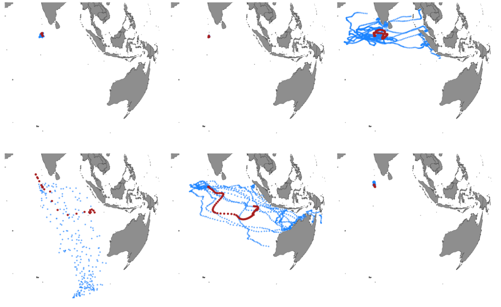

---
title:
subtitle: 
author:
date:
output:
  html_document:
    toc: false
    toc_float: true 
    depth: 2
    number_sections: false
    theme: spacelab
    highlight: pygments
editor_options: 
  markdown: 
    wrap: 150
---

## Session 2 

### Using satellite telemetry data to define behaviours

|                                 |
|:--------------------------------|
|  |

<br>

In this session we will introduce you to the `aniMotum` package, a valuable tool for analysing animal movement data. In this session we will work with a 
small subset of fictionalized tracking data that closely mimic Whale sharks tracked in the Indian Ocean. The data 
consists of tracking data from six Whale Sharks (*Rhincodon typus*) tagged with ARGOS tags at the Thaa Atoll, the Maldives. The data shows the 
large oceanic dispersal these species conduct across the Indian Ocean. The data have been processed using a Least-Squares algorithm, and each position
has an estimated error expressed as an ARGOS location class. We will use this dataset to further refine positions, and predict positions at regular 
intervals, and calculate measures of movement to get some insight into the behaviours of two of the individuals individuals.


<br>

```{r, echo=FALSE, message=FALSE, include=TRUE, out.width = '100%'}
library(tidyverse)
library(sf)
library(mapview)
library(leaflet)
mapviewOptions(fgb=FALSE)

tagdat <- 
  read_csv('https://raw.githubusercontent.com/vinayudyawer/OCS2024_SDMworkshop/main/data/Whaleshark.csv') %>% 
  rename(DeployID = ANIMALID) %>% 
  st_as_sf(coords = c("LONGITUDE", "LATITUDE"), crs = 4326)

path <-
  tagdat %>% 
  group_by(DeployID) %>% 
  summarise(do_union = FALSE) %>% 
  st_cast("LINESTRING")

m_111 <-
  mapview(path %>% filter(DeployID %in% "M-111"), alpha = 1, color = "white", homebutton = F, legend = F, map.type = c("Esri.NatGeoWorldMap"), layer.name = "M-111") +
  mapview(tagdat %>% filter(DeployID %in% "M-111"), alpha.regions = 1, alpha = 0, col.regions = "white", homebutton = F, legend = F, cex = 3, layer.name = "M-111") +
  mapview(tagdat %>% filter(DeployID %in% "M-111") %>% slice(1), alpha.regions = 1, alpha = 0, col.regions = "darkgreen", homebutton = F, legend = F, layer.name = "M-111") +
  mapview(tagdat %>% filter(DeployID %in% "M-111") %>% slice(n()), alpha.regions = 1, alpha = 0, col.regions = "firebrick", homebutton = F, legend = F, layer.name = "M-111")

m_129 <-
  mapview(path %>% filter(DeployID %in% "M-129"), alpha = 1, color = "white", homebutton = F, legend = F, map.type = c("Esri.NatGeoWorldMap"), layer.name = "M-129") +
  mapview(tagdat %>% filter(DeployID %in% "M-129"), alpha.regions = 1, alpha = 0, col.regions = "white", homebutton = F, legend = F, cex = 3, layer.name = "M-129") +
  mapview(tagdat %>% filter(DeployID %in% "M-129") %>% slice(1), alpha.regions = 1, alpha = 0, col.regions = "darkgreen", homebutton = F, legend = F, layer.name = "M-129") +
  mapview(tagdat %>% filter(DeployID %in% "M-129") %>% slice(n()), alpha.regions = 1, alpha = 0, col.regions = "firebrick", homebutton = F, legend = F, layer.name = "M-129")

m_130 <-
  mapview(path %>% filter(DeployID %in% "M-130"), alpha = 1, color = "white", homebutton = F, legend = F, map.type = c("Esri.NatGeoWorldMap"), layer.name = "M-130") +
  mapview(tagdat %>% filter(DeployID %in% "M-130"), alpha.regions = 1, alpha = 0, col.regions = "white", homebutton = F, legend = F, cex = 3, layer.name = "M-130") +
  mapview(tagdat %>% filter(DeployID %in% "M-130") %>% slice(1), alpha.regions = 1, alpha = 0, col.regions = "darkgreen", homebutton = F, legend = F, layer.name = "M-130") +
  mapview(tagdat %>% filter(DeployID %in% "M-130") %>% slice(n()), alpha.regions = 1, alpha = 0, col.regions = "firebrick", homebutton = F, legend = F, layer.name = "M-130")

m_149 <-
  mapview(path %>% filter(DeployID %in% "M-149"), alpha = 1, color = "white", homebutton = F, legend = F, map.type = c("Esri.NatGeoWorldMap"), layer.name = "M-149") +
  mapview(tagdat %>% filter(DeployID %in% "M-149"), alpha.regions = 1, alpha = 0, col.regions = "white", homebutton = F, legend = F, cex = 3, layer.name = "M-149") +
  mapview(tagdat %>% filter(DeployID %in% "M-149") %>% slice(1), alpha.regions = 1, alpha = 0, col.regions = "darkgreen", homebutton = F, legend = F, layer.name = "M-149") +
  mapview(tagdat %>% filter(DeployID %in% "M-149") %>% slice(n()), alpha.regions = 1, alpha = 0, col.regions = "firebrick", homebutton = F, legend = F, layer.name = "M-149")

m_150 <-
  mapview(path %>% filter(DeployID %in% "M-150"), alpha = 1, color = "white", homebutton = F, legend = F, map.type = c("Esri.NatGeoWorldMap"), layer.name = "M-150") +
  mapview(tagdat %>% filter(DeployID %in% "M-150"), alpha.regions = 1, alpha = 0, col.regions = "white", homebutton = F, legend = F, cex = 3, layer.name = "M-150") +
  mapview(tagdat %>% filter(DeployID %in% "M-150") %>% slice(1), alpha.regions = 1, alpha = 0, col.regions = "darkgreen", homebutton = F, legend = F, layer.name = "M-150") +
  mapview(tagdat %>% filter(DeployID %in% "M-150") %>% slice(n()), alpha.regions = 1, alpha = 0, col.regions = "firebrick", homebutton = F, legend = F, layer.name = "M-150")

m_156 <-
  mapview(path %>% filter(DeployID %in% "M-156"), alpha = 1, color = "white", homebutton = F, legend = F, map.type = c("Esri.NatGeoWorldMap"), layer.name = "M-156") +
  mapview(tagdat %>% filter(DeployID %in% "M-156"), alpha.regions = 1, alpha = 0, col.regions = "white", homebutton = F, legend = F, cex = 3, layer.name = "M-156") +
  mapview(tagdat %>% filter(DeployID %in% "M-156") %>% slice(1), alpha.regions = 1, alpha = 0, col.regions = "darkgreen", homebutton = F, legend = F, layer.name = "M-156") +
  mapview(tagdat %>% filter(DeployID %in% "M-156") %>% slice(n()), alpha.regions = 1, alpha = 0, col.regions = "firebrick", homebutton = F, legend = F, layer.name = "M-156")
  
(m_111 + m_129 + m_130 + m_149 + m_150 + m_156)@map %>% 
  addLayersControl(
        # overlayGroups = c("Esri.NatGeoWorldMap","Esri.WorldImagery"),
        baseGroups = c("M-111", "M-129", "M-130", "M-149", "M-150", "M-156"),
        options = layersControlOptions(collapsed = FALSE))


```

<br>

::: {style="display: grid; grid-template-columns: 1fr 2fr; grid-column-gap: 60px;"}
<div>

We will use the [***aniMotum***](https://github.com/ianjonsen/aniMotum) package developed by Dr. Ian Jonsen. This package provides a quick and easy
means to refine positions by integrating the error associated with location data, and modelling the data to be able to predict locations at fixed
intervals. The package also provides a means to explore potential movement behaviours using the characteristics of the track. For more details on
the package you can explore the vignettes provided with the package, and also explore its applications in this [paper](https://doi.org/10.1111/2041-210X.14060).

<br>

The package has a clear workflow, and we can walk through the first 4 steps to process and visualise our data:

<br>

1. Modify our data to the expected input format

2. Choose and fit an appropriate state-space movement process model

3. Check our model fit

4. Visualise our model estimates

5. Simulate tracks

</div>

<div>



</div>
:::

<br><br>

#### Step 1: Input and format data 

------------------------------------------------------------------------------------------------------------------------------------------------------

<br>

##### Input data

Lets begin our data processing by first reading in the data, and formatting it so that the package can read it properly:

```{r, message=FALSE}

library(aniMotum)

raw_data <- read_csv('https://raw.githubusercontent.com/vinayudyawer/OCS2024_SDMworkshop/main/data/Whaleshark.csv')

head(raw_data)

```

aniMotum expects the data to be in a specific form. 'Argos Least-Squares and GPS data should have 5 columns in the following order: id, date, lc, lon, lat. Where date can be a POSIC object or a text string in YYYY-MM-DD HH:MM:SS format. If a text string is supplied then the time zone is assumed to be UTC. Location class can include the following values: 3, 2, 1, 0, A, B, Z, G, or GL. The latter two are for GPS locations and 'Generic Locations', respectively. Class Z values are assumed to have error variances 10x smaller than Argos class 3 variances, but unlike Argos error variances the GPS variances are the same for longitude and latitude.' (From Help viewer)

Argos Kalman filter data should have 8 columns, the above 5 plus smaj, smin, eor that contain Argos error ellipse variables (in m for smaj, smin and deg for eor)

<br>


##### Format the data 

```{r, message=FALSE}
# Using transmute from the Dplyr package 
tagdat <- raw_data %>%
  dplyr::transmute(id = ANIMALID,
              date = DATE, 
              lc= ARGOSCLASS,
              lon = LONGITUDE, 
              lat = LATITUDE)

# Using format_data from the aniMotum Package) 
tagdat2 <- format_data(
  raw_data,
  id = "ANIMALID",
  date = "DATE",
  lc = "ARGOSCLASS",
  coord = c("LONGITUDE", "LATITUDE")
)

head(tagdat)
```

<br>

Lets look at the quality of the data by investigating the ARGOS class 


```{r, message=FALSE, fig.align='center'}
tagdat %>% 
  group_by(id, lc) %>% 
  summarise(num_pos = n()) %>% 
  ggplot(aes(x = id, y = num_pos, fill = lc)) +
  geom_col(position = "fill") +
  labs(x = "Tag ID", y = "Proportion of fixes", fill = "Location\nClass") +
  theme_bw()
```

It looks like a large proportion of our data have low accuracy position estimates (Location Classes A and B). This is often the same in many tracking studies. At this stage, we can make a decision on if we want to subset our tracking data to only include certain Location Classes, to make sure our positional data are accurate. However another way to get more accurate positions and retain as much data as possible, is to model the data with the estimated error to predict more accurate positions.

<br><br>

#### Step 2: Choose and fit a movement model 

------------------------------------------------------------------------------------------------------------------------------------------------------

Lets try and retain as much data as we can and move onto the second step; choosing and fitting a movement model. This step allows us to model the data we have, and gives us the ability to then predict positions along the animals movement path to produce positions at fixed time periods. This becomes important when we want to calculate metrics of movements to help define movement behaviours. There are three main movement processes that `aniMotum` provides:

 
- ***Random Walk (RW) models*** - where movements between positions are modeled to be random in direction and magnitude.

- ***Correlated Random Walk (CRW) model*** - where movements between positions are modeled as random and correlated in direction and magnitude.

- ***Continuous-time Move Persistence (MP) model*** - where movements between positions are modeled as random with correlations in direction and magnitude that vary in time.

*"The MP approach is most appropriate for fitting to irregularly timed and error-prone Argos data as both aspects are taken into account explicitly".* (Johnson 2023)


You can explore the specifics of this package from the vignette [here](https://ianjonsen.github.io/aniMotum/articles/Overview.html).

For our data, we will use the Continuous-time move persistence model (‘mp’ option in the code). We can run this model by simply using the `fit_ssm()` function in aniMotum. The function requires some basic information on the dispersal ability of our study species. At the least, it asks for our estimate of swimming speed of our animal. Whale sharks are pretty slow swimming sharks and their average speed has been measured to be about 1.5 m/s. We can also use this function to predict positions at fixed time periods. Here lets predict two positions for each day of the tracking period (a position every 12 hours).

```{r, message=FALSE, warning=FALSE}
# Fitting a Continuous-time move persistence (MP) model to our data 
fit <-
  fit_ssm(x = tagdat, 
          vmax = 1.5, ## maximum speed of whale sharks (in m/s)
          model = "mp", ## Move persistence model
          time.step = 12, ## predict positions every 12 hours
          control = ssm_control(verbose = 0)) ## Lets turn off the progress text

fit

```
<br>

So if we take a look at the fit object, we can see that actually the model converged for all but two of our sharks (M-150 and M-156). From the model run, we also found models were having issues evaluating standard errors. This can be due to a pre-filter step `fit_ssm()` conducts. Models can often also not converge as our predicted time-steps are too close, and thus overfitting a model. Lets modify our code to try and get more of our animals to converge. So lets now run another model, but this time lets use a larger time-step of 48 hours and turn off the pre-filter step (using the 'spdf' parameter). 


```{r, message=FALSE, warning=FALSE}
fit2 <-
  fit_ssm(x = tagdat, 
          vmax = 1.5, ## maximum speed of whale sharks (in m/s)
          model = "mp", ## Move persistence model
          time.step = 48, ## predict positions every 24 hours
          spdf = FALSE, ## turn off the pre-filter step
          control = ssm_control(verbose = 0)) ## Lets turn off the progress text

fit2

```

<br>

This is a lot better! When predicting on a 48 hour time step with the pre-filter turned off, the models converged for all sharks. Let's focus on two sharks as an example, lets use M-150 and M-130. 

```{r, message=FALSE, warning=FALSE}
fit3 <- tagdat %>%
  dplyr::filter(id %in% c("M-150", "M-130")) %>%
  fit_ssm(vmax = 1.5, ## maximum speed of whale sharks (in m/s)
          model = "mp", ## Move persistence model
          time.step = 48, ## predict positions every 24 hours
          spdf = FALSE, ## turn off the pre-filter step
          control = ssm_control(verbose = 0)) ## Lets turn off the progress text

summary(fit3)

```

<br>

Lets visualize and explore the outputs of the model: 

```{r, message=FALSE, fig.align = 'center', fig.height = 3, fig.width = 10}
## Lets have a look at the fitted component of the model 
## (original data, corrected by including positional error)

plot(fit3, 
     what = "fitted", ## what component of the model to plot ('fitted', 'predicted' or 'rerouted')
     type = 2, ## type of plot to make
     pages = 1, 
     ncol = 2)
```
In the above plots, the blue are the original positions, the yellow are where the model has 'corrected' positions, and the black 'x's are outliers identified by the model. 

<br><br>


#### Step 3: Check model fit 

------------------------------------------------------------------------------------------------------------------------------------------------------

<br>

Next we can look at the predicted component of the model and see how well the model fit the data. We can use the `osar()` function for this: 


```{r, eval=FALSE}

resid <- osar(fit3)

## Lets check our model fit for both tracks
plot(resid, type = "qq")
plot(resid, type = "acf")

```



<br>

We can also look at how closely the predicted positions compare to the ‘corrected’ fitted positions. This is often the best way to ascertain if the model you produced is a good fit. You can play around with the model parameters (e.g., vmax) to make sure the model represents the biology of the animal you are tracking

```{r, message=FALSE, fig.align = 'center', fig.height = 3, fig.width = 10}
plot(fit3, 
     what = "predicted", 
     type = 2,
     pages = 1,
     ncol = 2)

```

<br><br>

#### Step 4: Visualize move persistence estimates

------------------------------------------------------------------------------------------------------------------------------------------------------

<br>

##### What is 'move persistence'? 

Move persistence is an index of movement behaviour and is a continuous value between 0-1. The value represents changes in movement pattern for that individual based on autocorrelation in speed and direction (see details [here](https://esajournals.onlinelibrary.wiley.com/doi/10.1002/ecy.2566)) We can look at the patterns in this metric for each tracked individual spatially and over the tracking period. Lower move persistence values are related to slower movements that are often associated with area restricted searching behaviours often associated with foraging, with higher move persistence values representing more linear movements that are associated with migratory behaviours. 
Since we ran the 'mp' model, we now have values of move persistence for each predicted location and can explore a bit more into our animal's movement behaviours. 


```{r, message=FALSE, fig.align = 'center', fig.height = 3, fig.width = 10, fig.show='hold'}
plot(fit3,
     what = "predicted",
     type = 3,
     pages = 1,
     ncol = 2,
     normalise = TRUE)

plot(fit3,
     what = "predicted",
     type = 4,
     pages = 1,
     ncol = 2,
     normalise = TRUE)

```

We can use the `grab()` function to extract specific components of the model output to have a closer look at them, or produce our own maps using previously covered packages (eg., `ggspatial` or `mapview`). The `grab()` function also allows users to extract the positional data as a sf object and makes it so easy to plot them using other packages! 


```{r, message=FALSE}
# Lets plot our own version of the predicted component using mapview
pred_data <- grab(fit3,
                  what = "predicted",
                  normalise = TRUE)

# Lets convert this data frame into a point dataset using `sf`
library(sf)

pred_sf <-
  pred_data %>% 
  st_as_sf(coords = c("lon", "lat"), crs = 4326, remove = F)

# Lets convert the point dataset into a path

pred_path <- 
  pred_sf %>%
  group_by(id) %>%
  summarise(do_union = FALSE) %>%
  st_cast("LINESTRING")

```

<br><br>

##### ***Animate the tracks using gganimate!*** 

We can use the knowledge we acquired in session one to animate the modeled tracks
```{r, eval=FALSE}
library(ggspatial)
library(gganimate)

## NOTE: the creation of the animation can take a long time!

esri_sat <- paste0('https://services.arcgisonline.com/arcgis/rest/services/',
                   'World_Imagery/MapServer/tile/${z}/${y}/${x}.jpeg')
track <- 
  ggplot() +
  annotation_map_tile(type = esri_sat) +
  geom_spatial_path(data = pred_data, aes(x = lon, y = lat, group = id), col = "white", crs = 4326) + 
  geom_spatial_point(data = pred_data, aes(x = lon, y = lat, group = id, col = id), crs = 4326) +
  labs(title = 'Date: {as.Date(frame_along)}', x = 'Longitude', y = 'Latitude') +
  annotation_scale(text_col = "white") +
  transition_reveal(date)

anim <- animate(track, width = 7, height = 5, units = "in", res = 250, nframes = 250, fps = 50,
                render = gifski_renderer(loop = FALSE))

save_animation(animation = anim, file = "~/Desktop/session2_anim.gif")

```




<br><br>

Now lets use our lovely `mapview` and `leaflet` knowledge from session one to plot a nice, interactive plot of move persistence data! 

```{r, message=FALSE, out.width = '100%'}
library(leaflet)
library(mapview)
mapview::mapviewOptions(fgb = FALSE)

color_palette <- colorRampPalette(hcl.colors(10, palette = "Reds 3"))

m_130 <-
  mapview(pred_path %>% filter(id %in% "M-130"), alpha = 1, color = "white", homebutton = F, 
          legend = F, map.type = c("Esri.WorldImagery"), layer.name = "M-130") +
  mapview(pred_sf %>% filter(id %in% "M-130"), alpha.regions = 1, alpha = 0, zcol = "g",
          homebutton = F, legend = F, cex = 3, layer.name = "M-130", col.regions = color_palette(93)) +
  mapview(pred_sf %>% filter(id %in% "M-130") %>% slice(1), alpha.regions = 1, alpha = 0,
          col.regions = "darkgreen", homebutton = F, legend = F, layer.name = "M-130") +
  mapview(pred_sf %>% filter(id %in% "M-130") %>% slice(n()), alpha.regions = 1, alpha = 0,
          col.regions = "firebrick", homebutton = F, legend = F, layer.name = "M-130")

m_150 <-
  mapview(pred_path %>% filter(id %in% "M-150"), alpha = 1, color = "white", homebutton = F, 
          legend = F, map.type = c("Esri.WorldImagery"), layer.name = "M-150") +
  mapview(pred_sf %>% filter(id %in% "M-150"), alpha.regions = 1, alpha = 0, zcol = "g",
          homebutton = F, legend = F, cex = 3, layer.name = "M-150", col.regions = color_palette(54)) +
  mapview(pred_sf %>% filter(id %in% "M-150") %>% slice(1), alpha.regions = 1, alpha = 0,
          col.regions = "darkgreen", homebutton = F, legend = F, layer.name = "M-150") +
  mapview(pred_sf %>% filter(id %in% "M-150") %>% slice(n()), alpha.regions = 1, alpha = 0,
          col.regions = "firebrick", homebutton = F, legend = F, layer.name = "M-150")

mm <- 
(m_130 + m_150)@map %>% 
  addLayersControl(
        baseGroups = c("M-130", "M-150"),
        options = layersControlOptions(collapsed = FALSE)) %>% 
  addLegend(colors = color_palette(11), 
            labels = round(seq(0, 1, by = 0.1), 2),
            title = "g", opacity = 1)

mm
```

<br><br>

#### Step 5: Simulated tracks

------------------------------------------------------------------------------------------------------------------------------------------------------

<br>

The `aniMotum` package also allows users to use your fitted model to simulate similar tracks, which is useful if you want to compare your animal's track with other 'null' models. This allows for further hypothesis testing and analyses like resource selection functions. Here, we will use the `sim_fit()` function to simulate 'null' tracks for all our animals using model outputs from our tracks. Lets start with the raw data again to build our state-space model.

When fitting a state-space model to build simulation data, the `sim_fit()` function cannot handle 'move persistance' models (like the ones we built above). So lets build a simpler model using the 'Correlated Random Walk' (crw) algorithm. We will model it to predict one position per day to provide sufficient data to build Species Distribution Models in the next session.  


```{r, eval=FALSE}
## Lets use the tagdat dataframe to build our whaleshark crw model

whaleshark_fit <-
  fit_ssm(x = tagdat, 
          vmax = 1.5, ## maximum speed of whale sharks (in m/s)
          model = "crw", ## Move persistence model
          time.step = 24, ## predict positions every 24 hours
          spdf = FALSE) ## turn off the pre-filter step

  
null_fit <- 
  sim_fit(whaleshark_fit, ## the ssm model we want to base our null models on
          what = "predicted", ## component of the model to use
          reps = 20) ## number of replicated simulations per animal

plot(null_fit, ncol = 3)

```



<br>

Now if you have a look at the simulated tracks, it looks like the simulations go onto land, which isn't all that accurate for Whalesharks. The `aniMotum` package has a way to take this into account. The simulation function can take into account land masses to constrain the tracks from going onto land. We need to run a few extra steps first (check out [this vignette](https://ianjonsen.github.io/aniMotum/articles/Track_simulation.html#simulate-tracks-with-a-potential-function-to-help-avoid-land) to learn more about this feature):


```{r, eval=FALSE}

## load a rasterised file that provides information on the gradient of landmasses
library(terra)

load(system.file("extdata/grad.rda", package = "aniMotum"))
grad <- terra::unwrap(grad)

## Now lets rerun the simulation including the gradient object

null_fit2 <- 
  sim_fit(whaleshark_fit, 
          what = "predicted", 
          reps = 20, 
          grad = grad, 
          beta = c(-300,-300))

plot(null_fit2, ncol = 3)

```



<br>

Now that we have fixed the simulations from going on land, we can further refine the simulations to pick the ones that are most like the data the simulations are built from. When simulating a large number of replicate tracks using sim_fit, some portion of the simulations may reflect unrealistic movement patterns due to the relatively unconstrained nature of the simulation. A simple approach for identifying and removing less realistic simulated tracks is to use a similarity filter. We can use the `sim_filter()` function to filter out simulated tracks based on comparison with the spatial extent of original track.

```{r, eval=FALSE}

## Lets filter out the top 50% of tracks that are spatially similar to our original track

null_fit2_filtered <- 
  sim_filter(null_fit2, ## null simulation to filter
             keep = 0.5, ## proportion of tracks to keep
             var = c("lon", "lat"), ## variables to compare with original track
             FUN = "mean") ## filter to use a mean value of the above variables

plot(null_fit2_filtered, ncol = 3)
```


<br>

```{r, eval=FALSE}
## We can then finally extract all the tracks as a data.frame and save it as a .csv file

null_dat <- 
  null_fit2_filtered %>% 
  unnest(cols = sims)

write_csv(null_dat, "null_data.csv")

```


<br>

------------------------------------------------------------------------------------------------------------------------------------------------------

<a href="#top" style="color:steelblue; font:bold;" >Back to top</a>

<br><br>


