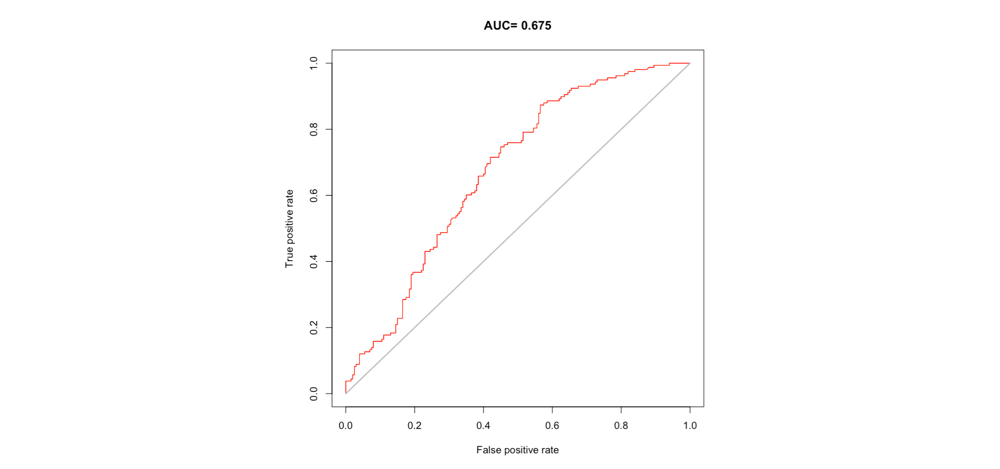
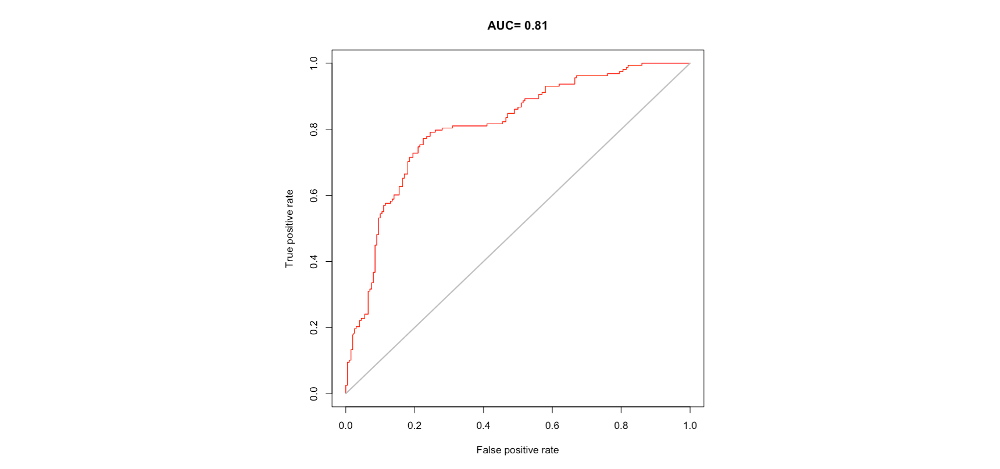

---
title:
subtitle: 
author:
date:
output:
  html_document:
    toc: false
    toc_float: true 
    depth: 2
    number_sections: false
    theme: spacelab
    highlight: pygments
editor_options: 
  markdown: 
    wrap: 150
---

## Session 3

### Basics of Species Distribution Models (SDMs)

|                                 |
|:--------------------------------|
|  |

 

Species distribution models are instrumental in predicting and understanding the geographic ranges of species. In this session, we will delve into the
use of `dismo`, `mgcv` and `randomForest` R packages, covering the basics of species distribution modelling. This will be a quick run-though over the theory and 
workflow of how to construct SDMs using observational data, and useful resources to help you along the way. Participants will learn how to construct
predictive models and assess habitat suitability for species.

#### Theory and Concept

Species Distribution Models (SDMs) are fundamental tools in ecology and conservation biology, aiming to understand and predict the spatial
distribution of species based on environmental variables. At its core, SDMs are grounded in the ecological niche theory, which suggests that species
occupy specific ecological niches characterised by environmental conditions such as temperature, water quality, and habitat features. By quantifying
the relationship between species occurrence records and environmental variables through statistical modeling techniques, SDMs provide insights into
the ecological requirements and habitat preferences of species.

  

  

These models typically utilise various algorithms, including MaxEnt, Random Forest, and Generalized Linear Models, to predict species distributions
across geographic areas. We will quickly go through an example dataset, and how different model structures and algorithm can drastically change your
predicted distribution. SDMs have diverse applications, from assessing the potential impacts of climate change on species distributions to informing
conservation planning and management strategies. However, they also come with limitations and uncertainties, including data quality issues,
assumptions about species-environment relationships, and challenges in extrapolating predictions to novel environmental conditions. Continuous
refinement and integration of multiple data sources and modeling approaches are essential for improving the accuracy and reliability of SDMs, thereby
enhancing their utility in addressing pressing ecological and conservation challenges. In this session, we will run though a quick example of how SDMs
are created in R, and the complexities of their development and interpretation.

Here we will provide a quick tour of SDMs, but if you want a more in-depth look at what goes into building and refining a SDM, check out some of these 
online sources ([SDM Intro](https://damariszurell.github.io/SDM-Intro/),[terra vignette](https://rspatial.org/raster/sdm/) and [Ecocommons](https://support.ecocommons.org.au/support/solutions/folders/6000240802/page/1?url_locale=)). There is also a wealth of literature on the subject
that you can refer to, including [this curated list](https://doi.org/10.1016/j.ecolmodel.2022.110242) of R packages that you can use to explore these analyses.

In this session we will use occurrence data on Oceanic Whitetip Sharks (*Carcharhinus longimanus*) from the Indian Ocean to model their distribution
using five commonly used SDM algorithms. We will also finally quickly introduce a simple ensemble model workflow to show how you can integrate outputs
from multiple algorithms to get better predictions of distribution. ***We have provided code to replicate the analysis and plotting, but as we will have***
***limited time during this session, we dont expect everyone to run these code. You can run them on your own time to see how it works!***

------------------------------------------------------------------------------------------------------------------------------------------------------

#### Basic steps of building SDMs

------------------------------------------------------------------------------------------------------------------------------------------------------

#### Data preperation                                       

##### Occurrence data

##### Absence or Pseudo-absence data

##### Environmental predictors

------------------------------------------------------------------------------------------------------------------------------------------------------

#### Model fitting {.tabset .tabset-fade .tabset-pills}

------------------------------------------------------------------------------------------------------------------------------------------------------

##### Linear models (LM, GLM)

 

 

------------------------------------------------------------------------------------------------------------------------------------------------------

[Back to top](#session_3)

  

##### Non-linear models (NLR, GAM)               

 

 

------------------------------------------------------------------------------------------------------------------------------------------------------

[Back to top](#session_3)

  

##### Classification models (BRT, GBM, Random Forest) 

 

 

------------------------------------------------------------------------------------------------------------------------------------------------------

[Back to top](#session_3)

  

##### Maximum Entropy (MaxEnt)                       

 

 

------------------------------------------------------------------------------------------------------------------------------------------------------

[Back to top](#session_3)

  

##### Ensemble models                                       

 

 

------------------------------------------------------------------------------------------------------------------------------------------------------

<a href="#top" style="color:steelblue; font:bold;" >Back to top</a>

  

