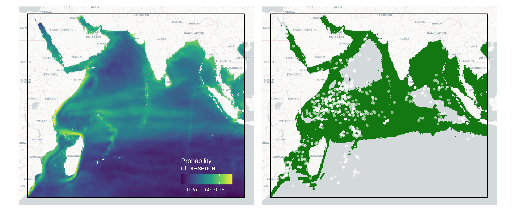
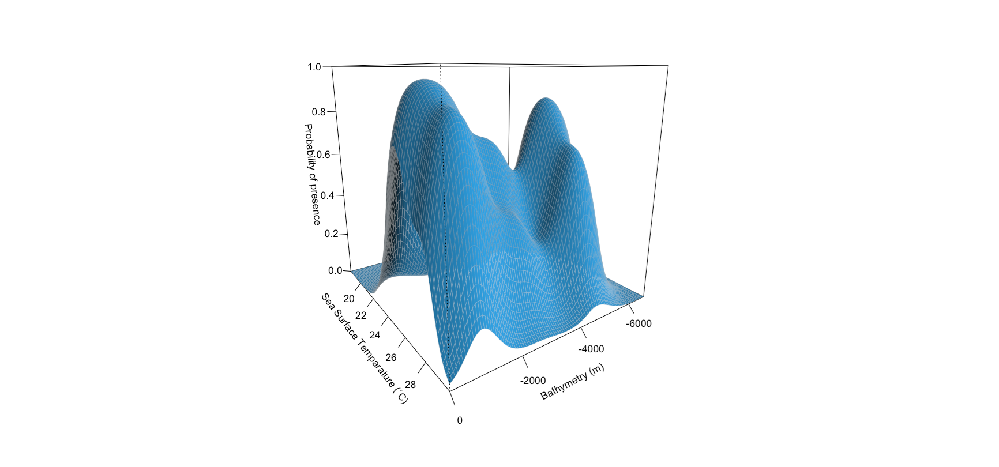
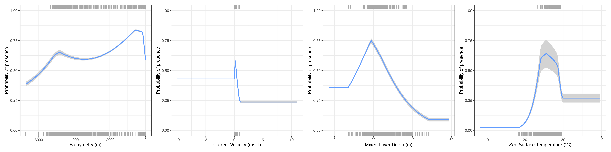

---
title:
subtitle: 
author:
date:
output:
  html_document:
    toc: false
    toc_float: true 
    depth: 2
    number_sections: false
    theme: spacelab
    highlight: pygments
editor_options: 
  markdown: 
    wrap: 150
---

## Session 3

### Basics of Species Distribution Models (SDMs)

|                                 |
|:--------------------------------|
|  |

 

Species distribution models are instrumental in predicting and understanding the geographic ranges of species. In this session, we will delve into the
use of `dismo`, `mgcv` and `randomForest` R packages, covering the basics of species distribution modelling. This will be a quick run-though over the theory and 
workflow of how to construct SDMs using observational data, and useful resources to help you along the way. Participants will learn how to construct
predictive models and assess habitat suitability for species.

 

------------------------------------------------------------------------------------------------------------------------------------------------------

#### Theory and Concept

Species Distribution Models (SDMs) are fundamental tools in ecology and conservation biology, aiming to understand and predict the spatial
distribution of species based on environmental variables. At its core, SDMs are grounded in the ecological niche theory, which suggests that species
occupy specific ecological niches characterised by environmental conditions such as temperature, water quality, and habitat features. By quantifying
the relationship between species occurrence records and environmental variables through statistical modeling techniques, SDMs provide insights into
the ecological requirements and habitat preferences of species.

  

  

These models typically utilise various algorithms, including MaxEnt, Random Forest, and Generalized Linear Models, to predict species distributions
across geographic areas. We will quickly go through an example dataset, and how different model structures and algorithm can drastically change your
predicted distribution. SDMs have diverse applications, from assessing the potential impacts of climate change on species distributions to informing
conservation planning and management strategies. However, they also come with limitations and uncertainties, including data quality issues,
assumptions about species-environment relationships, and challenges in extrapolating predictions to novel environmental conditions. Continuous
refinement and integration of multiple data sources and modeling approaches are essential for improving the accuracy and reliability of SDMs, thereby
enhancing their utility in addressing pressing ecological and conservation challenges. In this session, we will run though a quick example of how SDMs
are created in R, and the complexities of their development and interpretation.

Here we will provide a quick tour of SDMs, but if you want a more in-depth look at what goes into building and refining a SDM, check out some of these 
online sources ([SDM Intro](https://damariszurell.github.io/SDM-Intro/),[terra vignette](https://rspatial.org/raster/sdm/) and [Ecocommons](https://support.ecocommons.org.au/support/solutions/folders/6000240802/page/1?url_locale=)). There is also a wealth of literature on the subject
that you can refer to, including [this curated list](https://doi.org/10.1016/j.ecolmodel.2022.110242) of R packages that you can use to explore these analyses.

In this session we will use occurrence data on Oceanic Whitetip Sharks (*Carcharhinus longimanus*) from the Indian Ocean to model their distribution
using five commonly used SDM algorithms. We will also finally quickly introduce a simple ensemble model workflow to show how you can integrate outputs
from multiple algorithms to get better predictions of distribution. ***We have provided code to replicate the analysis and plotting, but as we will have***
***limited time during this session, we dont expect everyone to run these code. You can run them on your own time to see how it works!***

------------------------------------------------------------------------------------------------------------------------------------------------------

 

#### Basic steps of building SDMs

Building a SDM is an iterative process, and typically involves several steps. The paper [Zurell et al. 2020]( https://doi.org/10.1111/ecog.04960) provides a
comprehensive step by step run through of a standard protocol on how to develop SDMs and how to report them in papers to allow for reproducibility. 
Here's a quick overview:

  

  

***Overview/Conceptualisation -*** One of the key steps in developing SDMs is first conceptualising the objectives, available data, and the relevance of SDMs for your research
question. This includes understanding if SDMs are going to tell you what you need to answer your hypothesis. Similarly, if you do not have 
access to relevant data, then the outputs of SDMs may not be useful (the old GIGO adage: garbage in, gargabe out!). In this step, it is worth 
overviewing and conceptialising the objectives of the modelling excercise, and asscertain if this model is relevant for the taxon, location,
spatial and temporal scale of your study system.

 

***Data Collection, preperation and exploration -*** The next step we gather occurrence data for the species of interest (e.g., presence-only or presence-absence data) and environmental variables
(e.g., temperature, bathymetry) that may be biologically relevant for the study area and the species of interest. Organise and clean the data, 
ensuring that it's in a suitable format for analysis. This may involve handling missing values, converting data types, and standardizing units.
Explore the relationships between species occurrence and environmental variables using visualization techniques such as scatter plots, histograms, 
and correlation matrices.

 

***Model selection, fitting and training -*** We then choose an appropriate modeling technique for your data. Common SDM algorithms in R include MaxEnt (using the `dismo` package), Generalized 
Linear Models (GLMs) or Generalized Additive Models (GAMs) (using the `mgcv` package), and Random Forest (using the `randomForest` package). We then
Split the data into training and testing sets needed to evaluate model performance further down the track. We finally fit the chosen model using the 
training data. We will cover some of these techincal steps later in this session.

 

***Model assessment and exploration -*** Once models have been fit, we assess the performance of the model using evaluation metrics such as Area Under the Receiver Operating Characteristic 
Curve (AUC-ROC), Area Under the Precision-Recall Curve (AUC), or True Skill Statistic (TSS). We also explore the response curves for the model to
identify how each explanatory predictor impacts the probability of presence of your species. Response curves and variable importance plots can tell 
you if the predictor variables used are relevant, or having any influence on the model.

 

***Model prediction and visualisation -*** Once the model is trained and evaluated, use it to predict species distributions across the study area based on environmental variables. Visualize 
the predicted species distribution map using mapping packages like `terra` or `ggplot2`, along with additional spatial data if necessary. Validate the 
predicted distributions against the testing subset of data, independent occurrence data or expert knowledge to verify the accuracy and reliability of 
the model. 

 

***Refinement and Iteration -*** Refinement is key in SDMs, and you can often go through 10s of iterations before you have a properly fitted model that provides accurate estimates of 
species presence and response curves. Iterate through the modeling process, refining the model and incorporating additional data or variables as needed
to improve accuracy and robustness.

 

------------------------------------------------------------------------------------------------------------------------------------------------------

#### Data preperation                                       

Here we will go through a quick workflow in R to enable a ***very simple*** SDM, from sourcing occurrence data all the way to building ensemble models. 
Note, this is an overly simplistic example just to get everyone up to speed on how SDMs operate using occurrence data. We will go through how this modelling
workflow can be modified to use movement data to inform distribution models in the next session.

 

##### Occurrence data

##### Absence or Pseudo-absence data

##### Environmental predictors

------------------------------------------------------------------------------------------------------------------------------------------------------

#### Model fitting {.tabset .tabset-fade .tabset-pills}

------------------------------------------------------------------------------------------------------------------------------------------------------

##### Linear models

 

 

------------------------------------------------------------------------------------------------------------------------------------------------------

[Back to top](#session_3)

  

##### Non-linear models             

 

 

------------------------------------------------------------------------------------------------------------------------------------------------------

[Back to top](#session_3)

  

##### Classification models

 

 

------------------------------------------------------------------------------------------------------------------------------------------------------

[Back to top](#session_3)

  

##### Maximum Entropy                      

 

 

------------------------------------------------------------------------------------------------------------------------------------------------------

[Back to top](#session_3)

  

#### Ensemble model approach

 

 

------------------------------------------------------------------------------------------------------------------------------------------------------

<a href="#top" style="color:steelblue; font:bold;" >Back to top</a>

  

