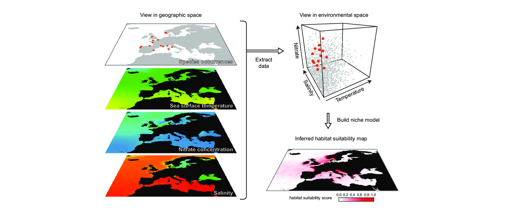
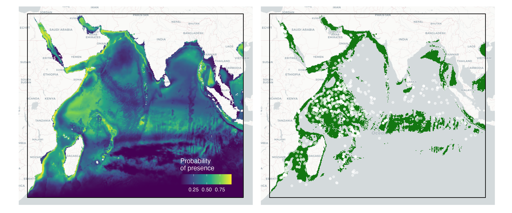

---
title:
subtitle: 
author:
date:
output:
  html_document:
    toc: false
    toc_float: true 
    depth: 2
    number_sections: false
    theme: spacelab
    highlight: pygments
editor_options: 
  markdown: 
    wrap: 150
---

## Session 3

### Basics of Species Distribution Models (SDMs)

|                                 |
|:--------------------------------|
|  |

<br>

Species distribution models are instrumental in predicting and understanding the geographic ranges of species. In this session, we will delve into the
use of `dismo`, `mgcv` and `randomForest` R packages, covering the basics of species distribution modelling. This will be a quick run-though over the theory and 
workflow of how to construct SDMs using observational data, and useful resources to help you along the way. Participants will learn how to construct
predictive models and assess habitat suitability for species.

<br>

------------------------------------------------------------------------------------------------------------------------------------------------------

#### Theory and Concept

Species Distribution Models (SDMs) are fundamental tools in ecology and conservation biology, aiming to understand and predict the spatial
distribution of species based on environmental variables. At its core, SDMs are grounded in the ecological niche theory, which suggests that species
occupy specific ecological niches characterised by environmental conditions such as temperature, water quality, and habitat features. By quantifying
the relationship between species occurrence records and environmental variables through statistical modeling techniques, SDMs provide insights into
the ecological requirements and habitat preferences of species.

<br><br>



<br><br>

These models typically utilise various algorithms, including MaxEnt, Random Forest, and Generalized Linear Models, to predict species distributions
across geographic areas. We will quickly go through an example dataset, and how different model structures and algorithm can drastically change your
predicted distribution. SDMs have diverse applications, from assessing the potential impacts of climate change on species distributions to informing
conservation planning and management strategies. However, they also come with limitations and uncertainties, including data quality issues,
assumptions about species-environment relationships, and challenges in extrapolating predictions to novel environmental conditions. Continuous
refinement and integration of multiple data sources and modeling approaches are essential for improving the accuracy and reliability of SDMs, thereby
enhancing their utility in addressing pressing ecological and conservation challenges. In this session, we will run though a quick example of how SDMs
are created in R, and the complexities of their development and interpretation.


Here we will provide a quick tour of SDMs, but if you want a more in-depth look at what goes into building and refining a SDM, check out some of these 
online sources ([SDM Intro](https://damariszurell.github.io/SDM-Intro/),[terra vignette](https://rspatial.org/raster/sdm/) and [Ecocommons](https://support.ecocommons.org.au/support/solutions/folders/6000240802/page/1?url_locale=)). There is also a wealth of literature on the subject
that you can refer to, including [this curated list](https://doi.org/10.1016/j.ecolmodel.2022.110242) of R packages that you can use to explore these analyses.


In this session we will use occurrence data on Oceanic Whitetip Sharks (*Carcharhinus longimanus*) from the Indian Ocean to model their distribution
using five commonly used SDM algorithms. We will also finally quickly introduce a simple ensemble model workflow to show how you can integrate outputs
from multiple algorithms to get better predictions of distribution. ***We have provided code to replicate the analysis and plotting, but as we will have***
***limited time during this session, we dont expect everyone to run these code. You can run them on your own time to see how it works!***

<br><br>


------------------------------------------------------------------------------------------------------------------------------------------------------

#### Basic steps of building SDMs


Building a SDM is an iterative process, and typically involves several steps. The paper [Zurell et al. 2020](https://doi.org/10.1111/ecog.04960) provides a
comprehensive step by step run through of a standard protocol on how to develop SDMs and how to report them in papers to allow for reproducibility. 
Here's a quick overview:

<br><br>


<br><br>


***Overview/Conceptualisation -*** One of the key steps in developing SDMs is first conceptualising the objectives, available data, and the relevance of SDMs for your research
question. This includes understanding if SDMs are going to tell you what you need to answer your hypothesis. Similarly, if you do not have 
access to relevant data, then the outputs of SDMs may not be useful (the old GIGO adage: garbage in, gargabe out!). In this step, it is worth 
overviewing and conceptialising the objectives of the modelling excercise, and asscertain if this model is relevant for the taxon, location,
spatial and temporal scale of your study system.

<br>


***Data Collection, preperation and exploration -*** The next step we gather occurrence data for the species of interest (e.g., presence-only or presence-absence data) and environmental variables
(e.g., temperature, bathymetry) that may be biologically relevant for the study area and the species of interest. Organise and clean the data, 
ensuring that it's in a suitable format for analysis. This may involve handling missing values, converting data types, and standardizing units.
Explore the relationships between species occurrence and environmental variables using visualization techniques such as scatter plots, histograms, 
and correlation matrices.

<br>


***Model selection, fitting and training -*** We then choose an appropriate modeling technique for your data. Common SDM algorithms in R include MaxEnt (using the `dismo` package), Generalized 
Linear Models (GLMs) or Generalized Additive Models (GAMs) (using the `mgcv` package), and Random Forest (using the `randomForest` package). We then
Split the data into training and testing sets needed to evaluate model performance further down the track. We finally fit the chosen model using the 
training data. We will cover some of these techincal steps later in this session.

<br>


***Model assessment and exploration -*** Once models have been fit, we assess the performance of the model using evaluation metrics such as Area Under the Receiver Operating Characteristic 
Curve (AUC-ROC), Area Under the Precision-Recall Curve (AUC), or True Skill Statistic (TSS). We also explore the response curves for the model to
identify how each explanatory predictor impacts the probability of presence of your species. Response curves and variable importance plots can tell 
you if the predictor variables used are relevant, or having any influence on the model.

<br>


***Model prediction and visualisation -*** Once the model is trained and evaluated, use it to predict species distributions across the study area based on environmental variables. Visualize 
the predicted species distribution map using mapping packages like `terra` or `ggplot2`, along with additional spatial data if necessary. Validate the 
predicted distributions against the testing subset of data, independent occurrence data or expert knowledge to verify the accuracy and reliability of 
the model. 

<br>


***Refinement and Iteration -*** Refinement is key in SDMs, and you can often go through 10s of iterations before you have a properly fitted model that provides accurate estimates of 
species presence and response curves. Iterate through the modeling process, refining the model and incorporating additional data or variables as needed
to improve accuracy and robustness.


<br><br>

------------------------------------------------------------------------------------------------------------------------------------------------------

#### Data preperation                                       

Here we will go through a quick workflow in R to enable a ***very simple*** SDM, from sourcing occurrence data all the way to building ensemble models. 
Note, this is an overly simplistic example just to get everyone up to speed on how SDMs operate using occurrence data. We will go through how this modelling
workflow can be modified to use movement data to inform distribution models in the next session.

<br>

##### ***Occurrence data***

Occurrence data used for SDMs typically include records of species presence or presence-absence across geographic locations. These data can be obtained from 
various sources, including published literature, museum collections, citizen science projects, and online databases. In R, there are several packages and 
resources available for accessing occurrence data:


- [***GBIF***](https://www.gbif.org) (Global Biodiversity Information Facility): The [`rgbif` package](https://docs.ropensci.org/rgbif/articles/rgbif.html) allows 
you to search and download occurrence records from the GBIF database directly within R.
- [***rvertnet***](https://github.com/ropensci/rvertnet): This package provides access to occurrence data from multiple vertebrate-focused biodiversity data networks,
including VertNet, MaNIS, and ORNIS.
- [***spocc***](https://github.com/ropensci/spocc): This package provides a unified interface to several online species occurrence data sources, including GBIF, 
iNaturalist, and eBird.
- [***ALA***](https://www.ala.org.au) (Atlas of Living Australia): The [`galah`](https://github.com/AtlasOfLivingAustralia/galah-R) package allows you to access 
species occurrence data from the ALA database.
- ***Data repositories***: Many research papers provide access to their occurrence data through online repositories such as [Dryad](https://datadryad.org/stash)
or [Figshare](https://figshare.com). You can download these datasets directly or use APIs if available.


Once you have obtained the occurrence data, you can import it into R using the functions we discussed in Session 1, or specific functions provided by the packages 
mentioned above. Be sure to clean and preprocess the data as needed before using it in your SDM analysis. Here we have accessed some example data on Oceanic Whitetip
Sharks (*Carcharhinus longimanus*) in the Indian Ocean from [GBIF](https://www.gbif.org), and using the code from Session 1 have plotted it using `ggspatial`.

<br>


```{r, eval=TRUE, message=FALSE, warning=FALSE}
## Lets first load some useful packages
library(tidyverse)
library(sf)
library(terra)
library(raster)
library(ggspatial)
library(dismo)
library(stats)
library(randomForest)
library(mgcv)
library(visreg)


```


```{r, eval=FALSE}
## We can call on the data from the workshop GitHub page directly

occ <- read_csv("https://raw.githubusercontent.com/vinayudyawer/OCS2024_SDMworkshop/main/data/session_3/Oceanic%20whitetip%20occ.csv")

occ_vect <-
  occ %>% 
  st_as_sf(coords = c("lon", "lat"), crs = 4326, remove = F) %>% 
  vect()

ggplot() + 
  annotation_map_tile('cartolight', zoom = 4) +
  layer_spatial(occ_vect, color = "black") +
  annotation_scale(width_hint = 0.2, location = "br") +
  theme_void()


```


<br>

##### ***Absence or Pseudo-absence data***

Now that we have occurrence data, we need data used to represent locations where a species is presumed to be absent. These data points serve as a contrast to presence
data and are essential for modeling the species' distribution accurately. If we have quantitative data of confirmed absences (i.e., we know for sure this species is 
not found here!), this is very valuable for SDM modelling. However, in most real-world cases, this kind of information is not available. In which case, we use 'presumed'
absence data known as 'pseudo'-absences. Pseudo-absence data are generated using various techniques such as random sampling from areas where the species has not been 
observed, environmental similarity methods, or background sampling from the study area.

In R, generating pseudo-absence data can be done using functions like 'randomPoints()' from the `dismo` package or 'st_sample()' function from the `sf` package. Additionally,
some SDM packages in R, such as `dismo`, `biomod2`, and `MaxEnt`, include built-in functions for generating pseudo-absence data as part of their modeling workflow.

It's important to note that the selection and quality of pseudo-absence data can significantly impact model performance and interpretation. Careful consideration should be 
given to the method used for generating pseudo-absences to ensure they adequately represent areas where the species is genuinely absent while minimizing sampling bias.

<br>

```{r, eval=FALSE}
## Lets define our model extent to within our occurrence data
model_extent <- st_read("https://raw.githubusercontent.com/vinayudyawer/OCS2024_SDMworkshop/main/data/session_3/mod_ext.GeoJSON")

## upload pseudo absence points from the GitHub page
pseudo_vect <- 
  read_csv("https://raw.githubusercontent.com/vinayudyawer/OCS2024_SDMworkshop/main/data/session_3/Oceanic%20whitetip%20peudo_absence.csv") %>% 
  st_as_sf(coords = c("lon", "lat"), crs = 4326, remove = F) %>% 
  vect()


ggplot() + 
  annotation_map_tile('cartolight', zoom = 4) +
  layer_spatial(pseudo_vect, color = "red", alpha = 0.3) +
  layer_spatial(occ_vect, color = "black") +
  layer_spatial(model_extent, fill = NA, col = "black", lwd = 0.5) +
  annotation_scale(width_hint = 0.2, location = "br") +
  theme_void()


```


<br>

##### ***Environmental predictors***

The final component required to run a basic SDM is the model predictors. When developing SDMs, model predictors take the format of rasterised gridded data. These datasets
include climate variables (e.g., temperature, current, wind), biological variables (e.g., primary productivity, prey density) or habitat characteristics
(e.g., habitat type, slope, bathymetry). Now when developing large scale models like we are doing here, using remote sensing datasets provide a great way to include ecologically
and biologically relevant predictor variables that can inform the probability of presence of the target species. When choosing and processing environmental predictor variables
for SDMs, several steps are essential:


- ***Selection of predictors -*** Identify variables that are likely to influence the distribution of hte species of interest.
- ***Data acquisition -*** Obtain spatial datasets for the selected predictors. There are several online data sources where this data can be obtained from. The two most useful
sources are from the [**MARSPEC**](http://marspec.weebly.com) dataset, and the [**Bio-ORACLE**](https://bio-oracle.org) dataset. These datasets can be accessed either through 
each of the dataset websites linked here, or can be directly accessed and downloaded through R using the [`sdmpredictors`](https://cran.r-project.org/web/packages/sdmpredictors/vignettes/quickstart.html) package.
- ***Data preprocessing -*** Preprocess the environmental predictor data to ensure consistency and compatibility with the species occurrence data. This may involve resampling 
or reprojecting datasets to a common spatial resolution and coordinate system, masking out irrelevant areas (e.g., land), and handling missing or erroneous values. This can be
done easily in R using the `sf` and `terra` packages.
- ***Variable reduction -*** Assess multicollinearity among predictors and consider reducing the number of variables to avoid overfitting and improve model interpretability. 
Techniques such as principal component analysis (PCA), variable clustering, or expert knowledge can aid in identifying redundant variables.
- ***Biological relevance -*** Consider the biological relevance of predictors to the species being modeled. Exclude variables that are not ecologically meaningful or are known 
to have little influence on the species distribution.
- ***Variable transformation -*** Transform predictors if necessary to meet model assumptions or improve model fit. Common transformations include logarithmic or square root 
transformations for skewed variables or standardization to a common scale.
- ***Variable correlation -*** Examine pairwise correlations among predictors to ensure they are not overly correlated, as this can lead to unstable model estimates. Consider 
removing highly correlated variables or using regularization techniques to mitigate collinearity effects.


Here we have accessed four environmental variables from the [Bio-ORACLE](https://bio-oracle.org) dataset, including **bathymetry**, **current velocity**, **mixed layer depth** and 
**sea surface temperature**. We have selected just four variables to simplify this excersise, but keep in mind you will need to have a closer look at variables when modelling your
own SDM to make sure the variables are ecologically relevant to your species. Similarly, conducting pairwise correlations should be conducted to make sure environmental variables
are not overly correlated, which will influence model outputs.


```{r, eval=FALSE}
## Lets download the example environmental variables and plot them
env_stack <- rast("https://raw.githubusercontent.com/vinayudyawer/OCS2024_SDMworkshop/main/data/session_3/env_layers.tif")

plot(env_stack)

```


<br><br>


------------------------------------------------------------------------------------------------------------------------------------------------------

#### Model fitting {.tabset .tabset-fade .tabset-pills}

<a id="session_3"></a>


Now that we have all our basic components to build a SDM, lets have a look at some of the algorithms commonly used to build distribution models. Here
we will use the occurrence, pseudo-absence and environmental data to build four types of models. For each algorithm we will build the model, explore
the model responses, evaluate the model accurracy, and finally predict a spatial probability of presence to define the species' distribution. Before we
get started, lets first format our model data and develop a training and testing dataset to allow model evaluation.


```{r, eval=FALSE}
## Lets extract environmental variables associated with all the occurrence and pseudo-absence data

# occurrence data extraction
ext_occ <- 
  extract(env_stack, occ_vect) %>% 
  mutate(pa = 1, 
         lat = occ_vect$lat, 
         lon = occ_vect$lon, 
         kfold = kfold(ext_occ, 5),
         test_train = ifelse(kfold == 1, "test", "train"))

# pseudo-absence data extraction
ext_pseudo <- 
  extract(env_stack, pseudo_vect) %>% 
  mutate(pa = 0, 
         lat = pseudo_vect$lat, 
         lon = pseudo_vect$lon, 
         kfold = kfold(ext_pseudo, 5),
         test_train = ifelse(kfold == 1, "test", "train"))

# put together the dataset and configure them to build models
model_data <- 
  bind_rows(ext_occ, ext_pseudo) %>% 
  as_tibble() %>% 
  transmute(pa = factor(pa), lon, lat, bathymetry, current_velocity, 
            mixed_layer_depth, temperature, test_train) %>% 
  na.omit()

```
```{r, echo=FALSE, eval=TRUE, message=FALSE}
model_data <- 
  read_csv("https://raw.githubusercontent.com/vinayudyawer/OCS2024_SDMworkshop/main/data/session_3/model_data.csv") %>% 
  na.omit() %>% 
  mutate(pa = factor(pa))
```
```{r}

## Now we can partition our data into 'training' datasets (to model) 
## and 'testing' datasets (to evaluate models)

training_data <- 
  model_data %>% 
  filter(test_train %in% "train")

test_presence <- 
  model_data %>% 
  filter(test_train %in% "test") %>% 
  filter(pa %in% 1) %>% 
  st_as_sf(coords = c("lon", "lat"), crs = 4326) %>% 
  as_Spatial()

test_absence <-
  model_data %>% 
  filter(test_train %in% "test") %>% 
  filter(pa %in% 0) %>% 
  st_as_sf(coords = c("lon", "lat"), crs = 4326) %>% 
  as_Spatial()


```

<br>

Click through the below buttons to have a look at how each model is built and evaluated:


------------------------------------------------------------------------------------------------------------------------------------------------------

##### Linear models

<br>

<style>
div.blue { background-color:#e6f0ff; border-radius: 5px; padding: 20px;}
</style>
<div class = "blue">


Linear models are a versatile way to explore relatively simplistic relationships between occurrence and environmental data. Here we will use a Generalised
Linear Model (GLM) to build our first SDM using the `stats` package. 


```{r}
## Build GLM model
glm_mod <- glm(pa ~ bathymetry + current_velocity + mixed_layer_depth + temperature, 
               data = training_data, family = binomial(link = "logit"))


summary(glm_mod)


```


We can now use the `visreg` package to look at the response curves of this model:

```{r, eval=FALSE}
visreg(glm_mod, scale = "response", gg = TRUE)

```


We can also look at how two variables may interact with each other in the model:

```{r, eval=FALSE}
visreg2d(glm_mod, xvar = "bathymetry", yvar = "temperature", plot.type = "persp", scale = "response",
         xlab = "Bathymetry (m)", ylab = "Sea Surface Temparature (˚C)", zlab = "Probability of presence",
         theta = 145, phi = 15, zlim = c(0,1))

```


We can now evaluate the model by quantifying false positive and true positive rates using the 'testing' dataset

```{r, eval=FALSE}
## using the evaluate() function in the `dismo` package
glm_eval <- evaluate(p = test_presence, a = test_absence, model = glm_mod)

plot(glm_eval, "ROC", type = "l")

```


And finally we can use the model to predict the distribution using the 'predict()' function in the `terra` package:


```{r, eval=FALSE}
## We can predict and plot the model response (continuous value between 0 and 1)
glm_predict <- terra::predict(env_stack, glm_mod, type = "response")

plot(glm_predict)

## We can now threshold the output to a map identifying the species distribution
# we need to first predict the model 'link' function
glm_link <- terra::predict(env_stack, glm_mod, type = "link")

# define the threshold using the evaluation metrics estimated earlier
glm_threshold <- threshold(glm_eval, stat = 'spec_sens')

plot(glm_link > glm_threshold)

```


<br>

</div>

<br>

------------------------------------------------------------------------------------------------------------------------------------------------------

[Back to top](#session_3)

<br><br>

##### Non-linear models             

<br>

<style>
div.blue { background-color:#e6f0ff; border-radius: 5px; padding: 20px;}
</style>
<div class = "blue">


Non-linear models fit more complex relationships between occurrence and environmental data, and the model often fits the data better. 
Here we will use a Generalised Additive Model (GAM) to build this SDM using the `mgcv` package. 


```{r}
## Build GAM model
gam_mod <- gam(pa ~ s(bathymetry) + s(current_velocity) + s(mixed_layer_depth) + s(temperature),
               data = training_data, family = binomial(link = "logit"))


summary(gam_mod)


```


We can now use the `visreg` package to look at the response curves of this model:

```{r, eval=FALSE}
visreg(gam_mod, scale = "response", gg = TRUE)

```


We can also look at how two variables may interact with each other in the model:

```{r, eval=FALSE}
visreg2d(gam_mod, xvar = "bathymetry", yvar = "temperature", scale = "response", plot.type = "persp",
         xlab = "Bathymetry (m)", ylab = "Sea Surface Temparature (˚C)", zlab = "Probability of presence",
         theta = 145, phi = 15, zlim = c(0,1))

```


We can now evaluate the model by quantifying false positive and true positive rates using the 'testing' dataset

```{r, eval=FALSE}
## using the evaluate() function in the `dismo` package
gam_eval <- evaluate(p = test_presence, a = test_absence, model = gam_mod)

plot(gam_eval, "ROC", type = "l")

```


And finally we can use the model to predict the distribution using the 'predict()' function in the `terra` package:


```{r, eval=FALSE}
## We can predict and plot the model response (continuous value between 0 and 1)
gam_predict <- terra::predict(env_stack, gam_mod, type = "response")

plot(gam_predict)

## We can now threshold the output to a map identifying the species distribution
# we need to first predict the model 'link' function
gam_link <- terra::predict(env_stack, gam_mod, type = "link")

# define the threshold using the evaluation metrics estimated earlier
gam_threshold <- threshold(gam_eval, stat = 'spec_sens')

plot(gam_link > gam_threshold)

```



<br>

</div>

<br>

------------------------------------------------------------------------------------------------------------------------------------------------------

[Back to top](#session_3)

<br><br>

##### Classification models

<br>

<style>
div.blue { background-color:#e6f0ff; border-radius: 5px; padding: 20px;}
</style>
<div class = "blue">


Classification models are another versatile way to define the relationship between occurrence and environmental predictors. These methods typically involve 
training classifiers on labeled occurrence data (presence-absence or presence-background) and environmental predictor variables. Common classification algorithms 
include Random Forest, Support Vector Machines (SVM), k-Nearest Neighbors (k-NN), and Gradient Boosting Machines (GBM). These algorithms learn patterns from 
the training data and then classify new locations as suitable or unsuitable for the species based on the learned patterns and environmental characteristics. 
Classification-based SDMs offer robustness, flexibility, and often higher predictive accuracy, making them valuable tools for ecological research, conservation 
planning, and biodiversity management. Here we will use a Random Forest model to build this SDM using the `randomForest` package. 


```{r}
## Build Random Forest model
rf_mod <- randomForest(pa ~ bathymetry + current_velocity + mixed_layer_depth + temperature,
                       data = model_data, ntree = 1000, nodesize = 10, importance = T)


rf_mod


```


We can now use the `visreg` package to look at the response curves of this model:

```{r, eval=FALSE}
visreg(rf_mod, gg = TRUE)

```


We can also look at how two variables may interact with each other in the model:

```{r, eval=FALSE}
visreg2d(rf_mod, xvar = "bathymetry", yvar = "temperature", plot.type = "persp",
         xlab = "Bathymetry (m)", ylab = "Sea Surface Temparature (˚C)", zlab = "Probability of presence",
         theta = 145, phi = 15)

```


We can now evaluate the model by quantifying false positive and true positive rates using the 'testing' dataset

```{r, eval=FALSE}
## using the evaluate() function in the `dismo` package
rf_eval <- evaluate(p = test_presence, a = test_absence, model = rf_mod, type = "prob")

plot(rf_eval, "ROC", type = "l")

```


And finally we can use the model to predict the distribution using the 'predict()' function in the `terra` package:


```{r, eval=FALSE}
## We can predict and plot the model probability (continuous value between 0 and 1)
rf_predict <- terra::predict(env_stack, rf_mod, type = "prob")

plot(rf_predict[[2]])

## We can now threshold the output to a map identifying the species distribution
# for randomForest models we model the 'response' to get the thresholded output
rf_link <- terra::predict(env_stack, rf_mod, type = "response")

plot(rf_link)

```


<br>

</div>

<br>

------------------------------------------------------------------------------------------------------------------------------------------------------

[Back to top](#session_3)

<br><br>

##### Maximum Entropy                      

<br>

<style>
div.blue { background-color:#e6f0ff; border-radius: 5px; padding: 20px;}
</style>
<div class = "blue">

The 'MaxEnt' method, short for Maximum Entropy Modeling, is a popular technique for Species Distribution Models (SDMs) widely used due to its effectiveness 
in predicting species distributions using presence-only data. MaxEnt models estimate the probability distribution of species occurrences by maximising entropy
subject to constraints derived from environmental predictor variables. This approach allows MaxEnt to capture complex relationships between species occurrences
and environmental conditions while making minimal assumptions about the underlying ecological processes. By leveraging environmental data, MaxEnt produces 
spatially explicit predictions of species distributions, providing valuable insights for conservation planning, habitat suitability assessment, and understanding
species-environment relationships.

Here we will use MaxEnt to build this SDM using the `dismo` package. This model requires the data in a slightly different format. 


```{r, message=FALSE, warning=FALSE}
## Setup the input data to enable the maxent() function in `dismo`
presence_data <- 
  training_data %>% 
  filter(pa %in% 1) %>% 
  st_as_sf(coords = c("lon", "lat"), crs = 4326) %>% 
  as_Spatial()

absence_data <- 
  training_data %>% 
  filter(pa %in% 0) %>% 
  st_as_sf(coords = c("lon", "lat"), crs = 4326) %>% 
  as_Spatial()

predictors <- raster::stack(env_stack)

## Build the MaxEnt model
maxent_mod <- maxent(x = predictors, p = presence_data, a = absence_data)

maxent_mod

```


We can now use the `dismo` packages 'response()' function to look at the response curves of this model:

```{r, eval=FALSE}
response(maxent_mod)

```


We can now evaluate the model by quantifying false positive and true positive rates using the 'testing' dataset, and identify which variables
contribute to the model most significantly

```{r, eval=FALSE}
## using the evaluate() function in the `dismo` package
maxent_eval <- evaluate(p = test_presence, a = test_absence, model = maxent_mod)

plot(maxent_eval, "ROC", type = "l")
plot(maxent_mod)

```


And finally we can use the model to predict the distribution using the 'predict()' function in the `terra` package:


```{r, eval=FALSE}
## We can predict and plot the model probability (continuous value between 0 and 1)
maxent_pred <- terra::predict(maxent_mod, env_stack)

plot(maxent_pred)

## We can now threshold the output to a map identifying the species distribution
# define the threshold using the evaluation metrics estimated earlier
maxent_threshold <- threshold(maxent_eval, stat = 'spec_sens')

plot(maxent_pred > maxent_threshold)

```


<br>

</div>

<br>

------------------------------------------------------------------------------------------------------------------------------------------------------

[Back to top](#session_3)

<br><br>

#### Ensemble model approach

<br>

<style>
div.blue { background-color:#e6f0ff; border-radius: 5px; padding: 20px;}
</style>
<div class = "blue">


</div>


<br>


------------------------------------------------------------------------------------------------------------------------------------------------------

<a href="#top" style="color:steelblue; font:bold;" >Back to top</a>

<br><br>


