---
title:
subtitle: 
author:
date:
output:
  html_document:
    toc: false
    toc_float: true 
    depth: 2
    number_sections: false
    theme: spacelab
    highlight: pygments
editor_options: 
  markdown: 
    wrap: 150
---

## Session 4

### Using telemetry data to define species distributions

|                                 |
|:--------------------------------|
|  |

<br>


This final session brings together what we've learned in the last three sessions and puts them all together! We will now focus on integrating telemetry data with 
species distribution models, enabling the creation of comprehensive distribution maps and the analysis of how environmental variables influence species presence and absence.


```{r, message=FALSE, warning=FALSE}
library(tidyverse)
library(terra)
library(ggspatial)
library(plotly)
library(patchwork)
library(visreg)
library(dismo)
library(mgcv)
library(mgcViz)

```

## Input occurrence data

```{r, eval=FALSE}
tracks <- read_csv('https://raw.githubusercontent.com/vinayudyawer/OCS2024_SDMworkshop/main/data/session_4/track_data.csv')

null_tracks <- read_csv('https://raw.githubusercontent.com/vinayudyawer/OCS2024_SDMworkshop/main/data/session_4/null_data.csv')

background <- read_csv('https://raw.githubusercontent.com/vinayudyawer/OCS2024_SDMworkshop/main/data/session_4/bg_data.csv')

model_extent <- vect("https://raw.githubusercontent.com/vinayudyawer/OCS2024_SDMworkshop/main/data/session_3/mod_ext.GeoJSON")

```


# quick plot to show the presence and pseudo absences

```{r, eval=FALSE}
ggplot() +
  annotation_map_tile('cartolight', zoom = 4) +
  layer_spatial(model_extent, fill = NA) +
  geom_spatial_point(data = background, aes(x = lon, y = lat), col = "grey", crs = 4326) +
  geom_spatial_point(data = null_tracks, aes(x = lon, y = lat), col = "pink", crs = 4326) +
  geom_spatial_point(data = tracks, aes(x = lon, y = lat), col = "firebrick", crs = 4326) +
  facet_wrap(~id) +
  theme_void()
```

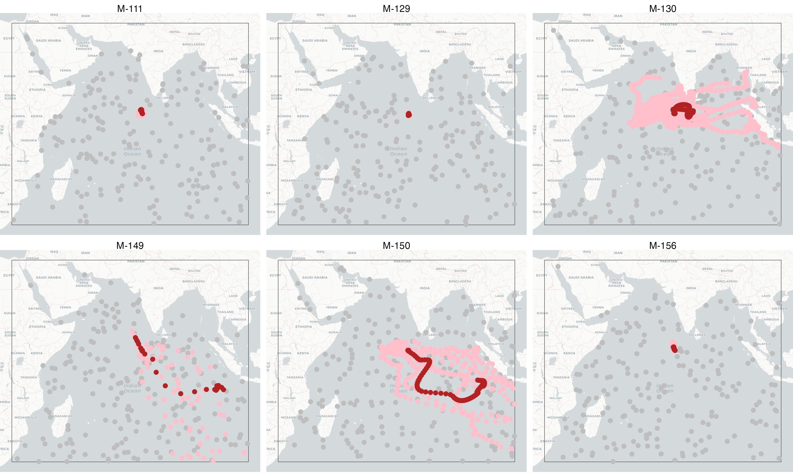


## Input environmental data

```{r, eval=FALSE}
env_stack <- rast("https://raw.githubusercontent.com/vinayudyawer/OCS2024_SDMworkshop/main/data/session_3/env_layers.tif")

# quick plot

plot(env_stack)

```

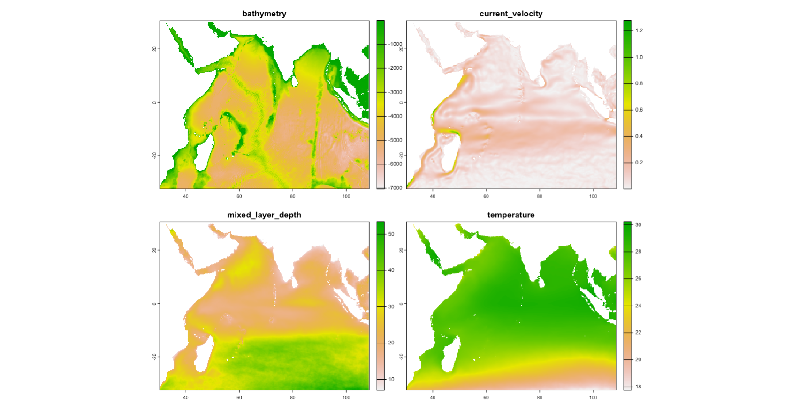

## extract environmental data for each occurrence, pseudo-absence and background point

```{r, eval=FALSE}

tracks_vec <- vect(tracks, geom=c("lon", "lat"), crs = "EPSG:4326")
null_vec <- vect(null_tracks, geom=c("lon", "lat"), crs = "EPSG:4326")
bg_vec <- vect(background, geom=c("lon", "lat"), crs = "EPSG:4326")

tracks_env <- 
  tracks %>% 
  bind_cols(extract(env_stack, tracks_vec)[-1])

null_env <- 
  null_tracks %>% 
  bind_cols(extract(env_stack, null_vec)[-1])

bg_env <- 
  background %>% 
  bind_cols(extract(env_stack, bg_vec)[-1])

```


# combine into a single data frame to allow for visualising and modelling

```{r, echo=FALSE, message=F}
model_data <- read_csv('https://raw.githubusercontent.com/vinayudyawer/OCS2024_SDMworkshop/main/data/session_4/model_data.csv')

```
```{r, eval=FALSE}
model_data <- 
  bind_rows(tracks_env, null_env, bg_env) %>% 
  mutate(presence = case_when(type %in% c("occurrence") ~ 1,
                              TRUE ~ 0)) %>% 
  filter_at(vars(bathymetry, current_velocity, mixed_layer_depth, temperature), all_vars(!is.na(.)))

```


# lets look at the distrutbutions of the environmental variables

```{r, eval=FALSE}
model_data %>% ggplot(aes(x = bathymetry)) + geom_histogram() + theme_bw() +
model_data %>% ggplot(aes(x = temperature)) + geom_histogram() + theme_bw() +
model_data %>% ggplot(aes(x = current_velocity)) + geom_histogram() + theme_bw() +
model_data %>% ggplot(aes(x = mixed_layer_depth)) + geom_histogram() + theme_bw()

```

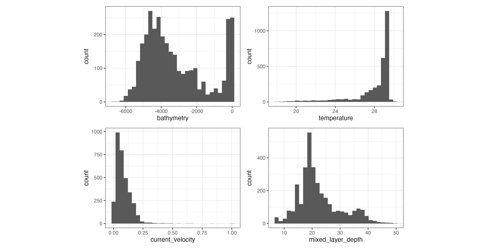

# transform data to correct skewness in variables

```{r, message=FALSE}
trans_data <-
  model_data %>%
  mutate(current_velocity = log10(current_velocity),
         temperature = exp(temperature),
         mixed_layer_depth = log10(mixed_layer_depth))

```


```{r, eval=FALSE}
trans_data %>% ggplot(aes(x = bathymetry)) + geom_histogram() + theme_bw() +
trans_data %>% ggplot(aes(x = temperature)) + geom_histogram() + theme_bw() +
trans_data %>% ggplot(aes(x = current_velocity)) + geom_histogram() + theme_bw() +
trans_data %>% ggplot(aes(x = mixed_layer_depth)) + geom_histogram() + theme_bw()

```

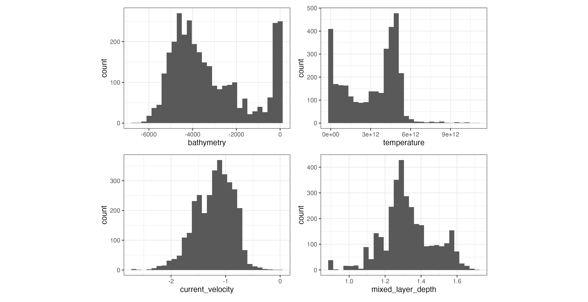


## we also have to transform the env_stack

```{r, eval=FALSE}

env_trans <- env_stack

env_trans$current_velocity <- log10(env_trans$current_velocity)
env_trans$temperature <- exp(env_trans$temperature)
env_trans$mixed_layer_depth <- log10(env_trans$mixed_layer_depth)

plot(env_trans)

```

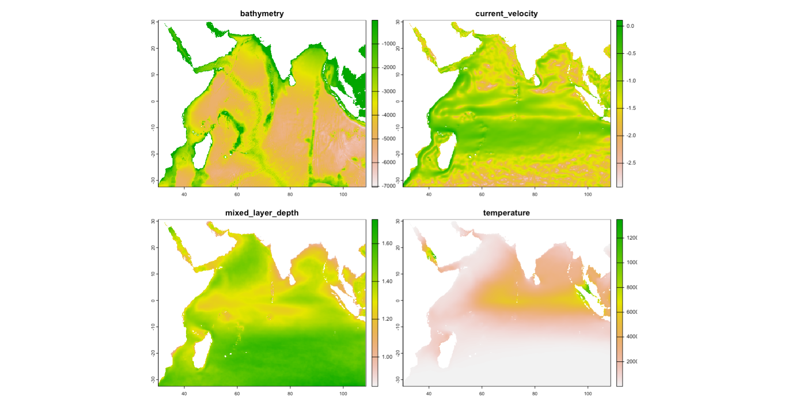


# lets visualise the data in environmental space


```{r, out.width='100%'}
trans_data %>% 
  plot_ly(x = ~bathymetry, 
        y = ~temperature,
        z = ~current_velocity,
        color = ~type) %>% 
  add_markers()

```


## split data into test and train datasets

````{r, eval=FALSE}

training_data <- 
  trans_data %>% 
  filter(test_train %in% "train")

test_presence <- 
  trans_data %>% 
  filter(test_train %in% "test") %>% 
  filter(presence %in% 1) %>% 
  vect(crs = "EPSG:4326")

test_absence <-
  trans_data %>% 
  filter(test_train %in% "test") %>% 
  filter(presence %in% 0) %>% 
  vect(crs = "EPSG:4326")

```


## Now lets build a model

```{r, eval=FALSE}

library(mgcv)

gamm_mod <- gamm(presence ~ s(bathymetry) + s(temperature) + 
                   s(current_velocity) + s(mixed_layer_depth), 
                 data = training_data,
                 random = list(id = ~id),
                 method = "REML", 
                 family = binomial("logit"))

## Lets seperate the GAM portion of the GAMM model 
mod <- gamm_mod$gam

```


## response curves

```{r, eval=FALSE}

library(mgcViz)

mod_viz <- getViz(mod)

print(
  plot(mod_viz) + 
    l_ciPoly(alpha = 0.5) + 
    l_fitLine() + 
    l_rug() +
    theme_bw(), 
  pages = 1)

```

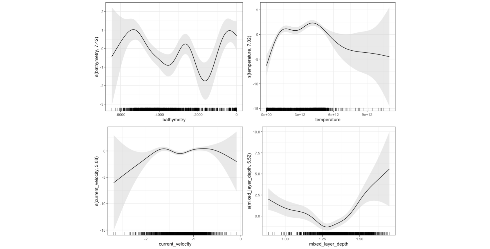


```{r, eval=FALSE}

vis.gam(mod, view = c("bathymetry", "temperature"), theta = 145, phi = 15, type = "response")

```

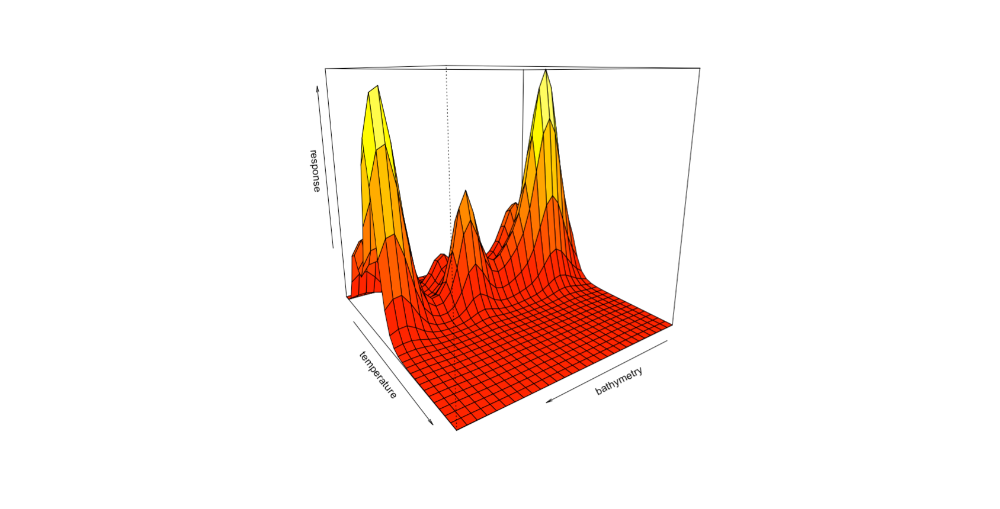

```{r, eval=FALSE}

vis.gam(mod, view = c("mixed_layer_depth", "current_velocity"), theta = 145, phi = 15, type = "response")

```


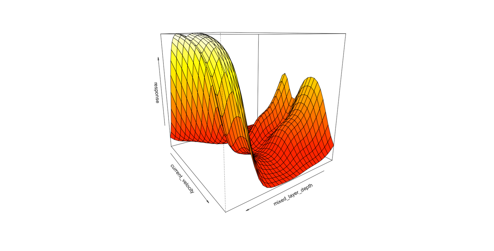


## using the evaluate() function in the `dismo` package

```{r, eval=FALSE}

library(dismo)

gamm_eval <- dismo::evaluate(p = test_presence, a = test_absence, model = mod)

plot(gamm_eval, "ROC", type = "l")

```

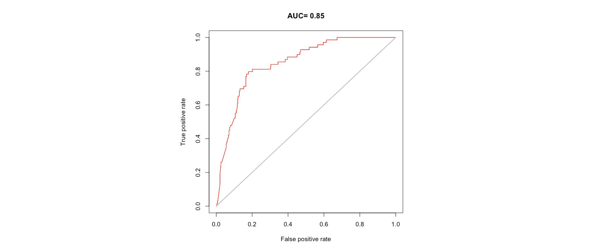


## We can predict and plot the model response (continuous value between 0 and 1)

```{r, eval=FALSE}
gamm_predict <- terra::predict(env_trans, mod, type = "response")

plot(gamm_predict)


## We can now threshold the output to a map identifying the species distribution
# we need to first predict the model 'link' function
gamm_link <- terra::predict(env_trans, mod, type = "link")

plot(gamm_link)

# define the threshold using the evaluation metrics estimated earlier
gamm_threshold <- threshold(gamm_eval, stat = 'spec_sens')

plot(gamm_link > gamm_threshold)

```

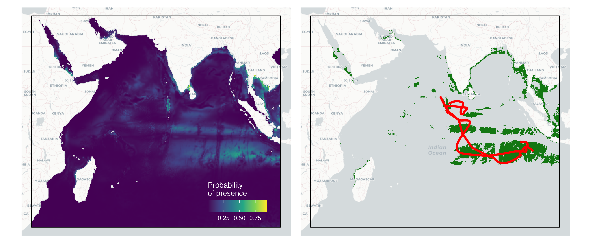


## modelling move persistance (g)

```{r, warning=FALSE}

mp_mod <- gam(g ~ s(bathymetry) + s(temperature) + 
                s(current_velocity) + s(mixed_layer_depth), 
               data = trans_data, 
              family = quasibinomial("logit"))

summary(mp_mod)

```


## explore the response curve


```{r, eval=FALSE}
visreg::visreg(mp_mod, scale = "response", gg = T)

```

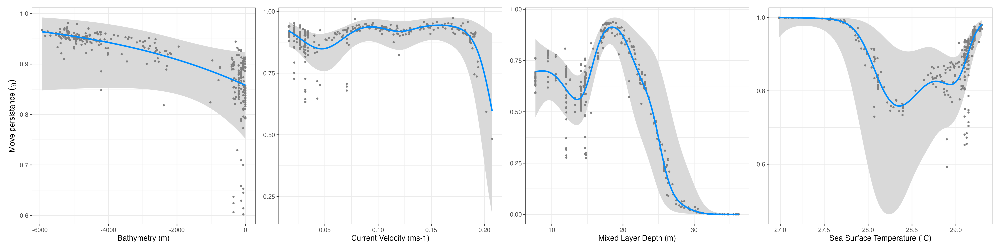


```{r, eval=FALSE}

visreg2d(mp_mod, xvar = "mixed_layer_depth", yvar = "temperature", scale = "response", plot.type = "persp",
         xlab = "Mixed Layer Depth (m)", ylab = "Sea Surface Temparature (˚C)", zlab = "Probability of presence",
         theta = 145, phi = 15, zlim = c(0,1))

```

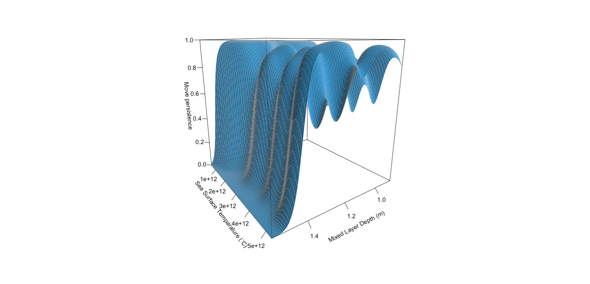

```{r, eval=FALSE}

mp_resp <- terra::predict(env_trans, mp_mod, type = "response")

plot(mp_resp)

```


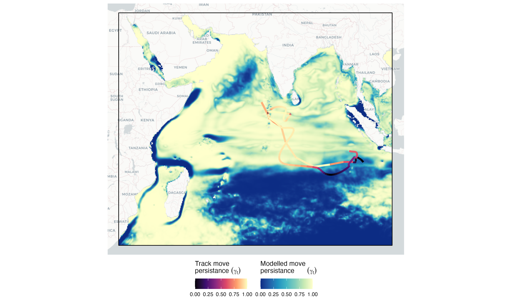

<br>

------------------------------------------------------------------------------------------------------------------------------------------------------

<a href="#top" style="color:steelblue; font:bold;" >Back to top</a>

<br><br>


